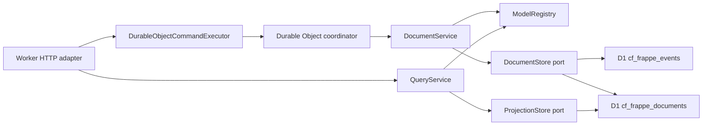

# cf-frappe

cf-frappe is an early Cloudflare-native application framework inspired by Frappe's metadata-driven model. It keeps the "define a DocType, get a useful app surface" idea, but makes event modeling and event sourcing the default instead of an afterthought.

The current slice is a working kernel:

- typed DocType metadata with fields, defaults, validation, naming, permissions, and workflows
- command-side document service that writes immutable events
- query-side projection service for current document reads and lists
- in-memory adapters for TDD
- Cloudflare D1 adapters for atomic event/projection commits
- Hono-powered resource API compatible with Workers
- Durable Object coordinator factory for serial per-aggregate command processing
- D1 projection-index planner from DocType `indexes`
- a runnable `Task` example under `examples/todos`

## Why

Frappe is productive because DocTypes centralize schema, form metadata, permissions, and APIs. cf-frappe targets the same developer ergonomics on Cloudflare, but with platform-native primitives:

| Frappe concept | cf-frappe direction |
| --- | --- |
| DocType | `defineDocType(...)` metadata |
| Document lifecycle | command handlers that emit domain events |
| Permissions | role and predicate rules attached to DocTypes |
| Hooks/controllers | pure hook contracts registered in `ModelRegistry` |
| REST resources | generated `/api/resource/:doctype` routes |
| Database tables | D1 append-only events plus current projections |
| Concurrency boundary | Durable Object command coordinator per aggregate stream |

See [docs/frappe-assessment.md](docs/frappe-assessment.md) for the assessment and parity map.

## Quick Start

```bash
npm install
npm run check
```

Create the D1 database before deploying the example:

```bash
npx wrangler d1 create cf-frappe-dev
```

Copy the returned `database_id` into `wrangler.jsonc`, then apply the schema:

```bash
npm run d1:migrate:local
npm run dev
```

## Define A Model

```ts
import { createRegistry, defineDocType } from "cf-frappe";

export const Task = defineDocType({
  name: "Task",
  naming: { kind: "field", field: "title" },
  fields: [
    { name: "title", type: "text", required: true, min: 3 },
    { name: "priority", type: "select", options: ["Low", "Medium", "High"], defaultValue: "Medium" }
  ],
  indexes: [["priority"]],
  commands: [
    {
      name: "raisePriority",
      eventType: "TaskPriorityRaised",
      fields: ["priority"]
    }
  ],
  permissions: [
    { roles: ["User"], actions: ["read", "create", "update", "transition"] }
  ]
});

export const registry = createRegistry({ doctypes: [Task] });
```

## Expose It On Workers

```ts
import { createAggregateCoordinatorClass, createCloudFrappeWorker } from "cf-frappe";
import { registry } from "./models";

export class AggregateCoordinator extends createAggregateCoordinatorClass({ registry }) {}

export default createCloudFrappeWorker({
  registry,
  actor: yourTrustedActorResolver
});
```

The generated API includes:

- `GET /health`
- `GET /api/meta/doctypes`
- `GET /api/meta/doctypes/:doctype`
- `POST /api/resource/:doctype`
- `GET /api/resource/:doctype`
- `GET /api/resource/:doctype/:name`
- `PUT /api/resource/:doctype/:name`
- `POST /api/resource/:doctype/:name/transition/:action`
- `POST /api/resource/:doctype/:name/command/:command`
- `DELETE /api/resource/:doctype/:name`

Generate D1 projection indexes from metadata:

```ts
import { renderD1ProjectionIndexMigration } from "cf-frappe";
import { registry } from "./models";

const sql = renderD1ProjectionIndexMigration(registry.list());
```

No actor resolver is installed by default. Production apps must pass a trusted resolver that derives the actor from a verified session, Access JWT, API token, or another authenticated source.

The checked-in Wrangler demo uses a read-only guest actor. For local demos only, `unsafeHeaderActorResolver` reads caller-controlled headers:

- `x-cf-frappe-user`
- `x-cf-frappe-roles`
- `x-cf-frappe-tenant`
- `x-cf-frappe-email`

## Architecture



The dependency direction is one way:

- `core` has pure types, schema validation, event folding, permissions, and registry contracts
- `application` orchestrates commands and queries through ports
- `ports` define storage, clocks, and id generation
- `adapters` implement in-memory, D1, and HTTP integration
- `cloudflare` packages Worker and Durable Object factories

## Quality Gate

Current local gate:

```bash
npm run check
```

This runs:

- TypeScript strict typecheck
- Vitest unit/API tests
- declaration build

Current suite: 52 tests across schema, permissions, events, registry, services, D1/in-memory adapters, HTTP API, Durable Object command routing, and D1 schema planning.

## Status

This is not Frappe parity yet. Missing major surfaces include generated desk UI, full migration management, reporting, background jobs, realtime events, auth integrations, file storage, app installation, and a compatibility-sized test suite. The current implementation is the event-sourced Cloudflare kernel needed to grow those surfaces without rewiring the foundation.

## References

- [Frappe DocTypes](https://docs.frappe.io/framework/user/en/basics/doctypes)
- [Frappe REST API](https://docs.frappe.io/framework/user/en/api/rest)
- [Frappe Hooks](https://docs.frappe.io/framework/user/en/python-api/hooks)
- [Frappe Users and Permissions](https://docs.frappe.io/framework/user/en/basics/users-and-permissions)
- [Cloudflare Workers](https://developers.cloudflare.com/workers/)
- [Cloudflare D1](https://developers.cloudflare.com/d1/)
- [Cloudflare Durable Objects](https://developers.cloudflare.com/durable-objects/)
