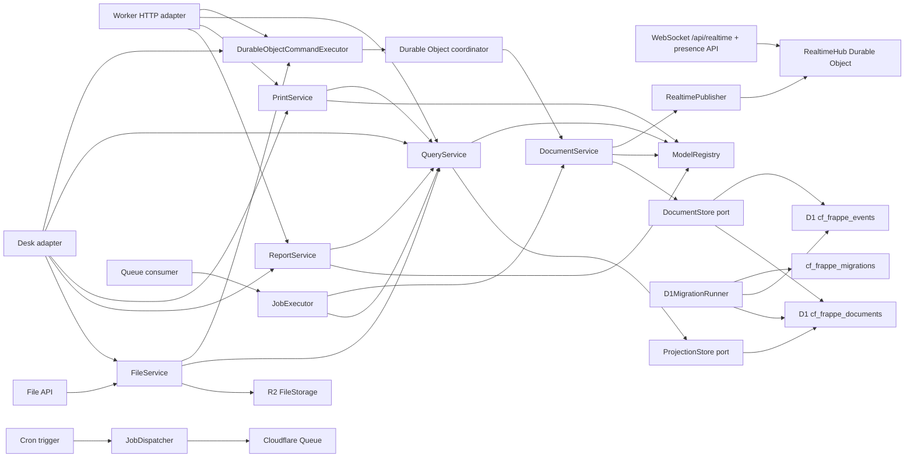

# cf-frappe

cf-frappe is an early Cloudflare-native application framework inspired by Frappe's metadata-driven model. It keeps the "define a DocType, get a useful app surface" idea, but makes event modeling and event sourcing the default instead of an afterthought.

The current slice is a working kernel:

- typed DocType metadata with fields, defaults, validation, naming, permissions, and workflows
- event-stream-backed naming series for human-readable document IDs
- metadata-defined link fields with event-stream referential integrity and generated lookup options
- metadata-defined child table fields validated from child DocType metadata
- event-sourced tenant custom field overlays composed with base DocType metadata
- event-sourced tenant field property overrides composed after custom fields
- event-sourced tenant workflow definition overrides composed after field property overrides
- event-sourced user permissions for linked-record read/write restrictions
- event-sourced document shares for per-record read/update/share grants
- first-class draft/submitted/cancelled document lifecycle events
- Frappe-style document duplication through command, HTTP, Desk, and client-script APIs
- command-side document service that writes immutable events
- permissioned document timelines with field-level diffs, comments, assignments, tags, and followers derived from append-only event streams
- admin-only audit search over immutable event streams
- query-side projection service for current document reads and lists
- in-memory adapters for TDD
- Cloudflare D1 adapters for atomic event/projection commits
- Hono-powered resource API compatible with Workers, including metadata-driven CSV export/import
- Durable Object coordinator factory for serial per-aggregate command processing
- D1 schema migration planner/runner from DocType `indexes`
- generated Desk list/form UI from DocType metadata
- metadata-configured form sections, field order, and form column layout
- metadata-configured list columns, default filters, saved user filters, system-field, pattern, presence, range, membership, scalar, and nested compound expression filters, generated point-and-click condition builders, filter-builder metadata, ordering, and page size
- metadata-defined print formats with reusable letterheads, field sections, HTML templates with escaped substitutions, and an optional Cloudflare Browser Rendering PDF adapter
- metadata-defined reports with typed filters, row ordering, summaries, and ordered/colored drilldown charts over current projections
- event-sourced saved report definitions for per-user report-builder presets with generated HTTP and Desk report-builder APIs
- metadata-defined workspaces with role-filtered shortcuts to DocType lists, new-document forms, reports, dashboards, files, notifications, admin tools, and safe links
- event-sourced tenant role catalog with generated HTTP and Desk administration
- event-sourced user accounts with optional role-catalog validation, Web Crypto password hashing, signed-cookie login/logout/me APIs, Cloudflare Access and generic OIDC account-sync adapters, Okta/Auth0/Google Workspace claim presets, recovery-token flows, separate user profile streams, and generated Desk administration
- metadata-defined same-origin client scripts with a built-in Desk browser API
- Cloudflare Queue/Cron background job primitives with event-sourced runtime schedule definitions and overrides
- R2-backed file attachments with event-sourced `File` metadata, metadata updates, multipart upload orchestration with browser chunk helpers, permissioned image transform/rendition workflows with overlay sources, bounded bulk metadata/delete workflows, generated Desk record attachment panels, and filtered file manager workflows
- event-sourced per-user notification inboxes plus tenant notification rules for document commit events, with generated HTTP management, Desk browser helpers, and Desk read/dismiss workflows
- Durable Object realtime topics for tenant, DocType, document, redacted per-user notifications, permissioned presence snapshots, transient field-edit intent, field-level merge planning, deterministic stale-save merge apply, generated realtime-updated Desk presence panels with stale-document warnings and live field-edit indicators, and bounded durable replay
- composable app manifests for packaging DocTypes, reports, print formats, hooks, and idempotent data patches/backfills
- installable `cf-frappe init` starter scaffold with a Task DocType/report/print/workspace/dashboard app plus seed data patch, signed-session, Cloudflare Access, or OIDC account-sync auth modes plus `cf-frappe access` setup automation, `cf-frappe install` package-manager, dependency metadata, app-registry wiring, migration generation, and remote data-patch/job/file operator commands for new Cloudflare apps
- a runnable `Task` example under `examples/todos`

## Why

Frappe is productive because DocTypes centralize schema, form metadata, permissions, and APIs. cf-frappe targets the same developer ergonomics on Cloudflare, but with platform-native primitives:

| Frappe concept | cf-frappe direction |
| --- | --- |
| DocType | `defineDocType(...)` metadata |
| Custom fields | event-sourced tenant custom field overlays composed into base DocTypes |
| Property setters | event-sourced tenant field property overrides composed into effective DocTypes |
| Naming series | `naming: { kind: "series" }` with an internal event-stream counter |
| Link fields | registered `type: "link"` targets with write-time existence checks and lookup options |
| Child tables | registered `type: "table"` child DocTypes embedded in event-sourced document data |
| Document lifecycle | event-sourced create, update, submit, cancel, and delete commands |
| Document duplicate | source read plus target create checks, then a new draft `DocumentCreated` event |
| Document amendment | cancelled-source read plus target create checks, then a new draft with amendment provenance |
| Workflows | source metadata transitions plus tenant-scoped event-sourced workflow definition overrides and transition events |
| Audit trail | permissioned timelines, field diffs, comments, assignments, tags, followers, and admin audit search from immutable events |
| Permissions | role and predicate rules attached to DocTypes plus event-sourced linked-record user permissions |
| DocShare / per-document sharing | document-stream share/revoke events folded into read/update/share overlays |
| Hooks/controllers | pure hook contracts registered in `ModelRegistry` |
| REST resources | generated `/api/resource/:doctype` routes with list CSV exports, import templates, and command-bound CSV imports |
| Desk list/forms | generated `/desk` pages, list/form layouts, columns, saved filters, flat and compound expression filters, ordering, and CSV exports from DocType metadata |
| Global search | metadata-driven `/api/search` and Desk client helper over readable projections |
| Print formats | metadata-defined printable document pages, letterheads, escaped templates, and optional Browser Rendering PDF output |
| Reports | metadata-defined and custom row-provider reports, typed filters, row ordering, summaries, ordered/colored drilldown charts, saved definitions, HTTP/Desk report-builder APIs, and Desk pages |
| Dashboards | metadata-defined Desk number and chart cards backed by document counts, document aggregates, report summaries, report charts, value-driven indicators, and drilldowns |
| Workspaces | metadata-defined role-filtered workspace shortcuts to DocType lists, new-document forms, reports, dashboards, files, notifications, admin tools, and links |
| Users/login | event-sourced account/profile streams, PBKDF2 password hashing, signed-cookie auth routes, Cloudflare Access and generic OIDC provider sync with provider claim presets, and recovery tokens |
| Client scripts | `defineClientScript(...)` browser bundles attached to Desk list/form pages |
| Background jobs | `JobRegistry`, Queue producers/consumers, Cron dispatch, and event-sourced runtime schedule definitions plus enable/disable/pause-until overrides |
| File attachments | `File` DocType metadata plus R2 object storage, metadata updates, direct upload reservation/finalization, multipart upload orchestration with browser chunk helpers, scan hooks, permissioned image transform/rendition options with overlay sources, generated Desk record attachment panels, and filtered file manager |
| User notifications | notification logs and rules | event-sourced per-user inbox streams with HTTP and Desk read/dismiss workflows plus event-sourced notification rules for document commit events |
| Realtime events | document commit events, permissioned presence snapshots with generated realtime-updated Desk presence panels, stale-document warnings, live field-edit intent, field-level merge planning, deterministic stale-save merge apply, and bounded replay over Durable Object topics |
| Database tables | D1 append-only events plus current projections |
| Migrations/patches | metadata-planned D1 migrations plus app-declared data patches with applied and rollback journals, event-level field unsets for rename/remove backfills, rollback planning/execution, and CLI-driven remote status/plan/rollback-plan/apply/rollback/enqueue/rollback-enqueue/retry/rollback-retry/rollback-retry-enqueue |
| Concurrency boundary | Durable Object command coordinator per aggregate stream |
| Apps | `defineApp(...)` manifests composed through `createRegistryFromApps(...)` |
| App starter | `cf-frappe init` scaffold with Worker, D1, Durable Object, a Task DocType/report/print/workspace/dashboard app plus seed data patch, signed-session, Cloudflare Access, or OIDC account-sync wiring, `cf-frappe access` setup automation, `cf-frappe install` package-manager/dependency/registry wiring, and `cf-frappe data-patches` / `cf-frappe jobs` / `cf-frappe files` remote operations |

See [docs/frappe-assessment.md](docs/frappe-assessment.md) for the assessment and parity map.
See [docs/test-parity.md](docs/test-parity.md) for the current upstream Frappe test-count target.

## Quick Start

Create a new app:

```bash
npx cf-frappe init my-app
cd my-app
npm install
cp .dev.vars.example .dev.vars
npm run cf:types
npm run d1:generate
npm run d1:migrate:local
npm run dev
```

To start behind Cloudflare Access, generate the same app with Access JWT verification and event-sourced account sync placeholders:

```bash
npx cf-frappe init my-app --auth cloudflare-access
npx cf-frappe access plan --account-id <account-id> --team-domain your-team.cloudflareaccess.com --name "My App" --domain app.example.com --email-domain example.com
npx cf-frappe access apply --account-id <account-id> --team-domain your-team.cloudflareaccess.com --name "My App" --domain app.example.com --email-domain example.com --api-token-env CF_API_TOKEN
```

To start behind any RS256 OpenID Connect provider, generate an OIDC starter and replace the placeholder issuer, audience, and JWKS URL in `wrangler.jsonc`. The generated Worker uses the shared OIDC group-role mapper, and apps can swap in Okta/Auth0/Google Workspace claim presets without adding IdP SDKs:

```bash
npx cf-frappe init my-app --auth oidc
```

Work on this repository:

```bash
npm install
npm run check
```

Create the D1 database before deploying the example:

```bash
npx wrangler d1 create cf-frappe-dev
```

Copy the returned `database_id` into `wrangler.jsonc`, then apply the schema:

```bash
npm run d1:migrate:local
npm run dev
```

## Define A Model

```ts
import { createRegistryFromApps, defineApp, defineClientScript, defineDocType, definePrintFormat, defineReport, fileDocType } from "cf-frappe";

export const Project = defineDocType({
  name: "Project",
  naming: { kind: "field", field: "title" },
  fields: [{ name: "title", type: "text", required: true }],
  permissions: [
    { roles: ["User"], actions: ["read", "create", "update"] }
  ]
});

export const Task = defineDocType({
  name: "Task",
  naming: { kind: "field", field: "title" },
  fields: [
    { name: "title", type: "text", required: true, min: 3 },
    { name: "project", type: "link", linkTo: "Project", required: true },
    { name: "priority", type: "select", options: ["Low", "Medium", "High"], defaultValue: "Medium" },
    { name: "status", type: "select", options: ["Open", "Closed"], defaultValue: "Open" },
    { name: "description", type: "longText" }
  ],
  formView: {
    sections: [
      { heading: "Summary", columns: 1, fields: ["title", "project", "priority", "status"] },
      { heading: "Details", columns: 2, fields: ["description"] }
    ]
  },
  listView: {
    columns: ["title", "project", "priority", "status"],
    filterFields: ["title", "project", "priority", "status"],
    filters: [{ field: "status", value: "Open" }],
    orderBy: "priority",
    order: "desc",
    pageSize: 25
  },
  indexes: [["project"], ["priority"], ["status"]],
  commands: [
    {
      name: "raisePriority",
      eventType: "TaskPriorityRaised",
      fields: ["priority"]
    }
  ],
  permissions: [
    { roles: ["User"], actions: ["read", "create", "update", "transition"] }
  ]
});

export const OpenTasks = defineReport({
  name: "Open Tasks",
  doctype: "Task",
  columns: [
    { name: "title", label: "Title" },
    { name: "priority", label: "Priority" }
  ],
  summaries: [
    { name: "task_count", label: "Tasks", aggregate: "count" }
  ],
  groups: [
    {
      name: "by_priority",
      label: "By Priority",
      field: "priority",
      summaries: [{ name: "task_count", label: "Tasks", aggregate: "count" }]
    }
  ],
  charts: [
    {
      name: "tasks_by_priority",
      label: "Tasks by Priority",
      type: "bar",
      group: "by_priority",
      summary: "task_count"
    }
  ],
  filters: [{ name: "priority", field: "priority", type: "select" }],
  roles: ["User"]
});

export const TaskPrint = definePrintFormat({
  name: "Task Standard",
  doctype: "Task",
  sections: [
    {
      heading: "Task",
      fields: [
        { field: "title", label: "Title" },
        { field: "priority", label: "Priority" }
      ]
    }
  ],
  roles: ["User"]
});

export const TaskFormScript = defineClientScript({
  name: "task-form",
  doctype: "Task",
  src: "/assets/task-form.js",
  scope: "form"
});

export const projectApp = defineApp({
  name: "projects",
  label: "Projects",
  version: "1.0.0",
  modules: ["Projects"],
  doctypes: [Project, Task, fileDocType],
  printFormats: [TaskPrint],
  reports: [OpenTasks],
  clientScripts: [TaskFormScript]
});

export const registry = createRegistryFromApps([projectApp]);
```

Generated Desk list and form pages load `/desk/client.js` before model-declared client scripts. That runtime exposes `window.cfFrappe` helpers for same-origin DocType, workspace, report, print, link-option, customization-overlay, policy/automation, document-history, and resolved list-view/filter-builder metadata, auth/session/recovery/account-management/provider/profile workflows, audit search/deleted-recovery workflows, role catalog workflows, custom-field workflows, field-property workflows, workflow-definition workflows, notification-rule workflows, user-permission workflows, data-patch workflows, job workflows, print workflows, report-builder workflows, resource reads/writes/merge apply, selected-document bulk actions, Desk navigation/list/export/import/bulk-action helpers, file metadata/upload/direct-upload/multipart-upload workflows, notification inbox/read-state workflows, document collaboration, saved-filter, report, link-option, command, workflow, lifecycle, form-event, field-control, generated stale-form `frm.merge_save()` / `frm.save({ merge: true })`, explicit shared-draft patch helpers plus presence-panel merge and shared-draft apply actions including child-table patches, user-feedback, parsed realtime subscription calls, transient field-edit and shared-draft patch messages, field-level merge preflight, and permissioned presence snapshots, so browser scripts can stay small and use the same permissioned HTTP/event boundaries as the server-rendered UI. Client form hooks and field controls are ergonomic only; authoritative validation and writes still live in server-side DocType, permission, and command handlers.

```js
window.cfFrappe.form.on("Task", {
  refresh(frm) {
    if (!frm.docname || frm.taskRealtime) return;
    window.cfFrappe.resource.get(frm.doctype, frm.docname).then((doc) => {
      frm.taskRealtime = window.cfFrappe.realtime.subscribeDocument(frm.doctype, doc.name, {
        event(event) {
          if (event.type === "TaskUpdated") frm.refresh();
        }
      }, {
        tenantId: doc.tenantId
      });
    });
  },
  title(frm) {
    console.debug("Task title changed", frm.get_value("title"));
  },
  validate(frm) {
    if (!frm.get_value("title")) {
      frm.validated = false;
    }
  }
});
```

`validate` and `before_save` hooks are synchronous client-side guards for the generated Save action only. Workflow transitions, lifecycle actions, and domain commands keep their own server-side command boundaries; asynchronous checks should update local form state before Save or run through the same-origin resource APIs explicitly.

Apps can depend on other apps, and dependency order controls hook order while still letting cross-app DocType links resolve in one registry:

```ts
const crm = defineApp({ name: "crm", doctypes: [Customer] });
const sales = defineApp({ name: "sales", dependencies: ["crm"], doctypes: [Invoice] });

export const registry = createRegistryFromApps([sales, crm]);
```

## Expose It On Workers

```ts
import { createAggregateCoordinatorClass, createCloudFrappeWorker } from "cf-frappe/cloudflare";
import { registry } from "./models";

export class AggregateCoordinator extends createAggregateCoordinatorClass({ registry }) {}

export default createCloudFrappeWorker({
  registry,
  actor: yourTrustedActorResolver
});
```

The generated API includes:

- `GET /health`
- `GET /api/meta/doctypes`
- `GET /api/meta/doctypes/:doctype`
- `GET /api/meta/workspaces`
- `GET /api/meta/workspaces/:workspace`
- `GET /api/meta/print-formats`
- `GET /api/meta/print-formats/:format`
- `GET /api/meta/reports`
- `GET /api/meta/reports/:report`
- `GET /api/print/:format/:name`
- `GET /api/print/:format/:name/pdf`
- `GET /api/report/:report/run`
- `GET /api/report/:report/export.csv`
- `GET /api/report/:report/pdf`
- `GET /api/report-builder/:doctype`
- `POST /api/report-builder/:doctype`
- `GET /api/report-builder/:doctype/:id`
- `PUT /api/report-builder/:doctype/:id`
- `DELETE /api/report-builder/:doctype/:id`
- `GET /api/report-builder/:doctype/:id/run`
- `GET /api/report-builder/:doctype/:id/export.csv`
- `GET /api/report-builder/:doctype/:id/pdf`
- `GET /api/link-options/:doctype/:field`
- `GET /api/audit/events`
- `GET /api/audit/deleted/:doctype/:name`
- `POST /api/auth/login`
- `POST /api/auth/logout`
- `POST /api/auth/password-reset/request`
- `POST /api/auth/password-reset/complete`
- `POST /api/auth/email-verification/request`
- `POST /api/auth/email-verification/complete`
- `GET /api/auth/me`
- `GET /api/users/:userId`
- `POST /api/users/:userId`
- `PUT /api/users/:userId/password`
- `PUT /api/users/:userId/roles`
- `POST /api/users/:userId/provider-sync`
- `POST /api/users/:userId/enable`
- `POST /api/users/:userId/disable`
- `GET /api/users/:userId/profile`
- `PUT /api/users/:userId/profile`
- `GET /api/data-patches`
- `POST /api/data-patches/plan`
- `POST /api/data-patches/rollback-plan`
- `POST /api/data-patches/apply`
- `POST /api/data-patches/rollback`
- `POST /api/data-patches/:id/plan`
- `POST /api/data-patches/:id/rollback-plan`
- `POST /api/data-patches/:id/apply`
- `POST /api/data-patches/:id/rollback`
- `POST /api/data-patches/:id/retry`
- `POST /api/data-patches/:id/rollback-retry`
- `POST /api/data-patches/enqueue`
- `POST /api/data-patches/:id/enqueue`
- `POST /api/data-patches/rollback-enqueue`
- `POST /api/data-patches/:id/rollback-enqueue`
- `POST /api/data-patches/:id/rollback-retry-enqueue`
- `GET /api/jobs`
- `GET /api/jobs/executions/:idempotencyKey`
- `POST /api/jobs/executions/:idempotencyKey/retry`
- `GET /api/jobs/schedules`
- `POST /api/jobs/schedules`
- `PUT /api/jobs/schedules/:scheduleId`
- `DELETE /api/jobs/schedules/:scheduleId`
- `POST /api/jobs/schedules/:scheduleId/run`
- `POST /api/jobs/schedules/:scheduleId/enable`
- `POST /api/jobs/schedules/:scheduleId/disable`
- `POST /api/jobs/schedules/:scheduleId/pause`
- `POST /api/jobs/schedules/:scheduleId/reset`
- `GET /api/notifications`
- `POST /api/notifications/:notificationId/read`
- `POST /api/notifications/:notificationId/dismiss`
- `GET /api/notification-rules/:doctype`
- `PUT /api/notification-rules/:doctype/:rule`
- `DELETE /api/notification-rules/:doctype/:rule`
- `GET /api/user-permissions/:userId`
- `POST /api/user-permissions/:userId`
- `DELETE /api/user-permissions/:userId`
- `GET /api/custom-fields/:doctype`
- `POST /api/custom-fields/:doctype`
- `DELETE /api/custom-fields/:doctype/:field`
- `GET /api/field-properties/:doctype`
- `PUT /api/field-properties/:doctype/:field`
- `DELETE /api/field-properties/:doctype/:field`
- `GET /api/workflows/:doctype`
- `PUT /api/workflows/:doctype`
- `DELETE /api/workflows/:doctype`
- `GET /api/realtime/presence`
- `POST /api/resource/:doctype`
- `POST /api/resource/:doctype/import.csv`
- `POST /api/resource/:doctype/delete`
- `POST /api/resource/:doctype/bulk-submit`
- `POST /api/resource/:doctype/bulk-cancel`
- `POST /api/resource/:doctype/bulk-transition/:action`
- `GET /api/resource/:doctype`
- `GET /api/resource/:doctype/saved-filters`
- `GET /api/resource/:doctype/:name`
- `GET /api/resource/:doctype/:name/timeline`
- `GET /api/resource/:doctype/:name/assignments`
- `GET /api/resource/:doctype/:name/tags`
- `GET /api/resource/:doctype/:name/followers`
- `GET /api/resource/:doctype/:name/shares`
- `PUT /api/resource/:doctype/:name`
- `POST /api/resource/:doctype/:name/duplicate`
- `POST /api/resource/:doctype/:name/amend`
- `POST /api/resource/:doctype/:name/comments`
- `POST /api/resource/:doctype/:name/activities`
- `POST /api/resource/:doctype/saved-filters`
- `POST /api/resource/:doctype/:name/assignments`
- `POST /api/resource/:doctype/:name/tags`
- `POST /api/resource/:doctype/:name/followers`
- `POST /api/resource/:doctype/:name/shares`
- `POST /api/resource/:doctype/:name/submit`
- `POST /api/resource/:doctype/:name/cancel`
- `POST /api/resource/:doctype/:name/transition/:action`
- `POST /api/resource/:doctype/:name/command/:command`
- `DELETE /api/resource/:doctype/:name/assignments/:assignee`
- `DELETE /api/resource/:doctype/:name/tags/:tag`
- `DELETE /api/resource/:doctype/:name/followers/:follower`
- `DELETE /api/resource/:doctype/:name/shares/:userId`
- `DELETE /api/resource/:doctype/saved-filters/:filterId`
- `DELETE /api/resource/:doctype/:name`

When file support is enabled, the generated API also includes:

- `GET /api/files`
- `POST /api/files`
- `POST /api/files/direct-upload`
- `POST /api/files/multipart-upload`
- `PATCH /api/files/:name`
- `GET /api/files/:name/content`
- `GET /api/files/:name/preview`
- `GET /api/files/:name/transform`
- `POST /api/files/:name/renditions`
- `GET /api/files/:name/renditions/:renditionId/content`
- `POST /api/files/:name/complete-upload`
- `PUT /api/files/:name/multipart-parts/:partNumber`
- `POST /api/files/:name/complete-multipart-upload`
- `POST /api/files/:name/abort-multipart-upload`
- `POST /api/files/delete`
- `POST /api/files/bulk-metadata`
- `DELETE /api/files/:name`

The generated Desk UI includes:

- `GET /desk/files`
- `POST /desk/files`
- `POST /desk/files/:name/metadata`
- `GET /desk/files/:name/content`
- `GET /desk/files/:name/preview`
- `POST /desk/files/bulk-delete`
- `POST /desk/files/bulk-metadata`
- `POST /desk/files/:name/delete`
- `GET /desk`
- `GET /desk/search`
- `GET /desk/workspaces/:workspace`
- `POST /desk/:doctype/bulk-delete`
- `POST /desk/:doctype/bulk-submit`
- `POST /desk/:doctype/bulk-cancel`
- `POST /desk/:doctype/bulk-transition/:action`
- `GET /desk/print/:format/:name`
- `GET /desk/print/:format/:name/pdf`
- `GET /desk/reports`
- `GET /desk/reports/:report`
- `GET /desk/reports/:report/export.csv`
- `GET /desk/reports/:report/print`
- `GET /desk/reports/:report/pdf`
- `GET /desk/report-builder/:doctype`
- `POST /desk/report-builder/:doctype`
- `GET /desk/report-builder/:doctype/:id`
- `GET /desk/report-builder/:doctype/:id/export.csv`
- `GET /desk/report-builder/:doctype/:id/print`
- `GET /desk/report-builder/:doctype/:id/pdf`
- `POST /desk/report-builder/:doctype/:id/delete`
- `GET /desk/admin/users`
- `POST /desk/admin/users`
- `POST /desk/admin/users/profile`
- `POST /desk/admin/users/password`
- `POST /desk/admin/users/roles`
- `POST /desk/admin/users/enable`
- `POST /desk/admin/users/disable`
- `GET /desk/admin/roles`
- `POST /desk/admin/roles`
- `POST /desk/admin/roles/:role/description`
- `POST /desk/admin/roles/:role/enable`
- `POST /desk/admin/roles/:role/disable`
- `GET /desk/admin/custom-fields`
- `POST /desk/admin/custom-fields`
- `POST /desk/admin/custom-fields/:doctype/:field/disable`
- `GET /desk/admin/user-permissions`
- `POST /desk/admin/user-permissions`
- `POST /desk/admin/user-permissions/revoke`
- `GET /desk/admin/jobs`
- `POST /desk/admin/jobs/:idempotencyKey/retry`
- `GET /desk/admin/jobs/schedules`
- `POST /desk/admin/jobs/schedules`
- `POST /desk/admin/jobs/schedules/:scheduleId/delete`
- `POST /desk/admin/jobs/schedules/:scheduleId/run`
- `POST /desk/admin/jobs/schedules/:scheduleId/enable`
- `POST /desk/admin/jobs/schedules/:scheduleId/disable`
- `POST /desk/admin/jobs/schedules/:scheduleId/pause`
- `POST /desk/admin/jobs/schedules/:scheduleId/reset`
- `GET /desk/admin/data-patches`
- `POST /desk/admin/data-patches/plan`
- `POST /desk/admin/data-patches/rollback-plan`
- `POST /desk/admin/data-patches/apply`
- `POST /desk/admin/data-patches/rollback`
- `POST /desk/admin/data-patches/:id/plan`
- `POST /desk/admin/data-patches/:id/rollback-plan`
- `POST /desk/admin/data-patches/:id/apply`
- `POST /desk/admin/data-patches/:id/rollback`
- `POST /desk/admin/data-patches/:id/retry`
- `GET /desk/notifications`
- `POST /desk/notifications/:notificationId/read`
- `POST /desk/notifications/:notificationId/dismiss`
- `GET /desk/:doctype`
- `GET /desk/:doctype/new`
- `POST /desk/:doctype`
- `GET /desk/:doctype/:name`
- `POST /desk/:doctype/:name`
- `POST /desk/:doctype/:name/duplicate`
- `POST /desk/:doctype/:name/amend`
- `POST /desk/:doctype/:name/submit`
- `POST /desk/:doctype/:name/cancel`
- `POST /desk/:doctype/:name/command/:command`

Generate and review D1 migrations from metadata:

```ts
import { planD1Migrations, renderD1Migrations } from "cf-frappe";
import { registry } from "./models";

const migrations = planD1Migrations(registry.list());
const sql = renderD1Migrations(migrations);
```

Starter apps can write missing metadata-planned migrations as reviewable files:

```bash
npm run d1:generate
```

When changing an existing DocType's D1 indexes, bump the DocType version so the generated migration gets a new stable id. If a renamed or removed field leaves an obsolete projection index behind, declare the old signature in `retiredIndexes`; the D1 planner emits `DROP INDEX IF EXISTS` before creating replacement indexes without rewriting event streams or document JSON:

```ts
const Lead = defineDocType({
  name: "Lead",
  version: 2,
  fields: [
    { name: "status", type: "select", options: ["Open", "Qualified"] },
    { name: "account_manager", type: "text" }
  ],
  retiredIndexes: [
    ["owner"],
    { doctype: "CRM Lead", fields: ["customer id", "status"] }
  ],
  indexes: [["account_manager", "status"]]
});
```

Apply pending D1 migrations from a trusted admin route, deployment task, or CI script:

```ts
import { D1MigrationRunner, planD1Migrations } from "cf-frappe";
import type { CloudFrappeEnv } from "cf-frappe/cloudflare";
import { registry } from "./models";

export async function migrate(env: CloudFrappeEnv) {
  const runner = new D1MigrationRunner(env.DB);
  return runner.apply(planD1Migrations(registry.list()));
}
```

Declare idempotent data patches in app manifests and run them through a journaled patch runner. Patches should call framework services such as the document command executor so backfills append events instead of rewriting projections directly:

```ts
import { defineDataPatch } from "cf-frappe";
import { createCloudFrappeWorker, type CloudFrappeEnv, type CloudFrappeRuntimeServices } from "cf-frappe/cloudflare";

const backfill = defineDataPatch<CloudFrappeRuntimeServices>({
  id: "crm.customer_status_v1",
  checksum: "v1",
  async run({ resources }) {
    // load targets through query services, then call resources.documents.update(...)
    return { touched: 0 };
  }
});

export default createCloudFrappeWorker<CloudFrappeEnv>({
  registry,
  actor: yourTrustedActorResolver
});
```

Renames or destructive field cleanup should also stay event-sourced. Use `DocumentService.update(...)` with an explicit `unset` list so projections remove stale top-level fields by folding the same append-only `DocumentUpdated` event that records the replacement value:

```ts
await resources.documents.update({
  actor,
  doctype: "Customer",
  name,
  patch: { account_manager: legacyOwner },
  unset: ["legacy_owner"],
  metadata: { patchId: "crm.customer_owner_rename_v2" }
});
```

Worker apps with registered patches expose `GET /api/data-patches` for an admin status dashboard, `POST /api/data-patches/plan` to preview the next apply plan without claiming the journal or running patch code, `POST /api/data-patches/apply` to claim and run unapplied patches, and `POST /api/data-patches/:id/apply` to run one registered patch. Bulk plan/apply accepts `?limit=1` or a JSON body such as `{ "limit": 10, "patchIds": ["crm.customer_status_v1"] }`; limits apply to the next pending patches in registry order so operators can run reviewable batches without inverting app-declared patch order. Patch definitions can also declare rollback metadata with `rollback: { label, run }`; `POST /api/data-patches/rollback-plan` and `POST /api/data-patches/:id/rollback-plan` return the rollbackable applied tail in reverse registry order without running compensating code, while `POST /api/data-patches/rollback` and `POST /api/data-patches/:id/rollback` claim rollback journal entries, run the rollback handlers, and record `rollback_pending`, `rolled_back`, or `rollback_failed` outcomes. Rolled-back patch ids remain terminal journal history; re-apply by authoring a new patch id/checksum rather than rewriting the old record. A failed patch can be retried through `POST /api/data-patches/:id/retry`; retry clears only a failed journal entry with the same registered checksum, then re-enters normal `DataPatchRunner.apply(...)` for that one patch, so already-appended domain events are not rolled back or rewritten. A failed rollback can be retried through `POST /api/data-patches/:id/rollback-retry`; rollback retry atomically claims only a matching `rollback_failed` journal entry as `rollback_pending`, checks that later patches are already safely rolled back, and then re-enters normal `DataPatchRunner.rollback(...)`. Pending, applied, rolled-back, missing, and checksum-drifted records are rejected when an operation would violate the journal state. The generated Desk also mounts `/desk/admin/data-patches` with the same journal-backed status, apply plan, rollback plan, apply, rollback, failed-patch retry, failed-rollback retry, and queue enqueue actions when the matching built-in jobs are registered; batch and single-patch enqueue controls accept `limit`, `idempotencyKey`, and `delaySeconds` from 0 to 86400 where applicable so operators can schedule bounded Cloudflare Queue work without dropping to the CLI. Browser scripts can call the same routes through `window.cfFrappe.dataPatches`, and the Desk sidebar lists enabled admin tools such as data patches, roles, user permissions, jobs, and schedules. By default this uses D1's `cf_frappe_data_patches` journal and passes the normal runtime services as patch resources; apps can override `dataPatches.resources` in `createCloudFrappeWorker(...)` to give patches a narrower dependency surface.

The CLI can drive the same remote admin routes for deployed Workers. Use `--header-env` for secret-bearing auth headers so tokens stay out of shell history. Assuming `CF_FRAPPE_AUTH` is already exported by your shell secret manager or CI secret store:

```bash
npx cf-frappe data-patches status --url https://your-worker.example --header-env Authorization=CF_FRAPPE_AUTH
npx cf-frappe data-patches plan --url https://your-worker.example --id crm.customer_status_v1 --header-env Authorization=CF_FRAPPE_AUTH
npx cf-frappe data-patches rollback-plan --url https://your-worker.example --limit 2 --header-env Authorization=CF_FRAPPE_AUTH
npx cf-frappe data-patches apply --url https://your-worker.example --id crm.customer_status_v1 --header-env Authorization=CF_FRAPPE_AUTH
npx cf-frappe data-patches rollback --url https://your-worker.example --id crm.customer_status_v1 --header-env Authorization=CF_FRAPPE_AUTH
npx cf-frappe data-patches retry --url https://your-worker.example --id crm.customer_status_v1 --header-env Authorization=CF_FRAPPE_AUTH
npx cf-frappe data-patches rollback-retry --url https://your-worker.example --id crm.customer_status_v1 --header-env Authorization=CF_FRAPPE_AUTH
npx cf-frappe data-patches enqueue --url https://your-worker.example --limit 5 --idempotency-key patches:batch-1 --header-env Authorization=CF_FRAPPE_AUTH
npx cf-frappe data-patches rollback-enqueue --url https://your-worker.example --limit 2 --idempotency-key patches:rollback-1 --header-env Authorization=CF_FRAPPE_AUTH
npx cf-frappe data-patches rollback-retry-enqueue --url https://your-worker.example --id crm.customer_status_v1 --idempotency-key patches:rollback-retry-1 --header-env Authorization=CF_FRAPPE_AUTH
```

The same CLI can inspect and operate background jobs without reaching for Desk pages:

```bash
npx cf-frappe jobs list --url https://your-worker.example --status failed --header-env Authorization=CF_FRAPPE_AUTH
npx cf-frappe jobs get --url https://your-worker.example --idempotency-key reports.daily:job_001 --header-env Authorization=CF_FRAPPE_AUTH
npx cf-frappe jobs retry --url https://your-worker.example --idempotency-key reports.daily:job_001 --header-env Authorization=CF_FRAPPE_AUTH
npx cf-frappe jobs schedules --url https://your-worker.example --job reports.daily --header-env Authorization=CF_FRAPPE_AUTH
npx cf-frappe jobs schedule-run --url https://your-worker.example --id daily-reports --header-env Authorization=CF_FRAPPE_AUTH
npx cf-frappe jobs schedule-pause --url https://your-worker.example --id daily-reports --until 2026-01-02T00:00:00.000Z --header-env Authorization=CF_FRAPPE_AUTH
npx cf-frappe jobs schedule-save --url https://your-worker.example --id runtime-daily --cron "15 4 * * *" --job reports.daily --enabled --payload-json '{"scope":"runtime"}' --header-env Authorization=CF_FRAPPE_AUTH
```

Longer backfills, rollback batches, and failed rollback retries can use the Cloudflare Queue job path. Register the built-in jobs in your app's `jobs.registry`; when the apply job exists, `POST /api/data-patches/enqueue` and `POST /api/data-patches/:id/enqueue` validate the same patch plan as `apply`, enqueue it, and return the queue message with `202 Accepted`. When the rollback job exists, `POST /api/data-patches/rollback-enqueue` and `POST /api/data-patches/:id/rollback-enqueue` do the same for rollback plans. When the rollback retry job exists, `POST /api/data-patches/:id/rollback-retry-enqueue` validates that the patch currently has a retryable failed rollback journal entry and enqueues the retry without claiming it inline. The generated Desk renders matching enqueue buttons under `/desk/admin/data-patches`, including batch and single-patch delivery fields for idempotency keys and queue delay, while browser helpers plus the CLI can drive the same API routes. Queue consumers run those plans through `DataPatchService.apply(...)`, `DataPatchService.rollback(...)`, or `DataPatchService.retryRollbackFailed(...)`, so the D1 patch journal still owns claims, skips, failures, rollback claims, retry claims, and checksum checks:

```ts
import {
  createDataPatchApplyJob,
  createDataPatchRollbackJob,
  createDataPatchRollbackRetryJob,
  createJobRegistry
} from "cf-frappe";
import {
  CloudflareJobQueue,
  createCloudFrappeWorker,
  type CloudFrappeEnv,
  type CloudFrappeRuntimeServices
} from "cf-frappe/cloudflare";

interface Env extends CloudFrappeEnv {
  readonly JOBS: Queue;
}

const jobs = createJobRegistry<CloudFrappeRuntimeServices>({
  jobs: [
    createDataPatchApplyJob<CloudFrappeRuntimeServices>(),
    createDataPatchRollbackJob<CloudFrappeRuntimeServices>(),
    createDataPatchRollbackRetryJob<CloudFrappeRuntimeServices>()
  ]
});

export default createCloudFrappeWorker<Env>({
  registry,
  actor: yourTrustedActorResolver,
  jobs: {
    registry: jobs,
    queue: (env) => new CloudflareJobQueue(env.JOBS)
  }
});
```

If `jobs.resources` returns a custom resource object and any built-in patch queue job is enabled, that object must be extensible; cf-frappe adds `dataPatches` to the job resources so the queued handlers can re-enter the same journal-backed service.

Production apps choose an actor resolver. For cookie-based apps, `signedSessionActorResolver(...)` verifies an HttpOnly HMAC-signed session cookie with Web Crypto, checks expiry, and returns the signed actor. `createSignedSessionCookie(...)` and `clearSignedSessionCookie(...)` issue and clear those cookies without introducing a server-side session projection.

```ts
import { signedSessionActorResolver } from "cf-frappe";
import { createCloudFrappeWorker, type CloudFrappeEnv } from "cf-frappe/cloudflare";

interface Env extends CloudFrappeEnv {
  readonly SESSION_SECRET: string;
}

export default createCloudFrappeWorker<Env>({
  registry,
  actor: (request, env) =>
    signedSessionActorResolver({
      secret: env.SESSION_SECRET,
      fallback: () => ({ id: "guest", roles: ["Guest"], tenantId: "default" })
    })(request)
});
```

For apps protected by Cloudflare Access, `cloudflareAccessActorResolver(...)` verifies the `Cf-Access-Jwt-Assertion` header first, falls back to the `CF_Authorization` cookie, validates the RS256 signature against the team JWKS endpoint, and checks `iss`, `aud`, `exp`, and `nbf` before mapping claims to an actor.

```ts
import { cloudflareAccessActorResolver } from "cf-frappe";
import { createCloudFrappeWorker, type CloudFrappeEnv } from "cf-frappe/cloudflare";

interface Env extends CloudFrappeEnv {
  readonly CF_ACCESS_TEAM_DOMAIN: string;
  readonly CF_ACCESS_AUD: string;
}

let accessActorResolver: ReturnType<typeof cloudflareAccessActorResolver> | undefined;

export default createCloudFrappeWorker<Env>({
  registry,
  actor: (request, env) => {
    accessActorResolver ??= cloudflareAccessActorResolver({
      teamDomain: env.CF_ACCESS_TEAM_DOMAIN,
      audience: env.CF_ACCESS_AUD,
      roles: (claims) =>
        claims.groups?.length ? claims.groups.map((group) => `Access:${group}`) : ["User"],
      tenantId: () => "default"
    });
    return accessActorResolver(request);
  }
});
```

For OpenID Connect providers, `oidcActorResolver(...)` uses the same RS256/JWKS verification path with configurable `issuer`, `audience`, `jwksUrl`, token source, roles, tenant, and actor mapping. The default token source is `Authorization: Bearer <token>`; apps can also read a raw header, cookie, or custom resolver without coupling an IdP SDK into core auth.

```ts
import { oidcActorResolver, oidcGroupsRoleMapper, oktaOidcProviderPreset } from "cf-frappe";
import { createCloudFrappeWorker, type CloudFrappeEnv } from "cf-frappe/cloudflare";

interface Env extends CloudFrappeEnv {
  readonly OIDC_ISSUER: string;
  readonly OIDC_AUD: string;
  readonly OIDC_JWKS_URL: string;
}

let oidcResolver: ReturnType<typeof oidcActorResolver> | undefined;

export default createCloudFrappeWorker<Env>({
  registry,
  actor: (request, env) => {
    oidcResolver ??= oidcActorResolver({
      issuer: env.OIDC_ISSUER,
      audience: env.OIDC_AUD,
      jwksUrl: env.OIDC_JWKS_URL,
      tenantId: () => "default",
      roles: oidcGroupsRoleMapper()
    });
    return oidcResolver(request);
  }
});
```

Provider presets are plain option fragments over the generic OIDC adapter. `oktaOidcProviderPreset(...)` maps group claims to roles, `auth0OidcProviderPreset(...)` maps namespaced roles plus optional permissions and organization tenants, and `googleWorkspaceOidcProviderPreset(...)` gates verified Google identities to configured hosted domains before account sync. All three can add selected claim values as event metadata for audit without coupling core auth to an IdP SDK.

Apps that want framework-owned login can also pass `auth` to `createCloudFrappeWorker(...)`. That mounts `/api/auth/login`, `/api/auth/logout`, `/api/auth/me`, password-reset/email-verification routes, and `/api/users/:userId` account-management routes, backed by per-user `__UserAccounts` event streams and a Web Crypto PBKDF2 password hasher. The account stream also supports generic auth-provider link/sync events through `POST /api/users/:userId/provider-sync`, so adapters can create passwordless provider-managed accounts, update provider-sourced email/roles/status, and preserve optimistic account versions without coupling provider SDKs to core auth. Worker auth can additionally opt into `auth.cloudflareAccess` or `auth.oidc` to verify provider JWTs, sync subjects/email/roles into the same event-sourced account stream, and return the folded account actor for API, Desk, and realtime authorization. `auth.oidc` accepts one provider or a list; each provider can use Bearer tokens, a configured header/cookie, a custom token resolver, or a provider preset spread beside its issuer/audience/JWKS settings. The `actor` resolver remains explicit as the fallback path, so apps can combine signed sessions, Cloudflare Access JWTs, OIDC JWTs, API tokens, or another authenticated source. Client scripts can call the same session, recovery, account-management, and provider-sync routes through `window.cfFrappe.auth` and `window.cfFrappe.accounts` without handling cookie details directly.

The CLI can also plan or create the Cloudflare Access resources for a starter deployment. `cf-frappe access plan` prints the self-hosted Access application payload, application policy payload, and Worker vars without mutating Cloudflare. `cf-frappe access apply` sends the same bounded payloads to Cloudflare's Access application and nested policy endpoints using an API token read from `--api-token-env`, then prints the `CF_ACCESS_TEAM_DOMAIN` and returned `CF_ACCESS_AUD` values to copy into `wrangler.jsonc`. Policy selectors support explicit emails, email domains, Access group IDs, or an `--everyone` include for local experiments.

```ts
export default createCloudFrappeWorker<Env>({
  registry,
  actor: (request, env) =>
    signedSessionActorResolver({
      secret: env.SESSION_SECRET,
      fallback: () => ({ id: "guest", roles: ["Guest"], tenantId: "default" })
    })(request),
  auth: {
    sessionSecret: (env) => env.SESSION_SECRET,
    sessionMaxAgeSeconds: 60 * 60 * 8,
    revalidateSignedSessions: true
  }
});
```

```ts
export default createCloudFrappeWorker<Env>({
  registry,
  actor: () => ({ id: "guest", roles: ["Guest"], tenantId: "default" }),
  auth: {
    sessionSecret: (env) => env.SESSION_SECRET,
    cloudflareAccess: {
      teamDomain: (env) => env.CF_ACCESS_TEAM_DOMAIN,
      audience: (env) => env.CF_ACCESS_AUD,
      tenantId: () => "default",
      roles: (claims) =>
        claims.groups?.length ? claims.groups.map((group) => `Access:${group}`) : ["User"]
    }
  }
});
```

```ts
export default createCloudFrappeWorker<Env>({
  registry,
  actor: () => ({ id: "guest", roles: ["Guest"], tenantId: "default" }),
  auth: {
    sessionSecret: (env) => env.SESSION_SECRET,
    oidc: {
      issuer: (env) => env.OIDC_ISSUER,
      audience: (env) => env.OIDC_AUD,
      jwksUrl: (env) => env.OIDC_JWKS_URL,
      provider: "oidc",
      tenantId: () => "default",
      roles: oidcGroupsRoleMapper()
    }
  }
});
```

```ts
export default createCloudFrappeWorker<Env>({
  registry,
  actor: () => ({ id: "guest", roles: ["Guest"], tenantId: "default" }),
  auth: {
    sessionSecret: (env) => env.SESSION_SECRET,
    oidc: {
      issuer: (env) => env.OKTA_ISSUER,
      audience: (env) => env.OKTA_AUD,
      jwksUrl: (env) => env.OKTA_JWKS_URL,
      tenantId: () => "default",
      ...oktaOidcProviderPreset({ metadataClaims: ["groups", "preferred_username"] })
    }
  }
});
```

The checked-in Wrangler demo uses a read-only guest actor. For local demos only, `unsafeHeaderActorResolver` reads caller-controlled headers:

- `x-cf-frappe-user`
- `x-cf-frappe-roles`
- `x-cf-frappe-tenant`
- `x-cf-frappe-email`

## Naming Strategies

DocTypes can choose how document names are assigned:

```ts
export const Ticket = defineDocType({
  name: "Support Ticket",
  naming: { kind: "series", pattern: "TICK-.####" },
  fields: [{ name: "subject", type: "text", required: true }],
  permissions: [{ roles: ["User"], actions: ["read", "create", "update"] }]
});
```

`field` and `provided` strategies use caller data, while `uuid` uses the configured id generator. A `series` strategy advances an internal `__NamingSeries` event stream per tenant, DocType, and pattern before the document create event is written. Explicit `name` values are rejected for series-named DocTypes so metadata remains the naming authority. That keeps the counter independent of projections; Cloudflare Durable Object command routing sends series creates through one shared aggregate key for the pattern, and direct D1 commits still use stream expected-version checks and retry on counter conflicts.

## Custom Fields

`CustomFieldService` stores tenant-specific DocType extensions as append-only `CustomFieldSaved` and `CustomFieldDisabled` events in one tenant-level metadata aggregate. It still folds legacy per-DocType custom-field streams before catalog events so existing overlays remain visible and can be disabled or updated through the catalog. It folds the current overlay for a DocType, validates every custom field against the base metadata, rejects base-field collisions, checks link/table targets against the registry, and composes an effective DocType definition without mutating the base registry. Command validation, generated metadata APIs, generated list views, generated form views, resource filters, saved filters, Desk forms, Desk lists, and Cloudflare Worker query/command services can resolve that effective tenant DocType through a narrow resolver seam. System managers can manage the same overlay through `GET /api/custom-fields/:doctype`, `POST /api/custom-fields/:doctype`, `DELETE /api/custom-fields/:doctype/:field`, the generated `/desk/admin/custom-fields` page, or `window.cfFrappe.customFields` client helpers. Browser scripts that only need to read the overlay can use `window.cfFrappe.meta.customFields(doctype, options)` over the same permissioned route. These adapters keep parsing and form coercion outside the service while preserving the event-sourced Customize Form boundary. Parent table custom fields are supported when they target a registered child DocType, and custom fields on child table DocTypes, including nested table custom fields, are resolved recursively for command validation, event payloads, generated metadata, JSON routes, and Desk child-table forms. Table custom fields cannot be list filters, and recursive table overlays remain rejected until recursive table controls are supported.

## Field Property Overrides

`FieldPropertyService` stores tenant-specific field metadata overrides as append-only `FieldPropertyOverrideSaved` and `FieldPropertyOverrideCleared` events in one tenant-level metadata aggregate. Source DocType fields remain the base; custom fields can run first through the pre-property resolver, field property overrides then update labels, required/read-only/hidden flags, form/list/search flags, select options, min/max, and JSON defaults, and workflow definitions run last. System managers can manage overrides through `GET /api/field-properties/:doctype`, `PUT /api/field-properties/:doctype/:field`, `DELETE /api/field-properties/:doctype/:field`, `/desk/admin/field-properties`, or `window.cfFrappe.fieldProperties` client helpers. Browser scripts that only need to read the override state can use `window.cfFrappe.meta.fieldProperties(doctype, options)` over the same permissioned route. Overrides are validated against the effective upstream field before append so they cannot make table fields list-filterable, apply select options to non-select fields, invert min/max, or store defaults that fail field validation.

## Workflow Definitions

`WorkflowService` stores tenant-specific workflow overrides as append-only `WorkflowDefinitionSaved` and `WorkflowDefinitionCleared` events in one tenant-level metadata aggregate. Source DocType workflows remain the base; custom-field overlays can run first through the pre-workflow resolver, and the workflow override is applied last so document commands, query metadata, Worker routing, and Desk pages all see the same effective DocType. System managers can inspect and mutate override state through `GET /api/workflows/:doctype`, `PUT /api/workflows/:doctype`, `DELETE /api/workflows/:doctype`, `/desk/admin/workflows`, or `window.cfFrappe.workflows` client helpers. Browser scripts that only need the workflow override state can use `window.cfFrappe.meta.workflow(doctype, options)` over the same permissioned read route; scripts that need the composed effective DocType workflow should use `window.cfFrappe.meta.doctype(doctype)`. Workflow definitions validate their state field, states, transitions, roles, event type, tenant ownership, and expected catalog version before appending events.

## Resource Lists

Resource list views are model metadata. `listView.columns` controls generated table columns, `listView.filterFields` controls Desk filter inputs, `listView.filters` provides default filters for generated list surfaces, `listView.orderBy` / `listView.order` set the default projection order, and `listView.pageSize` controls the default page size. Field-level `inListView` and `inListFilter` flags are available when a DocType prefers local field annotations over an explicit `listView` block.

Generated resource and Desk list pages call `QueryService.listDocumentsForView(...)`, which applies the DocType list-view defaults. URL filters replace defaults for the same field, so `filter_status=Closed` can override a default `status=Open`; `default_filters=0` disables default filters entirely. `order_by=count&order=asc` overrides the resolved list order through the same metadata validator, and Desk renders matching order controls beside filters. Internal scans such as reports use `QueryService.listDocuments(...)`, so list-view defaults do not accidentally hide documents from application services.

Desk list pages render the generated `New` action only for actors with DocType create permission, while read-only actors keep the filtered list, export, saved-filter, and other read-safe controls.

`GET /api/resource/:doctype/export.csv` and `/desk/:doctype/export.csv` export the same metadata-selected columns, filters, compound filter expression, saved filters, default-filter state, and ordering as the generated list view, bounded to 10,000 rows by default/max. CSV cells use the same quoting and spreadsheet-formula neutralization as report exports, and response headers expose total/exported/truncated counts. Browser scripts can build the same API URL through `window.cfFrappe.resource.csvUrl(doctype, options)` or generated Desk URL through `window.cfFrappe.desk.csvUrl(doctype, options)`.

Browser scripts can also build generated Desk navigation targets without duplicating route encoding: `window.cfFrappe.desk.listUrl(doctype, options)` returns the filtered/ordered list route, `window.cfFrappe.desk.newUrl(doctype)` returns `/desk/:doctype/new`, `window.cfFrappe.desk.formUrl(doctype, name)` returns `/desk/:doctype/:name`, and `workspaceUrl`, `dashboardUrl`, `reportUrl`, `reportPdfUrl`, `reportBuilderUrl`, `reportBuilderPdfUrl`, `printUrl`, `printPdfUrl`, `filesUrl`, `fileContentUrl`, `filePreviewUrl`, `notificationsUrl`, plus `admin*Url` helpers cover the generated workspace, dashboard, report, saved report-builder, print/PDF, file-manager, file download/preview, notification-inbox, and admin pages.

`GET /api/resource/:doctype/import-template.csv` and `/desk/:doctype/import-template.csv` download a create/update-permissioned, metadata-driven CSV template with `name`, `expectedVersion`, writable DocType field headers, and a sample row when static defaults exist. Browser scripts can build the API URL through `window.cfFrappe.resource.importTemplateCsvUrl(doctype)` or generated Desk URL through `window.cfFrappe.desk.importTemplateCsvUrl(doctype)`.

`POST /api/resource/:doctype/import.csv` accepts a `text/csv` body with DocType field headers plus optional `name` and `expectedVersion` columns. Create imports are the default; update imports use `?mode=update` and require a `name` value per row. The importer coerces cells from effective DocType metadata, bounds row count for Worker safety, and then calls the normal event-sourced create/update command path so permissions, custom fields, hooks, naming rules, link checks, validation, projections, and audit events stay authoritative. Successful batches return `201`; mixed row outcomes return `207` with per-row success/failure details. Browser scripts can call the same route through `window.cfFrappe.resource.importCsv(doctype, csv, options)`.

Generated Desk list pages expose the same importer as a permission-aware CSV form at `POST /desk/:doctype/import.csv`. The Desk route hides the form from read-only actors, rejects direct posts without create/update permission, preserves partial successes, returns to the same filtered/ordered list context, and renders per-row failure summaries while still writing through the normal document command boundary. Browser scripts can call the Desk form route through `window.cfFrappe.desk.importCsv(doctype, csv, options)`, which carries an explicit `returnTo` or the current generated list URL when called from that list page.

Generated list pages also expose permission-aware selected-row actions for document delete, lifecycle submit/cancel, and workflow transitions. `POST /api/resource/:doctype/delete`, `/bulk-submit`, `/bulk-cancel`, and `/bulk-transition/:action` accept bounded document selections with optional `expectedVersion` values and return per-document success/failure outcomes. Desk list pages render the matching detached checkbox form at `/desk/:doctype/bulk-delete`, `/bulk-submit`, `/bulk-cancel`, and `/bulk-transition/:action`; workflow DocTypes expose workflow transitions instead of direct submit/cancel list actions, and successful Desk bulk actions return to the same filtered/ordered list context. Client scripts can call the JSON routes through `window.cfFrappe.resource.bulkDelete`, `bulkSubmit`, `bulkCancel`, and `bulkTransition`, or the generated Desk form routes through `window.cfFrappe.desk.bulkDelete`, `bulkSubmit`, `bulkCancel`, and `bulkTransition`. All surfaces call `DocumentService` bulk methods that validate the batch before writing and then reuse the single-document event-sourced command paths for permissions, user permissions, docstatus guards, workflow guards, hooks, projections, and auditability.

Resource list filters are parsed from query strings, validated against DocType metadata by `QueryService`, coerced to field types, and then executed by the active projection adapter. Filters can target DocType fields plus namespaced system projection fields: `system.name`, `system.docstatus`, `system.createdAt`, `system.updatedAt`, and `system.version`. Scalar operators use one value; membership operators use repeated values such as `filter_priority__in=High&filter_priority__in=Medium` or `filter_priority__not_in=Low&filter_priority__not_in=Medium`. Text-like fields support literal substring `contains` plus SQL-pattern `like` / `not_like` values where `%` and `_` are wildcards, for example `filter_title__like=TASK-%25`. Presence filters use `filter_body__is=set` or `filter_body__is=not+set` and treat non-null values, including empty strings, as set. Numeric, date, and datetime fields also support two-value ranges with inclusive `between` and null-excluding `not_between`, for example `filter_count__between=2&filter_count__between=10` or `filter_count__not_between=2&filter_count__not_between=10`. Nested `all` / `any` expression trees can be passed as JSON through `filter_expression`; flat URL filters, saved filters, and the expression are composed with an outer `all`. Desk list pages generate an arbitrary-depth point-and-click `all` / `any` condition builder from the same filter-builder metadata, while preserving the advanced JSON editor as the canonical escape hatch. Saved filters persist both normalized flat filters and an optional normalized compound expression. Unknown fields, JSON fields, bad numeric/boolean values, invalid presence values, empty membership arrays, malformed ranges, unsupported operators, malformed expression JSON, empty groups, and over-bounded expressions fail as `BAD_REQUEST`.

HTTP and Desk list pages share the same query shape:

- `filter_priority=High`
- `filter_system.name__contains=TASK-`
- `filter_system.updatedAt__gte=2026-01-01T00:00:00.000Z`
- `filter_title__contains=launch`
- `filter_title__like=TASK-%25`
- `filter_title__not_like=%25Draft%25`
- `filter_priority__in=High&filter_priority__in=Medium`
- `filter_priority__not_in=Low&filter_priority__not_in=Medium`
- `filter_body__is=not+set`
- `filter_count__between=2&filter_count__between=10`
- `filter_count__not_between=2&filter_count__not_between=10`
- `filter_count__gte=2`
- `filter_count__lte=10`
- `filter_expression=<url-encoded {"kind":"group","match":"any","filters":[{"field":"priority","value":"High"},{"field":"count","operator":"between","value":[2,10]}]}>`
- `order_by=count&order=asc`
- `/api/resource/Task/export.csv?filter_priority=High&order_by=count&order=asc`

The D1 adapter builds filtered row and count queries with prepared statements, so filter values are bound parameters rather than interpolated SQL. Ordering by document metadata maps to known projection columns, while ordering by DocType fields uses escaped JSON paths and stable updated/name fallbacks.

## Link Fields

Link fields declare relationships in DocType metadata:

```ts
{ name: "project", type: "link", linkTo: "Project", required: true }
```

`defineDocType(...)` requires every link field to name a target, and `ModelRegistry` verifies that the target DocType is registered. On create, update, and model-declared domain commands, `DocumentService` folds the target document's event stream and rejects missing, deleted, or unreadable targets with `VALIDATION_FAILED` / `link_not_found`. Projection state is not used as write authority for link integrity.

Generated clients can call `QueryService.listLinkOptions(...)` or `GET /api/link-options/:doctype/:field?q=apollo&limit=20` to retrieve a `{ doctype, field, target, options }` envelope whose options are readable target documents shaped as `{ value, label }`. Browser scripts can use `window.cfFrappe.linkOptions(...)` or the metadata namespace alias `window.cfFrappe.meta.linkOptions(...)` over that same query boundary. Desk forms render visible link fields as select controls populated from the same query boundary.

## Roles

`RoleService` appends `RoleCreated`, `RoleDescriptionChanged`, `RoleEnabled`, and `RoleDisabled` events to one per-tenant catalog stream, then folds that stream into the current role list. This gives operators a Frappe-style Role administration surface without adding a projection-side authority table.

System managers can manage the catalog through `GET /api/roles`, `GET /api/roles/:role`, `POST /api/roles/:role`, `PUT /api/roles/:role/description`, `POST /api/roles/:role/enable`, `POST /api/roles/:role/disable`, the generated `/desk/admin/roles` page, or `window.cfFrappe.roles` client helpers. Browser scripts that only need to read role metadata can use `window.cfFrappe.meta.roles(...)` and `.role(...)` over the same permissioned catalog routes. The current catalog is authoritative for role administration; apps can opt into catalog-backed account role validation with `RoleCatalogUserRoleValidator` or `auth.validateRolesWithCatalog` while existing apps with static role strings keep working by default.

## User Accounts

`UserAccountService` appends `UserAccountCreated`, `UserAuthProviderLinked`, `UserAuthProviderSynced`, `UserPasswordChanged`, `UserPasswordResetRequested`, `UserPasswordResetCompleted`, `UserEmailVerificationRequested`, `UserEmailVerified`, `UserRolesChanged`, `UserAccountEnabled`, and `UserAccountDisabled` events to a per-tenant, per-user stream, then folds that stream into the current account state. The public account state never returns password hashes or recovery-token hashes. Apps that want the role catalog to be authoritative for accounts can pass a `UserRoleValidator`; the built-in `RoleCatalogUserRoleValidator` rejects missing or disabled roles by folding the same per-tenant role catalog stream.

System managers can manage accounts through `GET /api/users/:userId`, `POST /api/users/:userId`, `PUT /api/users/:userId/password`, `PUT /api/users/:userId/roles`, `POST /api/users/:userId/provider-sync`, `POST /api/users/:userId/enable`, and `POST /api/users/:userId/disable`. Provider sync can create or link accounts without a password hash, applies provider email/role/status claims through the same role validator, and treats identical repeated syncs as no-ops. Login accepts the account `userId`, verifies the folded account's password hash, rejects disabled or passwordless provider accounts with the same public response as invalid credentials, and issues the existing signed session cookie with the current account stream version. Apps can enable signed-session revalidation so password, reset, role, provider-sync, enable, and disable events invalidate older account cookies.

Recovery requests use `POST /api/auth/password-reset/request` and `POST /api/auth/email-verification/request`; both return generic acceptance so missing, disabled, or undeliverable accounts are not exposed. Token expiry is server-owned through `UserAccountService` or Worker `auth` options, and token generation has a separate `recoveryTokens` id-generator seam so event ids and security tokens do not share production policy. The matching `/complete` routes validate the folded stream challenge and append the completion event. Worker apps can pass `auth.recovery` to deliver plaintext tokens through email, queues, or another adapter; only token hashes are written to the event stream, and failed delivery appends a failure event that clears the pending challenge. Worker apps can set `auth.validateRolesWithCatalog: true` to apply the built-in catalog validator to user create and role-change commands.

User profile fields such as full name, username, language, time zone, desk theme, date/time/number formats, week start, default workspace, image, phone/mobile, location, and bio live in a separate per-user `__UserProfiles` event stream. `UserProfileService` lets system managers update any profile and lets a signed-in user update their own profile without changing password/role/security stream versions. HTTP clients can use `GET/PUT /api/users/:userId/profile`; browser scripts can use `window.cfFrappe.profiles.get/update`, or `window.cfFrappe.meta.profile(...)` when they only need the permissioned read model for UI metadata/preferences. The generated Desk user admin page renders a profile form when profiles are enabled.

## User Permissions

Frappe-style user permissions are event-sourced policy records. `UserPermissionService.allow(...)` and `UserPermissionService.revoke(...)` append `UserPermissionAllowed`/`UserPermissionRevoked` events to a per-tenant, per-user stream, then fold that stream into the current linked-record grants.

`QueryService` applies those grants after DocType role/predicate checks. If a user is allowed only `Project/Apollo`, direct reads of other `Project` documents are denied, lists omit them, and link options only expose allowed targets. Documents with link fields to restricted DocTypes are filtered the same way, and `DocumentService` uses the same policy while validating link targets and existing-document commands. `applicableDoctypes` can scope a grant to specific DocTypes when an app needs a narrower restriction.

System managers can manage the same event stream through `GET /api/user-permissions/:userId`, `POST /api/user-permissions/:userId`, `DELETE /api/user-permissions/:userId`, the generated `/desk/admin/user-permissions` page, or `window.cfFrappe.userPermissions` client helpers. Browser scripts that only need to read policy state can use `window.cfFrappe.meta.userPermissions(userId, options)` over the same permissioned route. These surfaces call `UserPermissionService`; they do not create a projection-side policy table. Production composition can attach `ModelBackedUserPermissionGrantValidator` so allow events are constrained to registered DocTypes, relevant `applicableDoctypes`, and existing target documents folded from the event stream.

## Document Sharing

Per-document shares are event-sourced on the document stream. `DocumentService.share(...)` appends `DocumentShared` with normalized `read`, `update`, and `share` grants; `write` is accepted as an API alias for `update`, and `update`/`share` imply `read`. `DocumentService.revokeShare(...)` appends `DocumentShareRevoked`. Repeated share/revoke commands no-op when the folded grant state is already current.

`QueryService` treats a folded share grant as an additive permission overlay for direct document reads and link validation, while still applying event-sourced user-permission restrictions as a separate boundary. Existing-document commands can use shared `update` access for updates and update-scoped domain commands, and shared `share` access can delegate a document to another user without weakening DocType-wide role rules.

HTTP clients can use `GET /api/resource/:doctype/:name/shares`, `POST /api/resource/:doctype/:name/shares`, and `DELETE /api/resource/:doctype/:name/shares/:userId` when document sharing is enabled in the resource API. Generated Desk forms render current grants, add share grants, and revoke existing shares for actors with document share access; read-only actors do not get share management controls. Share events advance the document version, appear in timelines and audit search, and generate redacted per-user realtime/notification payloads for the affected user.

## Child Tables

Child tables use regular DocType metadata for each row shape, then embed rows in the parent document's event payload and projection:

```ts
export const SalesInvoiceItem = defineDocType({
  name: "Sales Invoice Item",
  fields: [
    { name: "product", type: "link", linkTo: "Product", required: true },
    { name: "quantity", type: "integer", required: true, min: 1 },
    { name: "rate", type: "number", min: 0 }
  ]
});

export const SalesInvoice = defineDocType({
  name: "Sales Invoice",
  fields: [
    { name: "title", type: "text", required: true },
    { name: "items", type: "table", tableOf: "Sales Invoice Item", required: true }
  ],
  formView: {
    sections: [{ heading: "Invoice", columns: 1, fields: ["title", "items"] }]
  }
});

export const registry = createRegistry({
  doctypes: [Product, SalesInvoiceItem, SalesInvoice]
});
```

`ModelRegistry` verifies `tableOf` targets, `DocumentService` validates each child row through the effective child DocType schema, and nested link fields inside child rows use the same event-stream existence and read-permission checks as top-level links. Table fields are intentionally excluded from list filters and D1 projection indexes because they are row arrays rather than scalar keys.

Desk forms render visible table fields as editable row grids. Existing rows are rendered with one blank row for appending; blank rows are ignored on submit, while partially filled rows are validated at the command boundary. Child DocTypes can be embedded-only; nested link options are authorized through the readable parent form and still require read access to the linked target DocType.

HTTP resource updates treat a table field as a whole-array replacement. Desk includes the exported `CHILD_TABLE_ROW_INDEX_FIELD` marker on existing rows so the command service can preserve omitted read-only child values from the correct original row, then strips the marker before validation, events, and projections. Non-Desk clients that need that preservation must send a unique, in-range marker for each retained row or submit complete row data; without a marker, omitted read-only child values are not guessed because deletes and reorders would otherwise risk copying protected values onto the wrong row.

## Document Lifecycle

Every document starts as `draft`. `DocumentService.submit(...)` appends a `DocumentSubmitted` event and moves the projection to `submitted`; `DocumentService.cancel(...)` appends `DocumentCancelled` and moves it to `cancelled`. Submit is allowed only from draft, cancel only from submitted, amendment only from cancelled, and update/workflow/domain-command mutations are draft-only in this slice. Deleting a submitted document is rejected until it is cancelled, keeping lifecycle rules in the command boundary instead of the query projection.

HTTP clients can call `/api/resource/:doctype/:name/submit`, `/api/resource/:doctype/:name/cancel`, and `/api/resource/:doctype/:name/transition/:action` with optional `expectedVersion`. `POST /api/resource/:doctype/:name/duplicate` creates a new draft through the normal `DocumentCreated` path after checking source read access, target create access, source expected version, user permissions, and link validation; copied data drops read-only fields so defaults such as ownership are recalculated for the new document. `POST /api/resource/:doctype/:name/amend` follows the same creation path, but first requires the source document to be cancelled and records `amendedFrom` / `amendedFromVersion` metadata on the new draft event. Desk edit forms render the same duplicate, amend, lifecycle, and workflow transition actions for the current actor, workflow state, and document status, while the command service still appends the authoritative lifecycle or creation event.

## Document Timelines

`DocumentHistoryService` reads a document's authoritative event stream after `QueryService.getDocument(...)` confirms the current actor can read the document. That keeps the timeline event-sourced while preserving the same DocType read rules as normal resource reads.

HTTP clients can call `/api/resource/:doctype/:name/timeline` to get ordered timeline entries with event sequence, type, kind, actor, timestamp, summary, field-level `changes`, payload, and metadata. The endpoint defaults to the latest 50 entries, accepts `limit`, and returns `nextBeforeSequence` for older pages that can be requested with `before_sequence`. Diffs are folded from the immutable event stream, including a bounded baseline before a paged slice, so older pages keep accurate old/new values without unbounded stream reads. Desk edit forms render the latest 25 entries and concise field diffs below the generated form when history is enabled. Browser scripts that only need the current read models can call `window.cfFrappe.history.timeline(...)`, `.assignments(...)`, `.tags(...)`, `.followers(...)`, or `.shares(...)`; write commands still flow through `window.cfFrappe.resource`.

Comments are document stream events rather than side records. `DocumentService.comment(...)` and `POST /api/resource/:doctype/:name/comments` append `DocumentCommentAdded`, advance the document version, and leave document data/status unchanged. Desk renders a comment form in the timeline panel for actors with the DocType `comment` permission.

Activity feed entries use the same document stream. `DocumentService.recordActivity(...)` and `POST /api/resource/:doctype/:name/activities` append `DocumentActivityRecorded` with an activity type, subject, optional detail, channel, and external id; the projection version advances while document data/status remain unchanged. Timeline and Desk rendering show these entries alongside comments, assignments, lifecycle events, and domain commands.

Assignments are also document stream events. `DocumentService.assign(...)`, `DocumentService.unassign(...)`, and the assignment API routes append `DocumentAssigned`/`DocumentUnassigned`, advance the version only when the assignment set changes, and leave document data/status unchanged. `DocumentHistoryService.getAssignments(...)` folds the authorized stream into the current assignee list, and Desk renders assignment controls in the timeline panel for actors with the DocType `assign` permission.

Tags follow the same event-sourced collaboration pattern. `DocumentService.tag(...)`, `DocumentService.untag(...)`, and the tag API routes append `DocumentTagged`/`DocumentUntagged`, normalize whitespace, no-op repeated add/remove commands, and leave document data/status unchanged. `DocumentHistoryService.getTags(...)` folds the stream into the current tag list, and Desk renders tag controls for actors with the DocType `tag` permission.

Followers are collaboration metadata on the same document stream. `DocumentService.follow(...)`, `DocumentService.unfollow(...)`, and the follower API routes append `DocumentFollowed`/`DocumentUnfollowed`, default the follower id to the actor id, no-op repeated follow/unfollow commands, and leave document data/status unchanged. `DocumentHistoryService.getFollowers(...)` folds the stream into the current follower list, and Desk renders follow/unfollow controls for actors with the DocType `follow` permission.

Document shares use the same timeline path. Share and revoke events advance the document version without mutating document data/status, timeline entries summarize the affected user and permissions, and audit search can filter `DocumentShared` or `DocumentShareRevoked` events for system managers.

## Audit Search

`AuditService` searches immutable domain events across a tenant for actors with the `System Manager` role by default. Apps can pass custom admin roles when embedding the service, but ordinary DocType read permissions are intentionally not enough because audit search can span documents, actors, and event kinds. Tenant-scoped admins cannot query another tenant unless the app explicitly opts into platform-wide audit search.

HTTP clients can call `/api/audit/events` when audit support is enabled, and browser scripts can use `window.cfFrappe.audit.events` over the same route. Supported filters are `tenant`, `doctype`, `name`, `actor_id`, `kind`, `since`, `until`, and `limit`; the browser helper also accepts `actorId` and maps it to `actor_id`. The D1 adapter answers these queries from `cf_frappe_events` without reading projections, while in-memory adapters use the same `AuditEventStore` port for TDD parity.

Deleted document recovery is also event-sourced. `GET /api/audit/deleted/:doctype/:name` and `window.cfFrappe.audit.deleted` reconstruct the deleted snapshot and chronological event trail from the document stream for tenant-scoped admins. It returns the delete event id, actor, timestamp, folded deleted snapshot, and the events used for reconstruction. Recovery uses a bounded stream read so large histories fail explicitly instead of becoming unbounded Worker work.

## Desk Forms

Form layouts are also DocType metadata. `formView.sections` controls generated Desk form grouping, field order, section headings, and one- or two-column field grids. If a DocType omits `formView`, Desk falls back to visible fields in metadata order; field-level `inFormView` is available for small DocTypes that prefer local annotations.

`defineDocType(...)` validates form sections up front. Unknown fields, hidden fields, duplicate section fields, empty sections, and invalid column counts fail with `FORM_VIEW_INVALID`. Command validation still belongs to `DocumentService`, so form layout changes do not alter event creation, permissions, or field validation.

## Reports

Reports are metadata registered beside DocTypes. `ReportService` executes document-backed reports through `QueryService` and custom query-style reports through named row providers, so DocType read permissions and report role restrictions are both applied before rows and summaries are returned.

```ts
const result = await services.reports.runReport(actor, "Open Tasks", {
  filters: { priority: "High" },
  limit: 50
});
```

HTTP clients can call `/api/report/Open%20Tasks/run?filter_priority=High&order_by=priority&order=asc`, or `/api/report/Open%20Tasks/export.csv?filter_priority=High&order_by=priority&order=asc` for a filtered and ordered CSV export. Two-endpoint report filters use repeated params, for example `filter_count_range=2&filter_count_range=8` for `between` / `not_between` report filter definitions. When a `PrintPdfRenderer` port is configured, `/api/report/Open%20Tasks/pdf` renders the filtered report print view through the same PDF boundary, and browser scripts can use `window.cfFrappe.report.pdfUrl/pdf`. Desk renders the same report at `/desk/reports/Open%20Tasks` and exposes CSV, printable HTML, and PDF actions beside metadata-aware report filters and row ordering controls. Report metadata can declare typed equals/not-equals/contains/threshold plus inclusive `between` and null-excluding `not_between` range filters, explicit select options for custom sources, default row ordering, calculated arithmetic formula columns over numeric fields, finite numeric literals, and nested formula expressions, top-level summaries, grouped summaries, and charts backed by grouped summary metrics, all computed over the filtered result set before pagination. Bounded report filter expression trees compose flat filters with saved/default report expressions through an outer `all`, reference declared report filter names, and flow through `filter_expression` query parameters, saved report definitions, HTTP routes, and Desk browser URL helpers. Custom reports declare `source: { kind: "custom", provider: "..." }`; the injected row provider returns permission-scoped rows, while `ReportService` still owns filter coercion, ordering, summaries, groups, charts, CSV, print, PDF rendering, and expression post-filtering. The run result includes validated filter controls with current/default values, select options from report metadata or DocType field metadata, sortable column options including formula columns, and chart point drilldown metadata when a group field has a matching exact-match report filter. Chart metadata can order points by key, label, or value, cap the rendered point count, provide safe hex palettes, hide value labels, carry axis labels, and render Desk drilldown links that preserve the current report route and ordering. `SavedReportService` stores per-user report-builder definitions as append-only events and replays them into normal report definitions before using `ReportService` for execution/export/PDF rendering. The generated HTTP API exposes `/api/report-builder/:doctype` routes to create, list, read, update, delete, run, export, and render those saved definitions through the same bounded JSON and report execution paths, including array defaults such as `{ "operator": "not_between", "defaultValue": [2, 8] }`; browser scripts can use `window.cfFrappe.reportBuilder` over those same routes, including `pdfUrl/pdf` when the renderer is configured. The generated Desk builder at `/desk/report-builder/:doctype` lets a user save metadata-derived column/order presets, filter operator/default/required presets including not-equals, bounded visual filter expression trees, same-field numeric/date/datetime range presets, one arithmetic formula column with field, numeric-literal, or arbitrary-depth nested formula operands up to the core formula depth limit, grouped chart sort/limit/palette/value-label/axis-label controls, run them, export CSV, render print/PDF views, and delete them through the same service boundary. Broader report expression functions remain future report layers over the same service boundary.

## Workspaces

Apps can declare `defineWorkspace(...)` metadata beside DocTypes, reports, and dashboards. Workspaces are registry-owned, role-filtered, and validated at startup so DocType list, new-document, report, and dashboard shortcuts cannot point at missing resources. The generated HTTP API exposes `/api/meta/workspaces` and `/api/meta/workspaces/:workspace`; browser scripts can use `window.cfFrappe.meta.workspaces()` and `.workspace(name)` over the same permissioned metadata routes. Desk renders workspace cards on the home page and `/desk/workspaces/:workspace` pages with shortcuts resolved against the actor's readable DocTypes, creatable new-document forms, reports, dashboards, enabled file/notification surfaces, admin links, or safe URLs. Workspace metadata stays declarative while authorization and enabled-feature checks remain in the generated adapters.

## Saved List Filters

`SavedListFilterService` stores per-user list filters as append-only events in a tenant/DocType/owner stream, validates every saved filter against the DocType list-filter metadata, and folds the stream into the current saved-filter list. The generated resource API exposes `GET`, `POST`, and `DELETE` routes under `/api/resource/:doctype/saved-filters`, and `/api/resource/:doctype?saved_filter=<id>` applies a saved filter through the normal `QueryService.listDocumentsForView(...)` path.

List filters support `eq`, `ne`, `in`, `not_in`, `is`, `contains`, `like`, `not_like`, `gt`, `gte`, `lt`, `lte`, `between`, and `not_between` operators where the field type allows them. URL filters use `filter_field=value` for equality and `filter_field__operator=value` for explicit operators, and the generated Desk controls expose contains/not-equals for text-like fields, equals/not-equals for select and boolean fields, and range controls for numeric and date fields. The resource API exposes the resolved builder contract at `/api/meta/doctypes/:doctype/list-view`, including field-aware operator options, default controls, input types, labels, and query keys; Desk scripts can fetch the same contract with `window.cfFrappe.meta.listView(doctype)`. Saved filters use the same operator validation and query path as URL filters, so every filter remains metadata-checked before it reaches an adapter.

Desk list pages render saved filter links, a save-filter control attached to the generated filter form, and delete controls for the current actor's saved filters. URL filters still override saved filters by field/operator, with equality acting as the field-level override, so a saved filter can be refined without creating a second query pipeline.

## Global Search

DocType fields can opt into framework search with `inGlobalSearch: true`. `QueryService.search(...)` scans readable effective DocTypes through the projection boundary, applies normal DocType permissions, document shares, user-permission grants, and deleted-document filtering, then returns matched document labels, fields, snippets, update timestamps, and Desk routes. Document name plus title/naming-field labels are searchable by default; explicit field matches stay metadata-owned. HTTP clients can call `/api/search?q=launch&limit=20`, Desk users can open `/desk/search?q=launch&limit=20`, and browser scripts can call `window.cfFrappe.search("launch", { limit: 20 })` or build Desk links with `window.cfFrappe.desk.searchUrl("launch", { limit: 20 })` over the same query contract.

## Dashboards

Dashboards are metadata registered beside DocTypes and reports. `defineDashboard(...)` cards can count readable documents with metadata-validated list filters, aggregate readable numeric DocType fields with `count`, `sum`, `avg`, `min`, or `max`, read an existing report summary, or embed an existing report chart through `ReportService`. Metric cards can declare ordered numeric indicator rules so the executed card result derives status colors from the same permissioned value instead of duplicating client-side logic. Desk metric cards drill into their filtered DocType lists or report routes, while chart point drilldowns preserve report filters and merge the point filter. `DashboardService` keeps those cards behind `QueryService` and `ReportService`, so DocType permissions, document shares, user-permission grants, report roles, report filters, report chart controls, and custom row-provider reports are reused instead of reimplemented. Worker apps expose `GET /api/meta/dashboards`, `GET /api/meta/dashboards/:dashboard`, and `GET /api/dashboard/:dashboard/run`; Desk renders `/desk/dashboards` and `/desk/dashboards/:dashboard` pages, and browser scripts can use `window.cfFrappe.meta.dashboards()` and `window.cfFrappe.meta.dashboard(name)` for metadata plus `window.cfFrappe.dashboard.list/get/run` over the same routes.

## Print Formats

Print formats are metadata registered beside DocTypes. `PrintService` reads the current projection through `QueryService`, so DocType read permissions and print-format role restrictions are both enforced before printable HTML is produced.

```ts
const printable = await services.prints.printDocument(actor, "Task Standard", "TASK-1");
```

Print formats can reference reusable trusted letterhead header/footer HTML, then either declare field sections or a trusted HTML template with escaped `{{ doc.field }}`, `{{ doc.name }}`, and `{{ format.label }}` substitutions. They can also declare layout metadata for page size, orientation, margins, and print font settings; the HTML renderer emits matching `@page` and CSS variable rules, and the PDF renderer port receives the same layout object. `PrintSettingsService` stores tenant-wide default layout settings as append-only events, exposes `GET/PUT /api/print-settings`, renders generated Desk administration at `/desk/admin/print-settings`, and lets browser scripts use `window.cfFrappe.print.settings/updateSettings`; individual print formats override those defaults at render time. HTTP clients can call `/api/print/Task%20Standard/TASK-1`; browser scripts can use `window.cfFrappe.print.formats`, `format`, `url`, or `html` over the same metadata and print routes. When a `PrintPdfRenderer` port is configured, HTTP clients can call `/api/print/Task%20Standard/TASK-1/pdf`, browser scripts can use `window.cfFrappe.print.pdfUrl` and `pdf`, and Desk exposes `/desk/print/Task%20Standard/TASK-1/pdf` links beside printable HTML links. Desk report and saved-report pages also expose printable HTML and PDF report views that reuse the same filters, ordering, summaries, groups, and rows as the interactive report view while applying tenant default print layout settings; HTTP clients can call `/api/report/:report/pdf` and `/api/report-builder/:doctype/:id/pdf`, and browser scripts can use `window.cfFrappe.report.pdfUrl/pdf` plus `window.cfFrappe.reportBuilder.pdfUrl/pdf`. On Cloudflare, `CloudflareBrowserRenderingPdfRenderer` implements that port with Browser Rendering's Browser Run PDF quick action, mapping cf-frappe print layout metadata into Browser Rendering PDF options while keeping PDF generation outside the domain and application services.

```ts
import {
  CloudflareBrowserRenderingPdfRenderer,
  createAggregateCoordinatorClass,
  createCloudFrappeWorker,
  type CloudFrappeEnv
} from "cf-frappe/cloudflare";
import { registry } from "./models";

interface Env extends CloudFrappeEnv {
  readonly BROWSER: BrowserRun;
}

export class AggregateCoordinator extends createAggregateCoordinatorClass({ registry }) {}

export default createCloudFrappeWorker<Env>({
  registry,
  actor: yourTrustedActorResolver,
  printPdfRenderer: (env) => new CloudflareBrowserRenderingPdfRenderer({ browser: env.BROWSER })
});
```

Bind Browser Rendering in `wrangler.jsonc`:

```jsonc
{
  "compatibility_date": "2026-03-24",
  "browser": {
    "binding": "BROWSER",
    "remote": true
  }
}
```

The `remote` flag is only needed for local `quickAction()` development; deployed Workers use the configured Browser Run binding directly.

## Background Jobs

Jobs are registered separately from DocTypes, then dispatched through a `JobQueue` port. On Cloudflare, `CloudflareJobQueue` wraps a Queue binding and the Worker factory can expose both `queue(...)` and `scheduled(...)` handlers.

```ts
import {
  createJobRegistry,
  D1JobExecutionLog,
  type JobMessage
} from "cf-frappe";
import {
  CloudflareJobQueue,
  createAggregateCoordinatorClass,
  createCloudFrappeWorker,
  type CloudFrappeEnv,
  type CloudFrappeRuntimeServices
} from "cf-frappe/cloudflare";
import { registry } from "./models";

interface Env extends CloudFrappeEnv {
  readonly JOBS: Queue<JobMessage>;
}

const jobs = createJobRegistry<CloudFrappeRuntimeServices>({
  workerPools: [
    { name: "reports", concurrency: 2, retry: { maxAttempts: 5, baseDelaySeconds: 60 } }
  ],
  jobs: [
    {
      name: "task.digest",
      pool: "reports",
      handler: async ({ resources }) => {
        const actor = { id: "jobs", roles: ["System Manager"], tenantId: "default" };
        const tasks = await resources.queries.listDocuments(actor, "Task");
        console.log("Digest task count", tasks.data.length);
      }
    }
  ]
});

export class AggregateCoordinator extends createAggregateCoordinatorClass({ registry }) {}

export default createCloudFrappeWorker<Env>({
  registry,
  actor: yourTrustedActorResolver,
  jobs: {
    registry: jobs,
    queue: (env) => new CloudflareJobQueue(env.JOBS),
    executionLog: (env) => new D1JobExecutionLog(env.DB),
    cronTriggers: ["0 2 * * *"],
    schedules: [{ id: "task-digest", cron: "0 2 * * *", jobName: "task.digest" }]
  }
});
```

Queue consumers acknowledge malformed messages and permanent failures, retry retryable failures with backoff, and pass an idempotency key into every job context. Jobs can opt into named worker pools registered as metadata beside the pure handlers. The Cloudflare Queue consumer groups each batch by pool, runs every pool lane independently with that pool's concurrency, and merges retry defaults in framework, pool, then job order. Pool definitions stay in the registry, deployment bindings remain ordinary Queue/Cron configuration, and API/Desk/CLI job history surfaces the resolved pool. When an execution log is configured, cf-frappe stores running/succeeded/failed records with the original message snapshot, exposes an admin JSON dashboard at `/api/jobs`, renders the same history in Desk at `/desk/admin/jobs`, exposes the route through `window.cfFrappe.jobs`, and lets operators inspect the same data through `cf-frappe jobs list/get`. Failed executions can be requeued through `POST /api/jobs/executions/:idempotencyKey/retry`, the Desk Retry action, `window.cfFrappe.jobs.retry`, or `cf-frappe jobs retry`, preserving the original idempotency key so the failed record is reclaimed when the retry runs. Configured UTC schedules are visible at `/api/jobs/schedules`, `/desk/admin/jobs/schedules`, and `cf-frappe jobs schedules`; tenant admins can manually dispatch enabled visible static-tenant schedules through `POST /api/jobs/schedules/:scheduleId/run`, the Desk Run action, `window.cfFrappe.jobs.runSchedule`, or `cf-frappe jobs schedule-run`. The Desk schedule admin page can filter by cron and job, and run/enable/disable/pause/reset/delete/save actions redirect back to the same filtered schedule view so operators do not lose review context while stepping through a schedule set. The CLI exposes the same schedule run/enable/disable/pause/reset/save/delete routes with literal or environment-backed headers for deployed Workers. Static app-declared schedule definitions remain source metadata, while tenant-scoped runtime schedule definitions are saved as `JobScheduleSaved` events in the global `__JobSchedules/definitions` stream through `POST /api/jobs/schedules`, `PUT /api/jobs/schedules/:scheduleId`, the Desk runtime schedule form, or `cf-frappe jobs schedule-save`; `DELETE /api/jobs/schedules/:scheduleId`, the Desk Delete action, or `cf-frappe jobs schedule-delete` appends `JobScheduleDeleted`. Runtime schedule `delaySeconds` is validated against the same 0 to 86400 Cloudflare Queue delivery window before any schedule event is appended. Runtime definitions can reuse the same public `id` in different tenants, and their event envelopes carry the owner tenant for audit filtering. Cloudflare Cron Triggers are deployment config, so Worker runtime definitions are accepted only for expressions listed in app-declared static schedules or `jobs.cronTriggers`; runtime-only catalogs should mirror `triggers.crons` in `wrangler.jsonc`. Runtime enable/disable decisions for static schedules append `JobScheduleOverrideSet` events to the tenant `__JobSchedules/overrides` stream through `POST /api/jobs/schedules/:scheduleId/enable`, `POST /api/jobs/schedules/:scheduleId/disable`, the Desk actions, or the matching `cf-frappe jobs schedule-enable/schedule-disable` command. Temporary pauses append `JobSchedulePaused` through `POST /api/jobs/schedules/:scheduleId/pause`, the Desk Pause action, `window.cfFrappe.jobs.pauseSchedule`, or `cf-frappe jobs schedule-pause`, and active pause windows suppress manual dispatch and Cron delivery without editing app metadata. `POST /api/jobs/schedules/:scheduleId/reset`, the Desk Reset action, or `cf-frappe jobs schedule-reset` appends `JobScheduleOverrideCleared` to return a static schedule to its app-declared default without editing metadata. Generated index IDs remain available for inspection and manual dispatch compatibility, but persistent runtime overrides require an explicit stable schedule `id`. Manual dispatch and Cloudflare Cron fold the same effective configured plus runtime schedule state, so overridden-disabled or actively paused schedules remain visible for audit and are skipped by Cron; dynamic tenant or dynamic enabled schedules are inspectable but not overrideable. Without an execution log, schedules still enqueue messages with stable idempotency keys, but duplicate skipping is left to the consumer; configure `executionLog` for durable duplicate suppression and admin history. For production, create the Queue with Wrangler and add producer/consumer bindings plus UTC Cron triggers in `wrangler.jsonc`.

Runtime schedule idempotency keys share the framework's 256-character queue key bound and are rejected before schedule events are appended.

## File Attachments

File bytes live in a `FileStorage` port; file metadata is a regular event-sourced `File` document. On Cloudflare, `R2FileStorage` stores bytes in R2 while `DocumentService` records filename, object key, size, content type, attachment target, uploader, privacy, ETag, optional scan status, and generated rendition manifests. The `multipartUploads` capability groups R2-compatible create, part upload, complete, and abort operations behind one adapter boundary; multipart part bodies can stream through to R2, and the in-memory adapter enforces useful R2 contract checks for part numbering and non-final part sizing. When file support is enabled, HTTP clients can use `GET /api/files` for permission-aware metadata listing with attachment, filename, content type, uploader, storage state, scan status, privacy, and rendition metadata, `PATCH /api/files/:name` for event-sourced filename/privacy/attachment metadata updates, `POST /api/files/delete` for bounded selected-file bulk deletion with per-file outcomes, `POST /api/files/bulk-metadata` for bounded selected-file privacy/attachment updates with per-file outcomes, `POST /api/files/direct-upload` plus `POST /api/files/:name/complete-upload` for direct browser upload reservations, `/api/files/multipart-upload` plus part/complete/abort routes for large object uploads, and `POST /api/files/:name/renditions` plus `GET /api/files/:name/renditions/:renditionId/content` for persisted image derivatives. `window.cfFrappe.files` exposes the same routes to client scripts with metadata list/update/delete helpers, content/preview/rendition URL builders, buffered upload, direct-upload preparation/completion, one-call direct upload, low-level multipart helpers, one-call chunked multipart upload with progress callbacks, persisted rendition generation, and bounded bulk file actions. Scripted upload helpers can accept the dashboard `maxUploadBytes` metadata for local known-size preflight, strip that hint from direct and multipart reservation request bodies, and still leave unknown-size or unhinted uploads to the authoritative `FileService` checks. Direct and multipart upload reservations create pending `File` metadata with a storage key and upload instructions; completion verifies object metadata and scanner results through ports before appending the completion event and making the file downloadable. Rendition generation uses the same read/storage-state checks as downloads, records a pending `FileRenditionRequested` manifest entry before platform storage, stores the transformed stream through `FileStorage`, then appends `FileRenditionGenerated` with the available derivative metadata. Infected uploads append `FileScanFailed`, move the File to `scan_failed`, remove stored content when possible, and stay hidden from public readers. Desk adds `/desk/files` for file upload, readable file listing, metadata editing, content download, attachment and metadata filtering, selected-file bulk delete/metadata actions, and single-file delete actions through the same `FileService` boundary. Generated Desk file-manager and document attachment upload forms progressively use direct signed uploads when the Desk client script is available, while retaining multipart form posts as the no-JavaScript fallback.

```ts
import {
  CloudflareImagesFileTransformer,
  R2FileStorage,
  createAggregateCoordinatorClass,
  createCloudFrappeWorker,
  type CloudFrappeEnv
} from "cf-frappe/cloudflare";
import { registry } from "./models";

interface Env extends CloudFrappeEnv {
  readonly FILES: R2Bucket;
  readonly IMAGES: ImagesBinding;
}

export class AggregateCoordinator extends createAggregateCoordinatorClass({ registry }) {}

export default createCloudFrappeWorker<Env>({
  registry,
  actor: yourTrustedActorResolver,
  files: {
    storage: (env) => new R2FileStorage(env.FILES),
    scanner: (env) => ({
      async scan(target) {
        return await yourScannerBinding(env, target);
      }
    }),
    transformer: (env) => new CloudflareImagesFileTransformer(env.IMAGES),
    maxFileBytes: 25 * 1024 * 1024
  }
});
```

Register `fileDocType` with your app registry, then bind R2 in `wrangler.jsonc`:

```jsonc
{
  "r2_buckets": [
    {
      "binding": "FILES",
      "bucket_name": "cf-frappe-files"
    }
  ],
  "images": {
    "binding": "IMAGES"
  }
}
```

Buffered uploads still use `POST /api/files`. For direct browser uploads, configure `R2FileStorage` with a signer that returns a short-lived R2/S3 upload target:

```ts
new R2FileStorage(env.FILES, {
  directUploads: {
    async createUpload(command) {
      return await yourR2Presigner(command);
    }
  }
});
```

The framework keeps presigning, scanning, and image transforms as injected adapters so applications can choose their own AWS SDK, signing service, queue/workflow-backed scanner, Cloudflare Images binding, service binding, or local-development strategy without adding storage credentials, scanner credentials, or media-provider concerns to core framework code. Downloads, permissioned inline previews, `GET /api/files/:name/transform`, and persisted rendition generation share the same read and storage-state checks; previews remain limited to conservative browser-safe content types, and transforms accept bounded image options (`width`, `height`, `fit`, `format`, `quality`, `watermark`, `overlay`) for JPEG, PNG, WebP, and AVIF sources. Browser scripts can build transform URLs with `window.cfFrappe.files.transformUrl(name, options)`, generate stored renditions with `window.cfFrappe.files.generateRendition(name, options)`, and open them through `window.cfFrappe.files.renditionContentUrl(name, renditionId)`. Text watermark requests are normalized and persisted through the generic transformer port so custom adapters can compose them, including bounded placement, opacity, hex color, and font-size metadata. Image overlay requests resolve a permissioned File image as a second transformer source and persist bounded placement, opacity, width, and height metadata in rendition manifests. The Cloudflare Images binding adapter handles resize/output transforms and rejects text watermarks and image overlays explicitly instead of dropping unsupported intent. Richer media workflows such as video/audio processing and provider-backed overlay composition adapters remain future work over the same file workflow boundaries.

## Realtime

Realtime is modeled as a port over event-sourced commits. `DocumentService` publishes after-commit events, and the Cloudflare adapter delivers them through one Durable Object hub per topic.

```ts
import {
  DurableObjectRealtimePublisher,
  createAggregateCoordinatorClass,
  createCloudFrappeWorker,
  createRealtimeHubClass,
  type CloudFrappeEnv,
  type RealtimeHubNamespace
} from "cf-frappe/cloudflare";
import { registry } from "./models";

interface Env extends CloudFrappeEnv {
  readonly REALTIME: RealtimeHubNamespace;
}

export class AggregateCoordinator extends createAggregateCoordinatorClass<Env>({
  registry,
  realtime: (env) => new DurableObjectRealtimePublisher(env.REALTIME)
}) {}

export class RealtimeHub extends createRealtimeHubClass() {}

export default createCloudFrappeWorker<Env>({
  registry,
  actor: yourTrustedActorResolver,
  realtime: {
    namespace: (env) => env.REALTIME
  }
});
```

Clients subscribe with a WebSocket upgrade to `/api/realtime?topic=...`. Built-in topic helpers create tenant, DocType, document, and user topics such as `tenant:acme`, `doctype:acme:Task`, `document:acme:Task:TASK-1`, and `user:acme:owner%40example.com`. Document-topic subscriptions require `QueryService.getDocument(...)` to confirm the actor can read the document. Tenant and DocType topics are broad event streams, so they are limited to same-tenant System Managers until per-subscriber event filtering exists in the realtime hub. User topics are limited to the same user or same-tenant System Managers and receive redacted recipient notifications for events such as assignments and follows, without full document snapshots. The same redacted document events, plus event-sourced notification rules that target static users, document owners, or user-id fields from post-commit snapshots, can also be recorded into durable per-user notification inbox streams. Inbox routes are exposed through `/api/notifications` and `/desk/notifications` with read/dismiss events instead of projection-side mutation; rule management uses `/api/notification-rules/:doctype/:rule`. Desk scripts can use `window.cfFrappe.notifications.inbox(...)`, `.markRead(...)`, `.dismiss(...)`, and `window.cfFrappe.notificationRules.list(...)`, `.save(...)`, `.clear(...)` over the same permissioned routes; scripts that only need to read automation state can use `window.cfFrappe.meta.notificationRules(doctype, options)`. The hub persists a bounded SQLite replay log per topic, assigns cursors before fan-out, and can send replay batches when clients connect with `replayAfter`/`replayLimit`. It also emits join/leave presence snapshots from Worker-authorized actor metadata, and authorized clients can read the current topic snapshot through `GET /api/realtime/presence?topic=...` without opening a socket. Desk scripts can use `window.cfFrappe.realtime.subscribeDocument(...)`, `.subscribeDoctype(...)`, `.subscribeTenant(...)`, or `.subscribeUser(...)` to receive parsed `message`, `connected`, `event`, `notification`, `replay`, `presence`, `fieldEdit`, `sharedDraft`, and `malformed` callbacks instead of hand-building topics or JSON parsing socket frames; they can also call `.presenceDocument(...)`, `.presenceDoctype(...)`, `.presenceTenant(...)`, or `.presenceUser(...)` for permissioned collaboration badges before subscribing. `window.cfFrappe.collaboration.sendFieldEdit(...)` sends transient document-topic edit intent; the Durable Object hub rebroadcasts it with server-owned connection identity and does not write draft values to the document stream. `window.cfFrappe.collaboration.sendSharedDraft(...)` and generated `frm.share_draft()` send explicit transient patch/unset draft proposals over the same document topic with server-owned identity; these are not appended to the document stream. `planDocumentFieldMerge(...)`, `window.cfFrappe.collaboration.mergePlan(...)`, and generated `frm.mergePlan(...)` compute deterministic field-level merge plans from the rendered base document, a newer remote snapshot, and the local draft, separating unrelated changes from same-field conflicts without committing anything. Stale edits can be submitted through `DocumentService.merge(...)`, `POST /api/resource/:doctype/:name/merge`, `window.cfFrappe.resource.merge(...)`, generated `frm.merge_save()` / `frm.save({ merge: true })`, or the realtime presence panel's merge action; the server recomputes the plan from the event stream and either appends the merged `DocumentUpdated` event or returns a conflict/noop result. Generated form bindings send focus/input/change/blur field-edit intent without draft values when realtime context exists. When realtime is enabled, generated Desk document forms render a presence panel that hydrates from the same permissioned document snapshot endpoint and then stays updated from document-topic presence messages, live field-edit messages, newer document events, and explicit merge-save and shared-draft apply outcomes, with stale shared-draft proposals kept non-applyable.

Bind the realtime hub in `wrangler.jsonc`:

```jsonc
{
  "durable_objects": {
    "bindings": [
      {
        "name": "AGGREGATES",
        "class_name": "AggregateCoordinator"
      },
      {
        "name": "REALTIME",
        "class_name": "RealtimeHub"
      }
    ]
  },
  "migrations": [
    {
      "tag": "v1",
      "new_sqlite_classes": ["AggregateCoordinator", "RealtimeHub"]
    }
  ]
}
```

## Architecture



The dependency direction is one way:

- `core` has pure types, schema validation, event folding, permissions, and registry contracts
- `application` orchestrates commands, queries, document history, print views, reports, files, notifications, realtime, and job execution through ports
- `ports` define document storage, projections, file storage, realtime publishing, queues, execution logs, clocks, and id generation
- `adapters` implement in-memory, D1 stores/migrations, HTTP, Desk, R2, realtime, and Cloudflare integration
- `cf-frappe/cloudflare` packages Worker and Durable Object factories

## Quality Gate

Current local gate:

```bash
npm run check
```

This runs:

- TypeScript strict typecheck
- Vitest unit/API tests
- declaration build

Current suite: 1126 tests across 95 Vitest files covering app manifests, metadata-defined workspaces and dashboards including new-document and dashboard workspace shortcuts, report-chart dashboard cards, direct document aggregate dashboard cards, dashboard indicator rules, and metric-card drilldowns, event-sourced custom field overlays, event-sourced field property overrides with HTTP/Desk administration, Desk browser helpers including customization-overlay metadata read aliases, and Worker metadata composition, event-sourced runtime workflow definitions with HTTP/Desk administration, Desk browser helpers including metadata read aliases, and Worker metadata composition, event-sourced notification rules with HTTP administration, Worker routing, after-commit delivery, and Desk browser helpers, custom fields plus parent, child table, and nested child-table custom fields applied to runtime command validation, metadata APIs, workspace metadata client helpers, generated form/list/child-table views, resource filters including nested compound expressions, saved filters, metadata-aware list ordering, bounded resource CSV exports, metadata-driven CSV import templates, command-bound CSV imports with browser helpers, and generated Desk CSV import and bulk action forms plus Desk document/workspace/report/dashboard/print/file content/file manager/notification/admin navigation helpers and client helpers preserving list context, metadata-driven global search with a generated Desk search page and Desk search client helpers, link-option metadata client helpers, dashboard metadata/card execution and generated Desk dashboard pages through Worker routing, HTTP writes, and Desk forms/lists, generated custom-field HTTP and Desk administration, custom-field client helpers, field-property client helpers, workflow-definition client helpers, app-declared data patches/backfills, queued data-patch apply, rollback, and rollback-retry jobs, Desk queue controls for data-patch apply/rollback/rollback-retry enqueue with batch and single-patch delivery fields, failed data-patch retry controls, failed rollback retry controls, data-patch rollback planning and execution, data-patch admin APIs, data-patch client helpers, Desk administration, and remote CLI status/plan/rollback-plan/apply/rollback/enqueue/rollback-enqueue/retry/rollback-retry-enqueue operations, remote file list/update/bulk-update/bulk-delete/rendition/delete CLI operations, client scripts, Desk browser APIs, auth/session/recovery/account-management/provider/profile client helpers including profile metadata read aliases, audit search/deleted-recovery client helpers, role catalog client helpers including metadata read aliases, account-management and provider-sync client helpers, user-permission client helpers including policy metadata read aliases, job history/schedule client helpers, filtered Desk job schedule operator actions, print metadata/document/PDF/settings client helpers, generated print-settings Desk administration, report/report-builder PDF client helpers, selected-document bulk resource client helpers, document-history read client helpers, file metadata/upload/direct-upload/multipart-upload/transform/rendition client helpers, notification inbox/read-state and notification-rule client helpers including automation metadata read aliases, document collaboration client helpers, Desk form event hooks, Desk field controls and user feedback helpers, schema, permissions, signed sessions, Cloudflare Access JWT actor resolution and event-sourced account auto-sync, generic OIDC JWT actor resolution and event-sourced account auto-sync, OIDC group-role helpers and Okta/Auth0/Google Workspace provider claim presets, generic event-sourced auth-provider account sync, event-sourced role catalog administration, catalog-backed account role validation, event-sourced user accounts, event-sourced user profiles and profile preferences, password reset/email verification token flows, login/logout/me APIs, generated Desk account/profile administration, account-version session revalidation across HTTP and realtime auth, audit redaction and filtering for account, profile, role, field-property, workflow-definition, notification-rule, and share events, user permissions, document shares, durable per-user notification inboxes and rule-driven inbox delivery, events, registry, services, naming series, workflow helpers, document lifecycle, document duplication and amendment, event-level document field unsets for rename/remove data patches, generated workflow actions, generated bulk document deletion/lifecycle/workflow actions, document timelines and diffs, activity feed entries, admin audit search and deleted recovery, comments, assignments, tags, followers, saved user filters, saved report definitions, saved report HTTP and Desk report-builder APIs, metadata-driven Desk saved report builder filter presets including not-equals plus numeric/date/datetime same-field ranges, summaries/groups/formula columns/charts, Desk arbitrary-depth formula field/literal/nested visual operand controls, nested report formula expressions, metadata-configured form/list views, child table validation, metadata-validated system-field, pattern, presence, range, membership, compound expression, and operator-aware list filters, generated arbitrary-depth point-and-click compound condition builders, filter-builder metadata, print formats, event-sourced global print settings, print layout metadata, print templates, print letterheads, reports, custom row-provider report sources, typed report filters including between/not-between ranges, bounded report filter expression trees across HTTP, saved-report, custom-row-provider, Desk browser helper paths, and visual Desk report-builder controls, report ordering controls, report formula columns, report summaries, report group row caps, report charts, report chart controls including axis labels and drilldowns, report exports, Desk report printouts, document/report PDF renderer routes and the Cloudflare Browser Rendering PDF adapter, jobs, worker pool metadata and batch-lane execution, durable job execution history, retry administration, scheduler administration with event-sourced runtime schedule definition and enable/disable/pause-until/reset override controls, files, direct upload reservations/finalization, generated direct-upload Desk form enhancement, storage-level multipart upload primitives, event-sourced multipart upload orchestration and HTTP APIs, browser chunked multipart upload orchestration, file scan hooks, file metadata dashboard filters and update APIs, permissioned inline file previews, bounded image transform routes over a transformer port and Cloudflare Images adapter, styled text-watermark and image-overlay transform option validation and rendition metadata, event-sourced persisted image rendition generation and serving, bounded bulk file deletion and metadata updates, Desk record attachment panels and filtered file manager workflows, generated admin navigation, field-level document merge planning, server-side deterministic document merge apply, generated stale-form merge save, realtime topic fan-out, redacted per-user room notifications, permissioned presence snapshots, generated realtime-updated Desk presence panels with stale-document warnings, live field-edit indicators, presence-panel merge and shared-draft apply actions including child-table patches, and Desk helpers, transient document field-edit and shared-draft patch collaboration messages, bounded durable realtime replay, parsed Desk realtime subscriptions, D1/in-memory adapters, HTTP API, generated Desk UI, Durable Object command routing, Worker routing, Queue/Cron/R2 integration, D1 schema planning/projection-index retirement/migration/application of data-patch journals, and CLI starter scaffolding/package-manager/dependency/app-registry/migration-file/seed-data-patch generation plus Cloudflare Access and OIDC starter auth-mode wiring and Access setup plan/apply commands.

## Status

This is not Frappe parity yet. Basic generated Desk list/form/report/print pages, metadata-defined workspaces and dashboards, event-sourced custom field overlays with parent, child table, and nested child-table custom fields, event-sourced field property overrides, generated HTTP and Desk administration plus runtime command/query/form/list/saved-filter/global-search/dashboard application and browser client helpers, field property override administration with command/query/Worker metadata composition, event-sourced runtime workflow definitions with HTTP/Desk administration and command/query/Worker metadata composition, event-sourced notification rules with HTTP administration, after-commit inbox delivery, Worker routing, and browser client helpers, generated Admin navigation, generated workflow transition actions, Frappe-style document duplication and cancelled-document amendment, selected-row bulk document deletion/lifecycle/workflow actions, permissioned document timelines with field diffs, activity feed entries, admin audit search and deleted recovery with browser client helpers, comments, assignments, tags, followers, event-sourced document shares with HTTP and Desk management routes, signed session, Cloudflare Access, generic OIDC actor resolution/account sync, and Okta/Auth0/Google Workspace OIDC claim presets, event-sourced role catalog administration with browser client helpers, optional catalog-backed account role validation, event-sourced user accounts with login/logout/me APIs, recovery-token flows, separate profile streams with profile preference fields, browser client helpers, and Desk account/profile administration, event-sourced user permissions with admin API/Desk management and browser client helpers, durable user notification inboxes with HTTP/Desk read-dismiss workflows and browser client helpers, app manifest composition, declarative client script injection with a built-in Desk browser API, workspace metadata client helpers, dashboard client helpers, field-property and workflow-definition client helpers, document-history read helpers, document collaboration and saved-filter client helpers, print metadata/document/PDF/settings client helpers, report-builder client helpers, basic form event hooks, basic field controls, user feedback helpers, parsed realtime subscription helpers, saved user filters, bounded resource CSV exports, metadata-driven CSV import templates, command-bound CSV imports, generated Desk navigation/CSV import/bulk action helpers, event-sourced saved report definitions with HTTP and Desk report-builder APIs, Desk saved report builder filter operator/default/required/range presets, summary/group/arbitrary-depth formula-column field, literal, and nested formula operand/chart sort/limit/palette/value-label/axis-label controls, formula columns with numeric field, literal, and nested expression operands, bounded report group rows, metadata-configured form, list, global-search, and dashboard views with operator-aware flat and nested compound expression filters, generated arbitrary-depth point-and-click compound condition builders, metadata-aware ordering, and resolved filter-builder metadata, metadata-planned D1 migrations with retired projection-index drops, app-declared data patches/backfills with D1/in-memory applied and rollback journals plus admin API/Desk plan/rollback-plan/apply/rollback/retry/rollback-retry controls, browser client helpers, event-level document field unsets for rename/remove data patches, queue-backed apply, rollback, and rollback-retry enqueue APIs and Desk controls, and remote CLI status/plan/rollback-plan/apply/rollback/enqueue/rollback-enqueue/retry/rollback-retry/rollback-retry-enqueue operations, Cloudflare-native background job primitives with worker pools, durable execution history, retry administration, scheduler administration with event-sourced runtime schedule definition and enable/disable/pause-until/reset override controls, and job browser client helpers, R2-backed file attachments with HTTP metadata listing/update APIs, direct upload reservation/finalization APIs, storage-level multipart upload primitives, browser chunked multipart upload helpers, scan hooks, record attachment panels, permissioned inline previews, bounded image transforms plus styled text-watermark and image-overlay source options through an injected transformer port, event-sourced persisted image renditions, bounded bulk delete/metadata updates, and a filtered Desk file manager, typed report filters, bounded report filter expression trees with Desk report-builder visual controls, report row ordering, report formula columns, report charts/exports/printouts with metadata-driven ordering/palette/value-label/axis-label/drilldown controls, custom print templates, reusable letterheads, event-sourced global print settings, field-level document merge planning plus server-side deterministic merge apply, Durable Object realtime tenant/DocType/document topics plus redacted user notifications, permissioned presence snapshots, realtime-updated Desk document presence panels with stale-document warnings, live field-edit intent, explicit shared-draft patch transport, generated shared-draft proposal apply actions with stale-version guards, and bounded durable replay, and starter CLI package-manager/dependency/app-registry/migration-file/seed-data-patch generation plus signed-session, Cloudflare Access, and OIDC starter auth-mode wiring and Access setup plan/apply commands exist, but conflict-free collaborative editing, setup automation beyond Cloudflare Access plus generic OIDC configuration, richer media handling such as video/audio processing and provider-backed overlay composition adapters, richer operator workflows, broader browser-side client APIs beyond the current metadata/auth/accounts/audit/roles/custom-fields/field-properties/workflows/notification-rules/user-permissions/data-patches/jobs/print/report-builder/resource/history/desk/search/dashboard/file/notification/report/collaboration/realtime surface, and a compatibility-sized test suite remain open. The current implementation is the event-sourced Cloudflare kernel needed to grow those surfaces without rewiring the foundation.

## References

- [Frappe DocTypes](https://docs.frappe.io/framework/user/en/basics/doctypes)
- [Frappe Form API](https://docs.frappe.io/framework/user/en/api/form)
- [Frappe REST API](https://docs.frappe.io/framework/user/en/api/rest)
- [Frappe Hooks](https://docs.frappe.io/framework/user/en/python-api/hooks)
- [Frappe Users and Permissions](https://docs.frappe.io/framework/user/en/basics/users-and-permissions)
- [Cloudflare Workers](https://developers.cloudflare.com/workers/)
- [Cloudflare D1](https://developers.cloudflare.com/d1/)
- [Cloudflare Durable Objects](https://developers.cloudflare.com/durable-objects/)
- [Cloudflare Durable Objects WebSockets](https://developers.cloudflare.com/durable-objects/best-practices/websockets/)
- [Cloudflare Queues](https://developers.cloudflare.com/queues/)
- [Cloudflare Cron Triggers](https://developers.cloudflare.com/workers/configuration/cron-triggers/)
- [Cloudflare R2](https://developers.cloudflare.com/r2/)
