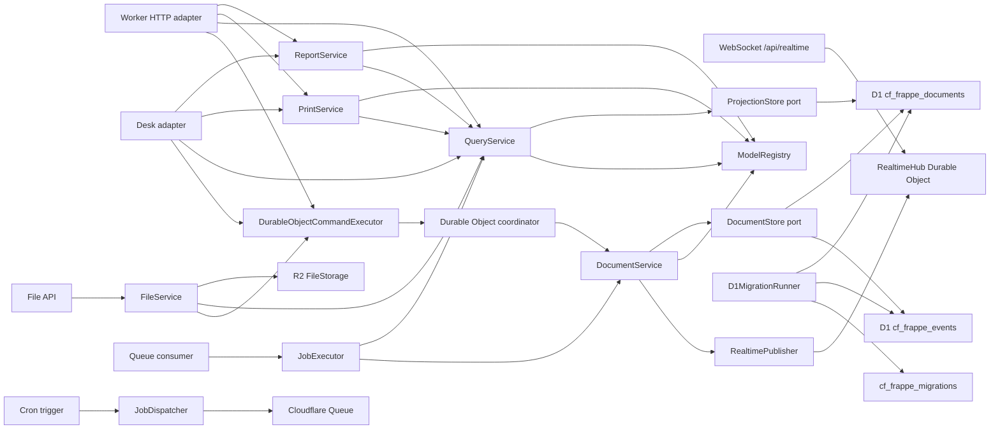

# cf-frappe

cf-frappe is an early Cloudflare-native application framework inspired by Frappe's metadata-driven model. It keeps the "define a DocType, get a useful app surface" idea, but makes event modeling and event sourcing the default instead of an afterthought.

The current slice is a working kernel:

- typed DocType metadata with fields, defaults, validation, naming, permissions, and workflows
- event-stream-backed naming series for human-readable document IDs
- metadata-defined link fields with event-stream referential integrity and generated lookup options
- metadata-defined child table fields validated from child DocType metadata
- first-class draft/submitted/cancelled document lifecycle events
- command-side document service that writes immutable events
- permissioned document timelines with field-level diffs, comments, and assignments derived from append-only event streams
- query-side projection service for current document reads and lists
- in-memory adapters for TDD
- Cloudflare D1 adapters for atomic event/projection commits
- Hono-powered resource API compatible with Workers
- Durable Object coordinator factory for serial per-aggregate command processing
- D1 schema migration planner/runner from DocType `indexes`
- generated Desk list/form UI from DocType metadata
- metadata-configured form sections, field order, and form column layout
- metadata-configured list columns, default filters, saved user filters, filter controls, and page size
- metadata-defined print formats with reusable letterheads, field sections, or HTML templates with escaped substitutions
- metadata-defined reports, summaries, and charts over current projections
- Cloudflare Queue/Cron background job primitives
- R2-backed file attachments with event-sourced `File` metadata
- Durable Object WebSocket realtime topics for document events
- a runnable `Task` example under `examples/todos`

## Why

Frappe is productive because DocTypes centralize schema, form metadata, permissions, and APIs. cf-frappe targets the same developer ergonomics on Cloudflare, but with platform-native primitives:

| Frappe concept | cf-frappe direction |
| --- | --- |
| DocType | `defineDocType(...)` metadata |
| Naming series | `naming: { kind: "series" }` with an internal event-stream counter |
| Link fields | registered `type: "link"` targets with write-time existence checks and lookup options |
| Child tables | registered `type: "table"` child DocTypes embedded in event-sourced document data |
| Document lifecycle | event-sourced create, update, submit, cancel, and delete commands |
| Audit trail | permissioned document timelines, field diffs, comments, and assignments from immutable events |
| Permissions | role and predicate rules attached to DocTypes |
| Hooks/controllers | pure hook contracts registered in `ModelRegistry` |
| REST resources | generated `/api/resource/:doctype` routes |
| Desk list/forms | generated `/desk` pages, list/form layouts, columns, saved filters, and filters from DocType metadata |
| Print formats | metadata-defined printable document pages, letterheads, and escaped templates |
| Reports | metadata-defined report columns, filters, summaries, charts, API, and Desk pages |
| Background jobs | `JobRegistry`, Queue producers/consumers, and Cron dispatch |
| File attachments | `File` DocType metadata plus R2 object storage |
| Realtime events | document commit events over Durable Object WebSocket topics |
| Database tables | D1 append-only events plus current projections |
| Migrations | metadata-planned D1 migrations with applied checksum journal |
| Concurrency boundary | Durable Object command coordinator per aggregate stream |

See [docs/frappe-assessment.md](docs/frappe-assessment.md) for the assessment and parity map.
See [docs/test-parity.md](docs/test-parity.md) for the current upstream Frappe test-count target.

## Quick Start

```bash
npm install
npm run check
```

Create the D1 database before deploying the example:

```bash
npx wrangler d1 create cf-frappe-dev
```

Copy the returned `database_id` into `wrangler.jsonc`, then apply the schema:

```bash
npm run d1:migrate:local
npm run dev
```

## Define A Model

```ts
import { createRegistry, defineDocType, definePrintFormat, defineReport, fileDocType } from "cf-frappe";

export const Project = defineDocType({
  name: "Project",
  naming: { kind: "field", field: "title" },
  fields: [{ name: "title", type: "text", required: true }],
  permissions: [
    { roles: ["User"], actions: ["read", "create", "update"] }
  ]
});

export const Task = defineDocType({
  name: "Task",
  naming: { kind: "field", field: "title" },
  fields: [
    { name: "title", type: "text", required: true, min: 3 },
    { name: "project", type: "link", linkTo: "Project", required: true },
    { name: "priority", type: "select", options: ["Low", "Medium", "High"], defaultValue: "Medium" },
    { name: "status", type: "select", options: ["Open", "Closed"], defaultValue: "Open" },
    { name: "description", type: "longText" }
  ],
  formView: {
    sections: [
      { heading: "Summary", columns: 1, fields: ["title", "project", "priority", "status"] },
      { heading: "Details", columns: 2, fields: ["description"] }
    ]
  },
  listView: {
    columns: ["title", "project", "priority", "status"],
    filterFields: ["title", "project", "priority", "status"],
    filters: [{ field: "status", value: "Open" }],
    pageSize: 25
  },
  indexes: [["project"], ["priority"], ["status"]],
  commands: [
    {
      name: "raisePriority",
      eventType: "TaskPriorityRaised",
      fields: ["priority"]
    }
  ],
  permissions: [
    { roles: ["User"], actions: ["read", "create", "update", "transition"] }
  ]
});

export const OpenTasks = defineReport({
  name: "Open Tasks",
  doctype: "Task",
  columns: [
    { name: "title", label: "Title" },
    { name: "priority", label: "Priority" }
  ],
  summaries: [
    { name: "task_count", label: "Tasks", aggregate: "count" }
  ],
  groups: [
    {
      name: "by_priority",
      label: "By Priority",
      field: "priority",
      summaries: [{ name: "task_count", label: "Tasks", aggregate: "count" }]
    }
  ],
  charts: [
    {
      name: "tasks_by_priority",
      label: "Tasks by Priority",
      type: "bar",
      group: "by_priority",
      summary: "task_count"
    }
  ],
  filters: [{ name: "priority", field: "priority", type: "select" }],
  roles: ["User"]
});

export const TaskPrint = definePrintFormat({
  name: "Task Standard",
  doctype: "Task",
  sections: [
    {
      heading: "Task",
      fields: [
        { field: "title", label: "Title" },
        { field: "priority", label: "Priority" }
      ]
    }
  ],
  roles: ["User"]
});

export const registry = createRegistry({
  doctypes: [Project, Task, fileDocType],
  printFormats: [TaskPrint],
  reports: [OpenTasks]
});
```

## Expose It On Workers

```ts
import { createAggregateCoordinatorClass, createCloudFrappeWorker } from "cf-frappe";
import { registry } from "./models";

export class AggregateCoordinator extends createAggregateCoordinatorClass({ registry }) {}

export default createCloudFrappeWorker({
  registry,
  actor: yourTrustedActorResolver
});
```

The generated API includes:

- `GET /health`
- `GET /api/meta/doctypes`
- `GET /api/meta/doctypes/:doctype`
- `GET /api/meta/print-formats`
- `GET /api/meta/print-formats/:format`
- `GET /api/meta/reports`
- `GET /api/meta/reports/:report`
- `GET /api/print/:format/:name`
- `GET /api/report/:report/run`
- `GET /api/report/:report/export.csv`
- `GET /api/link-options/:doctype/:field`
- `POST /api/resource/:doctype`
- `GET /api/resource/:doctype`
- `GET /api/resource/:doctype/saved-filters`
- `GET /api/resource/:doctype/:name`
- `GET /api/resource/:doctype/:name/timeline`
- `GET /api/resource/:doctype/:name/assignments`
- `PUT /api/resource/:doctype/:name`
- `POST /api/resource/:doctype/:name/comments`
- `POST /api/resource/:doctype/saved-filters`
- `POST /api/resource/:doctype/:name/assignments`
- `POST /api/resource/:doctype/:name/submit`
- `POST /api/resource/:doctype/:name/cancel`
- `POST /api/resource/:doctype/:name/transition/:action`
- `POST /api/resource/:doctype/:name/command/:command`
- `DELETE /api/resource/:doctype/:name/assignments/:assignee`
- `DELETE /api/resource/:doctype/saved-filters/:filterId`
- `DELETE /api/resource/:doctype/:name`

When file support is enabled, the generated API also includes:

- `POST /api/files`
- `GET /api/files/:name/content`
- `DELETE /api/files/:name`

The generated Desk UI includes:

- `GET /desk`
- `GET /desk/print/:format/:name`
- `GET /desk/reports`
- `GET /desk/reports/:report`
- `GET /desk/reports/:report/export.csv`
- `GET /desk/:doctype`
- `GET /desk/:doctype/new`
- `POST /desk/:doctype`
- `GET /desk/:doctype/:name`
- `POST /desk/:doctype/:name`
- `POST /desk/:doctype/:name/submit`
- `POST /desk/:doctype/:name/cancel`
- `POST /desk/:doctype/:name/command/:command`

Generate and review D1 migrations from metadata:

```ts
import { planD1Migrations, renderD1Migrations } from "cf-frappe";
import { registry } from "./models";

const migrations = planD1Migrations(registry.list());
const sql = renderD1Migrations(migrations);
```

Apply pending D1 migrations from a trusted admin route, deployment task, or CI script:

```ts
import { D1MigrationRunner, planD1Migrations, type CloudFrappeEnv } from "cf-frappe";
import { registry } from "./models";

export async function migrate(env: CloudFrappeEnv) {
  const runner = new D1MigrationRunner(env.DB);
  return runner.apply(planD1Migrations(registry.list()));
}
```

No actor resolver is installed by default. Production apps must pass a trusted resolver that derives the actor from a verified session, Access JWT, API token, or another authenticated source.

The checked-in Wrangler demo uses a read-only guest actor. For local demos only, `unsafeHeaderActorResolver` reads caller-controlled headers:

- `x-cf-frappe-user`
- `x-cf-frappe-roles`
- `x-cf-frappe-tenant`
- `x-cf-frappe-email`

## Naming Strategies

DocTypes can choose how document names are assigned:

```ts
export const Ticket = defineDocType({
  name: "Support Ticket",
  naming: { kind: "series", pattern: "TICK-.####" },
  fields: [{ name: "subject", type: "text", required: true }],
  permissions: [{ roles: ["User"], actions: ["read", "create", "update"] }]
});
```

`field` and `provided` strategies use caller data, while `uuid` uses the configured id generator. A `series` strategy advances an internal `__NamingSeries` event stream per tenant, DocType, and pattern before the document create event is written. Explicit `name` values are rejected for series-named DocTypes so metadata remains the naming authority. That keeps the counter independent of projections; Cloudflare Durable Object command routing sends series creates through one shared aggregate key for the pattern, and direct D1 commits still use stream expected-version checks and retry on counter conflicts.

## Resource Lists

Resource list views are model metadata. `listView.columns` controls generated table columns, `listView.filterFields` controls Desk filter inputs, `listView.filters` provides default filters for generated list surfaces, and `listView.pageSize` controls the default page size. Field-level `inListView` and `inListFilter` flags are available when a DocType prefers local field annotations over an explicit `listView` block.

Generated resource and Desk list pages call `QueryService.listDocumentsForView(...)`, which applies the DocType list-view defaults. URL filters replace defaults for the same field, so `filter_status=Closed` can override a default `status=Open`; `default_filters=0` disables default filters entirely. Internal scans such as reports use `QueryService.listDocuments(...)`, so list-view defaults do not accidentally hide documents from application services.

Resource list filters are parsed from query strings, validated against DocType metadata by `QueryService`, coerced to field types, and then executed by the active projection adapter. Unknown fields, JSON fields, bad numeric/boolean values, and unsupported boolean operators fail as `BAD_REQUEST`.

HTTP and Desk list pages share the same query shape:

- `filter_priority=High`
- `filter_title__contains=launch`
- `filter_count__gte=2`
- `filter_count__lte=10`

The D1 adapter builds filtered row and count queries with prepared statements, so filter values are bound parameters rather than interpolated SQL.

## Link Fields

Link fields declare relationships in DocType metadata:

```ts
{ name: "project", type: "link", linkTo: "Project", required: true }
```

`defineDocType(...)` requires every link field to name a target, and `ModelRegistry` verifies that the target DocType is registered. On create, update, and model-declared domain commands, `DocumentService` folds the target document's event stream and rejects missing, deleted, or unreadable targets with `VALIDATION_FAILED` / `link_not_found`. Projection state is not used as write authority for link integrity.

Generated clients can call `QueryService.listLinkOptions(...)` or `GET /api/link-options/:doctype/:field?q=apollo&limit=20` to retrieve readable target documents as `{ value, label }` options. Desk forms render visible link fields as select controls populated from the same query boundary.

## Child Tables

Child tables use regular DocType metadata for each row shape, then embed rows in the parent document's event payload and projection:

```ts
export const SalesInvoiceItem = defineDocType({
  name: "Sales Invoice Item",
  fields: [
    { name: "product", type: "link", linkTo: "Product", required: true },
    { name: "quantity", type: "integer", required: true, min: 1 },
    { name: "rate", type: "number", min: 0 }
  ]
});

export const SalesInvoice = defineDocType({
  name: "Sales Invoice",
  fields: [
    { name: "title", type: "text", required: true },
    { name: "items", type: "table", tableOf: "Sales Invoice Item", required: true }
  ],
  formView: {
    sections: [{ heading: "Invoice", columns: 1, fields: ["title", "items"] }]
  }
});

export const registry = createRegistry({
  doctypes: [Product, SalesInvoiceItem, SalesInvoice]
});
```

`ModelRegistry` verifies `tableOf` targets, `DocumentService` validates each child row through the child DocType schema, and nested link fields inside child rows use the same event-stream existence and read-permission checks as top-level links. Table fields are intentionally excluded from list filters and D1 projection indexes because they are row arrays rather than scalar keys.

Desk forms render visible table fields as editable row grids. Existing rows are rendered with one blank row for appending; blank rows are ignored on submit, while partially filled rows are validated at the command boundary. Child DocTypes can be embedded-only; nested link options are authorized through the readable parent form and still require read access to the linked target DocType.

HTTP resource updates treat a table field as a whole-array replacement. Desk includes the exported `CHILD_TABLE_ROW_INDEX_FIELD` marker on existing rows so the command service can preserve omitted read-only child values from the correct original row, then strips the marker before validation, events, and projections. Non-Desk clients that need that preservation must send a unique, in-range marker for each retained row or submit complete row data; without a marker, omitted read-only child values are not guessed because deletes and reorders would otherwise risk copying protected values onto the wrong row.

## Document Lifecycle

Every document starts as `draft`. `DocumentService.submit(...)` appends a `DocumentSubmitted` event and moves the projection to `submitted`; `DocumentService.cancel(...)` appends `DocumentCancelled` and moves it to `cancelled`. Submit is allowed only from draft, cancel only from submitted, and update/workflow/domain-command mutations are draft-only in this slice. Deleting a submitted document is rejected until it is cancelled, keeping lifecycle rules in the command boundary instead of the query projection.

HTTP clients can call `/api/resource/:doctype/:name/submit` and `/api/resource/:doctype/:name/cancel` with optional `expectedVersion`. Desk edit forms render the allowed lifecycle action for the current actor and document status.

## Document Timelines

`DocumentHistoryService` reads a document's authoritative event stream after `QueryService.getDocument(...)` confirms the current actor can read the document. That keeps the timeline event-sourced while preserving the same DocType read rules as normal resource reads.

HTTP clients can call `/api/resource/:doctype/:name/timeline` to get ordered timeline entries with event sequence, type, kind, actor, timestamp, summary, field-level `changes`, payload, and metadata. The endpoint defaults to the latest 50 entries, accepts `limit`, and returns `nextBeforeSequence` for older pages that can be requested with `before_sequence`. Diffs are folded from the immutable event stream, including a bounded baseline before a paged slice, so older pages keep accurate old/new values without unbounded stream reads. Desk edit forms render the latest 25 entries and concise field diffs below the generated form when history is enabled.

Comments are document stream events rather than side records. `DocumentService.comment(...)` and `POST /api/resource/:doctype/:name/comments` append `DocumentCommentAdded`, advance the document version, and leave document data/status unchanged. Desk renders a comment form in the timeline panel for actors with the DocType `comment` permission.

Assignments are also document stream events. `DocumentService.assign(...)`, `DocumentService.unassign(...)`, and the assignment API routes append `DocumentAssigned`/`DocumentUnassigned`, advance the version only when the assignment set changes, and leave document data/status unchanged. `DocumentHistoryService.getAssignments(...)` folds the authorized stream into the current assignee list, and Desk renders assignment controls in the timeline panel for actors with the DocType `assign` permission.

## Desk Forms

Form layouts are also DocType metadata. `formView.sections` controls generated Desk form grouping, field order, section headings, and one- or two-column field grids. If a DocType omits `formView`, Desk falls back to visible fields in metadata order; field-level `inFormView` is available for small DocTypes that prefer local annotations.

`defineDocType(...)` validates form sections up front. Unknown fields, hidden fields, duplicate section fields, empty sections, and invalid column counts fail with `FORM_VIEW_INVALID`. Command validation still belongs to `DocumentService`, so form layout changes do not alter event creation, permissions, or field validation.

## Reports

Reports are metadata registered beside DocTypes. `ReportService` executes them through `QueryService`, so DocType read permissions and report role restrictions are both applied before rows and summaries are returned.

```ts
const result = await services.reports.runReport(actor, "Open Tasks", {
  filters: { priority: "High" },
  limit: 50
});
```

HTTP clients can call `/api/report/Open%20Tasks/run?filter_priority=High`, or `/api/report/Open%20Tasks/export.csv?filter_priority=High` for a filtered CSV export. Desk renders the same report at `/desk/reports/Open%20Tasks` and exposes the CSV export beside the report filters. Report metadata can declare top-level summaries, grouped summaries, and charts backed by grouped summary metrics, all computed over the filtered result set before pagination. This report slice is projection-backed and read-only; richer chart controls and custom query adapters are future report layers over the same service boundary.

## Saved List Filters

`SavedListFilterService` stores per-user list filters as append-only events in a tenant/DocType/owner stream, validates every saved filter against the DocType list-filter metadata, and folds the stream into the current saved-filter list. The generated resource API exposes `GET`, `POST`, and `DELETE` routes under `/api/resource/:doctype/saved-filters`, and `/api/resource/:doctype?saved_filter=<id>` applies a saved filter through the normal `QueryService.listDocumentsForView(...)` path.

Desk list pages render saved filter links, a save-filter control attached to the generated filter form, and delete controls for the current actor's saved filters. URL filters still override saved filters field-by-field, so a saved filter can be refined without creating a second query pipeline.

## Print Formats

Print formats are metadata registered beside DocTypes. `PrintService` reads the current projection through `QueryService`, so DocType read permissions and print-format role restrictions are both enforced before printable HTML is produced.

```ts
const printable = await services.prints.printDocument(actor, "Task Standard", "TASK-1");
```

Print formats can reference reusable trusted letterhead header/footer HTML, then either declare field sections or a trusted HTML template with escaped `{{ doc.field }}`, `{{ doc.name }}`, and `{{ format.label }}` substitutions. HTTP clients can call `/api/print/Task%20Standard/TASK-1`. Desk exposes the same printable page at `/desk/print/Task%20Standard/TASK-1` and links available print formats from generated edit forms. PDF generation, print settings, and report printouts are future layers over the same view-model boundary.

## Background Jobs

Jobs are registered separately from DocTypes, then dispatched through a `JobQueue` port. On Cloudflare, `CloudflareJobQueue` wraps a Queue binding and the Worker factory can expose both `queue(...)` and `scheduled(...)` handlers.

```ts
import {
  CloudflareJobQueue,
  createAggregateCoordinatorClass,
  createCloudFrappeWorker,
  createJobRegistry,
  type CloudFrappeEnv,
  type CloudFrappeRuntimeServices,
  type JobMessage
} from "cf-frappe";
import { registry } from "./models";

interface Env extends CloudFrappeEnv {
  readonly JOBS: Queue<JobMessage>;
}

const jobs = createJobRegistry<CloudFrappeRuntimeServices>({
  jobs: [
    {
      name: "task.digest",
      handler: async ({ resources }) => {
        const actor = { id: "jobs", roles: ["System Manager"], tenantId: "default" };
        const tasks = await resources.queries.listDocuments(actor, "Task");
        console.log("Digest task count", tasks.data.length);
      }
    }
  ]
});

export class AggregateCoordinator extends createAggregateCoordinatorClass({ registry }) {}

export default createCloudFrappeWorker<Env>({
  registry,
  actor: yourTrustedActorResolver,
  jobs: {
    registry: jobs,
    queue: (env) => new CloudflareJobQueue(env.JOBS),
    schedules: [{ cron: "0 2 * * *", jobName: "task.digest" }]
  }
});
```

Queue consumers process each message independently: malformed messages and permanent failures are acknowledged, retryable failures use backoff, and job contexts carry an idempotency key. For production, create the Queue with Wrangler and add producer/consumer bindings plus UTC Cron triggers in `wrangler.jsonc`.

## File Attachments

File bytes live in a `FileStorage` port; file metadata is a regular event-sourced `File` document. On Cloudflare, `R2FileStorage` stores bytes in R2 while `DocumentService` records filename, object key, size, content type, attachment target, uploader, privacy, and ETag.

```ts
import {
  R2FileStorage,
  createAggregateCoordinatorClass,
  createCloudFrappeWorker,
  type CloudFrappeEnv
} from "cf-frappe";
import { registry } from "./models";

interface Env extends CloudFrappeEnv {
  readonly FILES: R2Bucket;
}

export class AggregateCoordinator extends createAggregateCoordinatorClass({ registry }) {}

export default createCloudFrappeWorker<Env>({
  registry,
  actor: yourTrustedActorResolver,
  files: {
    storage: (env) => new R2FileStorage(env.FILES),
    maxFileBytes: 25 * 1024 * 1024
  }
});
```

Register `fileDocType` with your app registry, then bind R2 in `wrangler.jsonc`:

```jsonc
{
  "r2_buckets": [
    {
      "binding": "FILES",
      "bucket_name": "cf-frappe-files"
    }
  ]
}
```

Uploads are buffered in this first slice so the framework always knows the object length before writing to R2. Multipart uploads and presigned direct browser uploads are intentionally left as future adapters over the same `FileStorage` boundary.

## Realtime

Realtime is modeled as a port over event-sourced commits. `DocumentService` publishes after-commit events, and the Cloudflare adapter delivers them through one Durable Object hub per topic.

```ts
import {
  DurableObjectRealtimePublisher,
  createAggregateCoordinatorClass,
  createCloudFrappeWorker,
  createRealtimeHubClass,
  type CloudFrappeEnv,
  type RealtimeHubNamespace
} from "cf-frappe";
import { registry } from "./models";

interface Env extends CloudFrappeEnv {
  readonly REALTIME: RealtimeHubNamespace;
}

export class AggregateCoordinator extends createAggregateCoordinatorClass<Env>({
  registry,
  realtime: (env) => new DurableObjectRealtimePublisher(env.REALTIME)
}) {}

export class RealtimeHub extends createRealtimeHubClass() {}

export default createCloudFrappeWorker<Env>({
  registry,
  actor: yourTrustedActorResolver,
  realtime: {
    namespace: (env) => env.REALTIME
  }
});
```

Clients subscribe with a WebSocket upgrade to `/api/realtime?topic=...`. Built-in topic helpers create tenant, DocType, and document topics such as `tenant:acme`, `doctype:acme:Task`, and `document:acme:Task:TASK-1`. This slice exposes document-topic subscriptions only after `QueryService.getDocument(...)` confirms the actor can read the document; broader tenant/DocType filtered fan-out is future work.

Bind the realtime hub in `wrangler.jsonc`:

```jsonc
{
  "durable_objects": {
    "bindings": [
      {
        "name": "AGGREGATES",
        "class_name": "AggregateCoordinator"
      },
      {
        "name": "REALTIME",
        "class_name": "RealtimeHub"
      }
    ]
  },
  "migrations": [
    {
      "tag": "v1",
      "new_sqlite_classes": ["AggregateCoordinator", "RealtimeHub"]
    }
  ]
}
```

## Architecture



The dependency direction is one way:

- `core` has pure types, schema validation, event folding, permissions, and registry contracts
- `application` orchestrates commands, queries, document history, print views, reports, files, realtime, and job execution through ports
- `ports` define document storage, projections, file storage, realtime publishing, queues, execution logs, clocks, and id generation
- `adapters` implement in-memory, D1 stores/migrations, HTTP, Desk, R2, realtime, and Cloudflare integration
- `cloudflare` packages Worker and Durable Object factories

## Quality Gate

Current local gate:

```bash
npm run check
```

This runs:

- TypeScript strict typecheck
- Vitest unit/API tests
- declaration build

Current suite: 249 tests across schema, permissions, events, registry, services, naming series, document lifecycle, document timelines and diffs, comments, assignments, saved user filters, metadata-configured form/list views, child table validation, metadata-validated list filters, print formats, print templates, print letterheads, reports, report summaries, report charts, report exports, jobs, files, realtime, D1/in-memory adapters, HTTP API, generated Desk UI, Durable Object command routing, Worker routing, WebSocket topic routing, Queue/Cron/R2 integration, and D1 schema planning/migration application.

## Status

This is not Frappe parity yet. Basic generated Desk list/form/report/print pages, permissioned document timelines with field diffs, comments, assignments, saved user filters, metadata-configured form and list views, metadata-planned D1 migrations, Cloudflare-native background job primitives, R2-backed file attachments, report charts/exports, custom print templates, reusable letterheads, and Durable Object realtime topics exist, but richer chart controls, durable job dashboards, richer realtime presence, auth integrations, advanced file workflows, app installation, client scripting, and a compatibility-sized test suite remain open. The current implementation is the event-sourced Cloudflare kernel needed to grow those surfaces without rewiring the foundation.

## References

- [Frappe DocTypes](https://docs.frappe.io/framework/user/en/basics/doctypes)
- [Frappe REST API](https://docs.frappe.io/framework/user/en/api/rest)
- [Frappe Hooks](https://docs.frappe.io/framework/user/en/python-api/hooks)
- [Frappe Users and Permissions](https://docs.frappe.io/framework/user/en/basics/users-and-permissions)
- [Cloudflare Workers](https://developers.cloudflare.com/workers/)
- [Cloudflare D1](https://developers.cloudflare.com/d1/)
- [Cloudflare Durable Objects](https://developers.cloudflare.com/durable-objects/)
- [Cloudflare Durable Objects WebSockets](https://developers.cloudflare.com/durable-objects/best-practices/websockets/)
- [Cloudflare Queues](https://developers.cloudflare.com/queues/)
- [Cloudflare Cron Triggers](https://developers.cloudflare.com/workers/configuration/cron-triggers/)
- [Cloudflare R2](https://developers.cloudflare.com/r2/)
