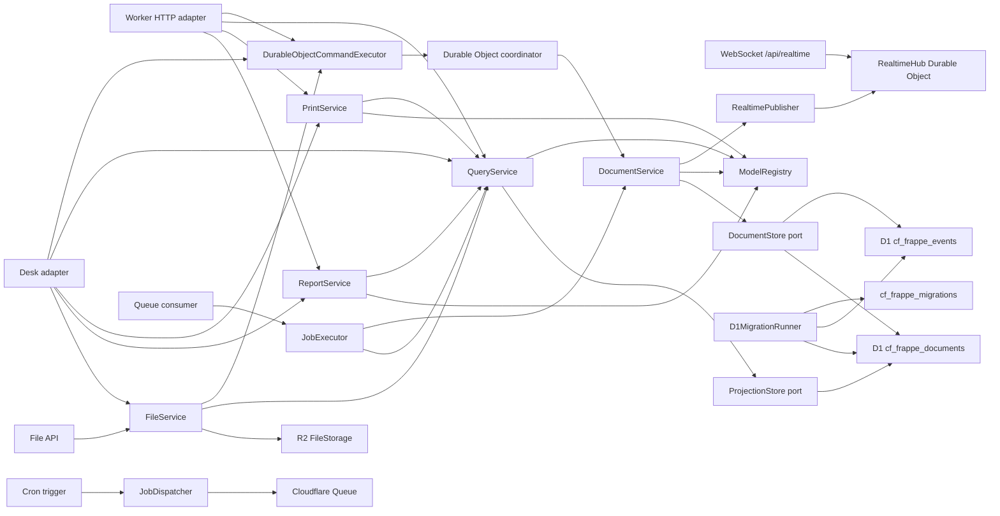

# cf-frappe

cf-frappe is an early Cloudflare-native application framework inspired by Frappe's metadata-driven model. It keeps the "define a DocType, get a useful app surface" idea, but makes event modeling and event sourcing the default instead of an afterthought.

The current slice is a working kernel:

- typed DocType metadata with fields, defaults, validation, naming, permissions, and workflows
- event-stream-backed naming series for human-readable document IDs
- metadata-defined link fields with event-stream referential integrity and generated lookup options
- metadata-defined child table fields validated from child DocType metadata
- event-sourced user permissions for linked-record read/write restrictions
- first-class draft/submitted/cancelled document lifecycle events
- command-side document service that writes immutable events
- permissioned document timelines with field-level diffs, comments, assignments, tags, and followers derived from append-only event streams
- admin-only audit search over immutable event streams
- query-side projection service for current document reads and lists
- in-memory adapters for TDD
- Cloudflare D1 adapters for atomic event/projection commits
- Hono-powered resource API compatible with Workers
- Durable Object coordinator factory for serial per-aggregate command processing
- D1 schema migration planner/runner from DocType `indexes`
- generated Desk list/form UI from DocType metadata
- metadata-configured form sections, field order, and form column layout
- metadata-configured list columns, default filters, saved user filters, operator-aware filter controls, filter-builder metadata, and page size
- metadata-defined print formats with reusable letterheads, field sections, or HTML templates with escaped substitutions
- metadata-defined reports with typed filters, row ordering, summaries, and ordered/colored charts over current projections
- event-sourced saved report definitions for per-user report-builder presets with generated HTTP and Desk report-builder APIs
- event-sourced tenant role catalog with generated HTTP and Desk administration
- event-sourced user accounts with optional role-catalog validation, Web Crypto password hashing, signed-cookie login/logout/me APIs, recovery-token flows, separate user profile streams, and generated Desk administration
- metadata-defined same-origin client scripts with a built-in Desk browser API
- Cloudflare Queue/Cron background job primitives
- R2-backed file attachments with event-sourced `File` metadata and Desk file manager workflows
- Durable Object WebSocket realtime topics for tenant, DocType, document, redacted per-user notifications, basic presence snapshots, and bounded durable replay
- composable app manifests for packaging DocTypes, reports, print formats, and hooks
- installable `cf-frappe init` starter scaffold plus `cf-frappe install` dependency metadata and app-registry wiring for new Cloudflare apps
- a runnable `Task` example under `examples/todos`

## Why

Frappe is productive because DocTypes centralize schema, form metadata, permissions, and APIs. cf-frappe targets the same developer ergonomics on Cloudflare, but with platform-native primitives:

| Frappe concept | cf-frappe direction |
| --- | --- |
| DocType | `defineDocType(...)` metadata |
| Naming series | `naming: { kind: "series" }` with an internal event-stream counter |
| Link fields | registered `type: "link"` targets with write-time existence checks and lookup options |
| Child tables | registered `type: "table"` child DocTypes embedded in event-sourced document data |
| Document lifecycle | event-sourced create, update, submit, cancel, and delete commands |
| Audit trail | permissioned timelines, field diffs, comments, assignments, tags, followers, and admin audit search from immutable events |
| Permissions | role and predicate rules attached to DocTypes plus event-sourced linked-record user permissions |
| Hooks/controllers | pure hook contracts registered in `ModelRegistry` |
| REST resources | generated `/api/resource/:doctype` routes |
| Desk list/forms | generated `/desk` pages, list/form layouts, columns, saved filters, and filters from DocType metadata |
| Print formats | metadata-defined printable document pages, letterheads, and escaped templates |
| Reports | metadata-defined report columns, typed filters, row ordering, summaries, ordered/colored charts, saved definitions, HTTP/Desk report-builder APIs, and Desk pages |
| Users/login | event-sourced account/profile streams, PBKDF2 password hashing, signed-cookie auth routes, and recovery tokens |
| Client scripts | `defineClientScript(...)` browser bundles attached to Desk list/form pages |
| Background jobs | `JobRegistry`, Queue producers/consumers, and Cron dispatch |
| File attachments | `File` DocType metadata plus R2 object storage and generated Desk file manager |
| Realtime events | document commit events, basic presence, and bounded replay over Durable Object WebSocket topics |
| Database tables | D1 append-only events plus current projections |
| Migrations | metadata-planned D1 migrations with applied checksum journal |
| Concurrency boundary | Durable Object command coordinator per aggregate stream |
| Apps | `defineApp(...)` manifests composed through `createRegistryFromApps(...)` |
| App starter | `cf-frappe init` scaffold with Worker, D1, Durable Object, signed-session wiring, and `cf-frappe install` dependency/registry wiring |

See [docs/frappe-assessment.md](docs/frappe-assessment.md) for the assessment and parity map.
See [docs/test-parity.md](docs/test-parity.md) for the current upstream Frappe test-count target.

## Quick Start

Create a new app:

```bash
npx cf-frappe init my-app
cd my-app
npm install
cp .dev.vars.example .dev.vars
npm run cf:types
npm run d1:migrate:local
npm run dev
```

Work on this repository:

```bash
npm install
npm run check
```

Create the D1 database before deploying the example:

```bash
npx wrangler d1 create cf-frappe-dev
```

Copy the returned `database_id` into `wrangler.jsonc`, then apply the schema:

```bash
npm run d1:migrate:local
npm run dev
```

## Define A Model

```ts
import { createRegistryFromApps, defineApp, defineClientScript, defineDocType, definePrintFormat, defineReport, fileDocType } from "cf-frappe";

export const Project = defineDocType({
  name: "Project",
  naming: { kind: "field", field: "title" },
  fields: [{ name: "title", type: "text", required: true }],
  permissions: [
    { roles: ["User"], actions: ["read", "create", "update"] }
  ]
});

export const Task = defineDocType({
  name: "Task",
  naming: { kind: "field", field: "title" },
  fields: [
    { name: "title", type: "text", required: true, min: 3 },
    { name: "project", type: "link", linkTo: "Project", required: true },
    { name: "priority", type: "select", options: ["Low", "Medium", "High"], defaultValue: "Medium" },
    { name: "status", type: "select", options: ["Open", "Closed"], defaultValue: "Open" },
    { name: "description", type: "longText" }
  ],
  formView: {
    sections: [
      { heading: "Summary", columns: 1, fields: ["title", "project", "priority", "status"] },
      { heading: "Details", columns: 2, fields: ["description"] }
    ]
  },
  listView: {
    columns: ["title", "project", "priority", "status"],
    filterFields: ["title", "project", "priority", "status"],
    filters: [{ field: "status", value: "Open" }],
    pageSize: 25
  },
  indexes: [["project"], ["priority"], ["status"]],
  commands: [
    {
      name: "raisePriority",
      eventType: "TaskPriorityRaised",
      fields: ["priority"]
    }
  ],
  permissions: [
    { roles: ["User"], actions: ["read", "create", "update", "transition"] }
  ]
});

export const OpenTasks = defineReport({
  name: "Open Tasks",
  doctype: "Task",
  columns: [
    { name: "title", label: "Title" },
    { name: "priority", label: "Priority" }
  ],
  summaries: [
    { name: "task_count", label: "Tasks", aggregate: "count" }
  ],
  groups: [
    {
      name: "by_priority",
      label: "By Priority",
      field: "priority",
      summaries: [{ name: "task_count", label: "Tasks", aggregate: "count" }]
    }
  ],
  charts: [
    {
      name: "tasks_by_priority",
      label: "Tasks by Priority",
      type: "bar",
      group: "by_priority",
      summary: "task_count"
    }
  ],
  filters: [{ name: "priority", field: "priority", type: "select" }],
  roles: ["User"]
});

export const TaskPrint = definePrintFormat({
  name: "Task Standard",
  doctype: "Task",
  sections: [
    {
      heading: "Task",
      fields: [
        { field: "title", label: "Title" },
        { field: "priority", label: "Priority" }
      ]
    }
  ],
  roles: ["User"]
});

export const TaskFormScript = defineClientScript({
  name: "task-form",
  doctype: "Task",
  src: "/assets/task-form.js",
  scope: "form"
});

export const projectApp = defineApp({
  name: "projects",
  label: "Projects",
  version: "1.0.0",
  modules: ["Projects"],
  doctypes: [Project, Task, fileDocType],
  printFormats: [TaskPrint],
  reports: [OpenTasks],
  clientScripts: [TaskFormScript]
});

export const registry = createRegistryFromApps([projectApp]);
```

Generated Desk list and form pages load `/desk/client.js` before model-declared client scripts. That runtime exposes `window.cfFrappe` helpers for same-origin metadata, resolved list-view/filter-builder metadata, resource, report, link-option, command, workflow, lifecycle, form-event, field-control, user-feedback, and parsed realtime subscription calls, so browser scripts can stay small and use the same permissioned HTTP/event boundaries as the server-rendered UI. Client form hooks and field controls are ergonomic only; authoritative validation and writes still live in server-side DocType, permission, and command handlers.

```js
window.cfFrappe.form.on("Task", {
  refresh(frm) {
    if (!frm.docname || frm.taskRealtime) return;
    window.cfFrappe.resource.get(frm.doctype, frm.docname).then((doc) => {
      frm.taskRealtime = window.cfFrappe.realtime.subscribeDocument(frm.doctype, doc.name, {
        event(event) {
          if (event.type === "TaskUpdated") frm.refresh();
        }
      }, {
        tenantId: doc.tenantId
      });
    });
  },
  title(frm) {
    console.debug("Task title changed", frm.get_value("title"));
  },
  validate(frm) {
    if (!frm.get_value("title")) {
      frm.validated = false;
    }
  }
});
```

`validate` and `before_save` hooks are synchronous client-side guards for the generated Save action only. Workflow transitions, lifecycle actions, and domain commands keep their own server-side command boundaries; asynchronous checks should update local form state before Save or run through the same-origin resource APIs explicitly.

Apps can depend on other apps, and dependency order controls hook order while still letting cross-app DocType links resolve in one registry:

```ts
const crm = defineApp({ name: "crm", doctypes: [Customer] });
const sales = defineApp({ name: "sales", dependencies: ["crm"], doctypes: [Invoice] });

export const registry = createRegistryFromApps([sales, crm]);
```

## Expose It On Workers

```ts
import { createAggregateCoordinatorClass, createCloudFrappeWorker } from "cf-frappe";
import { registry } from "./models";

export class AggregateCoordinator extends createAggregateCoordinatorClass({ registry }) {}

export default createCloudFrappeWorker({
  registry,
  actor: yourTrustedActorResolver
});
```

The generated API includes:

- `GET /health`
- `GET /api/meta/doctypes`
- `GET /api/meta/doctypes/:doctype`
- `GET /api/meta/print-formats`
- `GET /api/meta/print-formats/:format`
- `GET /api/meta/reports`
- `GET /api/meta/reports/:report`
- `GET /api/print/:format/:name`
- `GET /api/report/:report/run`
- `GET /api/report/:report/export.csv`
- `GET /api/report-builder/:doctype`
- `POST /api/report-builder/:doctype`
- `GET /api/report-builder/:doctype/:id`
- `PUT /api/report-builder/:doctype/:id`
- `DELETE /api/report-builder/:doctype/:id`
- `GET /api/report-builder/:doctype/:id/run`
- `GET /api/report-builder/:doctype/:id/export.csv`
- `GET /api/link-options/:doctype/:field`
- `GET /api/audit/events`
- `GET /api/audit/deleted/:doctype/:name`
- `POST /api/resource/:doctype`
- `GET /api/resource/:doctype`
- `GET /api/resource/:doctype/saved-filters`
- `GET /api/resource/:doctype/:name`
- `GET /api/resource/:doctype/:name/timeline`
- `GET /api/resource/:doctype/:name/assignments`
- `GET /api/resource/:doctype/:name/tags`
- `GET /api/resource/:doctype/:name/followers`
- `PUT /api/resource/:doctype/:name`
- `POST /api/resource/:doctype/:name/comments`
- `POST /api/resource/:doctype/:name/activities`
- `POST /api/resource/:doctype/saved-filters`
- `POST /api/resource/:doctype/:name/assignments`
- `POST /api/resource/:doctype/:name/tags`
- `POST /api/resource/:doctype/:name/followers`
- `POST /api/resource/:doctype/:name/submit`
- `POST /api/resource/:doctype/:name/cancel`
- `POST /api/resource/:doctype/:name/transition/:action`
- `POST /api/resource/:doctype/:name/command/:command`
- `DELETE /api/resource/:doctype/:name/assignments/:assignee`
- `DELETE /api/resource/:doctype/:name/tags/:tag`
- `DELETE /api/resource/:doctype/:name/followers/:follower`
- `DELETE /api/resource/:doctype/saved-filters/:filterId`
- `DELETE /api/resource/:doctype/:name`

When file support is enabled, the generated API also includes:

- `POST /api/files`
- `GET /api/files/:name/content`
- `DELETE /api/files/:name`

The generated Desk UI includes:

- `GET /desk/files`
- `POST /desk/files`
- `GET /desk/files/:name/content`
- `POST /desk/files/:name/delete`
- `GET /desk`
- `GET /desk/print/:format/:name`
- `GET /desk/reports`
- `GET /desk/reports/:report`
- `GET /desk/reports/:report/export.csv`
- `GET /desk/report-builder/:doctype`
- `POST /desk/report-builder/:doctype`
- `GET /desk/report-builder/:doctype/:id`
- `GET /desk/report-builder/:doctype/:id/export.csv`
- `POST /desk/report-builder/:doctype/:id/delete`
- `GET /desk/:doctype`
- `GET /desk/:doctype/new`
- `POST /desk/:doctype`
- `GET /desk/:doctype/:name`
- `POST /desk/:doctype/:name`
- `POST /desk/:doctype/:name/submit`
- `POST /desk/:doctype/:name/cancel`
- `POST /desk/:doctype/:name/command/:command`

Generate and review D1 migrations from metadata:

```ts
import { planD1Migrations, renderD1Migrations } from "cf-frappe";
import { registry } from "./models";

const migrations = planD1Migrations(registry.list());
const sql = renderD1Migrations(migrations);
```

Apply pending D1 migrations from a trusted admin route, deployment task, or CI script:

```ts
import { D1MigrationRunner, planD1Migrations, type CloudFrappeEnv } from "cf-frappe";
import { registry } from "./models";

export async function migrate(env: CloudFrappeEnv) {
  const runner = new D1MigrationRunner(env.DB);
  return runner.apply(planD1Migrations(registry.list()));
}
```

Production apps choose an actor resolver. For cookie-based apps, `signedSessionActorResolver(...)` verifies an HttpOnly HMAC-signed session cookie with Web Crypto, checks expiry, and returns the signed actor. `createSignedSessionCookie(...)` and `clearSignedSessionCookie(...)` issue and clear those cookies without introducing a server-side session projection.

```ts
import { createCloudFrappeWorker, signedSessionActorResolver, type CloudFrappeEnv } from "cf-frappe";

interface Env extends CloudFrappeEnv {
  readonly SESSION_SECRET: string;
}

export default createCloudFrappeWorker<Env>({
  registry,
  actor: (request, env) =>
    signedSessionActorResolver({
      secret: env.SESSION_SECRET,
      fallback: () => ({ id: "guest", roles: ["Guest"], tenantId: "default" })
    })(request)
});
```

Apps that want framework-owned login can also pass `auth` to `createCloudFrappeWorker(...)`. That mounts `/api/auth/login`, `/api/auth/logout`, `/api/auth/me`, password-reset/email-verification routes, and `/api/users/:userId` account-management routes, backed by per-user `__UserAccounts` event streams and a Web Crypto PBKDF2 password hasher. The `actor` resolver remains explicit so apps can use the same signed cookie resolver, Cloudflare Access JWTs, API tokens, or another authenticated source.

```ts
export default createCloudFrappeWorker<Env>({
  registry,
  actor: (request, env) =>
    signedSessionActorResolver({
      secret: env.SESSION_SECRET,
      fallback: () => ({ id: "guest", roles: ["Guest"], tenantId: "default" })
    })(request),
  auth: {
    sessionSecret: (env) => env.SESSION_SECRET,
    sessionMaxAgeSeconds: 60 * 60 * 8,
    revalidateSignedSessions: true
  }
});
```

The checked-in Wrangler demo uses a read-only guest actor. For local demos only, `unsafeHeaderActorResolver` reads caller-controlled headers:

- `x-cf-frappe-user`
- `x-cf-frappe-roles`
- `x-cf-frappe-tenant`
- `x-cf-frappe-email`

## Naming Strategies

DocTypes can choose how document names are assigned:

```ts
export const Ticket = defineDocType({
  name: "Support Ticket",
  naming: { kind: "series", pattern: "TICK-.####" },
  fields: [{ name: "subject", type: "text", required: true }],
  permissions: [{ roles: ["User"], actions: ["read", "create", "update"] }]
});
```

`field` and `provided` strategies use caller data, while `uuid` uses the configured id generator. A `series` strategy advances an internal `__NamingSeries` event stream per tenant, DocType, and pattern before the document create event is written. Explicit `name` values are rejected for series-named DocTypes so metadata remains the naming authority. That keeps the counter independent of projections; Cloudflare Durable Object command routing sends series creates through one shared aggregate key for the pattern, and direct D1 commits still use stream expected-version checks and retry on counter conflicts.

## Resource Lists

Resource list views are model metadata. `listView.columns` controls generated table columns, `listView.filterFields` controls Desk filter inputs, `listView.filters` provides default filters for generated list surfaces, and `listView.pageSize` controls the default page size. Field-level `inListView` and `inListFilter` flags are available when a DocType prefers local field annotations over an explicit `listView` block.

Generated resource and Desk list pages call `QueryService.listDocumentsForView(...)`, which applies the DocType list-view defaults. URL filters replace defaults for the same field, so `filter_status=Closed` can override a default `status=Open`; `default_filters=0` disables default filters entirely. Internal scans such as reports use `QueryService.listDocuments(...)`, so list-view defaults do not accidentally hide documents from application services.

Resource list filters are parsed from query strings, validated against DocType metadata by `QueryService`, coerced to field types, and then executed by the active projection adapter. Unknown fields, JSON fields, bad numeric/boolean values, and unsupported boolean operators fail as `BAD_REQUEST`.

HTTP and Desk list pages share the same query shape:

- `filter_priority=High`
- `filter_title__contains=launch`
- `filter_count__gte=2`
- `filter_count__lte=10`

The D1 adapter builds filtered row and count queries with prepared statements, so filter values are bound parameters rather than interpolated SQL.

## Link Fields

Link fields declare relationships in DocType metadata:

```ts
{ name: "project", type: "link", linkTo: "Project", required: true }
```

`defineDocType(...)` requires every link field to name a target, and `ModelRegistry` verifies that the target DocType is registered. On create, update, and model-declared domain commands, `DocumentService` folds the target document's event stream and rejects missing, deleted, or unreadable targets with `VALIDATION_FAILED` / `link_not_found`. Projection state is not used as write authority for link integrity.

Generated clients can call `QueryService.listLinkOptions(...)` or `GET /api/link-options/:doctype/:field?q=apollo&limit=20` to retrieve readable target documents as `{ value, label }` options. Desk forms render visible link fields as select controls populated from the same query boundary.

## Roles

`RoleService` appends `RoleCreated`, `RoleDescriptionChanged`, `RoleEnabled`, and `RoleDisabled` events to one per-tenant catalog stream, then folds that stream into the current role list. This gives operators a Frappe-style Role administration surface without adding a projection-side authority table.

System managers can manage the catalog through `GET /api/roles`, `GET /api/roles/:role`, `POST /api/roles/:role`, `PUT /api/roles/:role/description`, `POST /api/roles/:role/enable`, `POST /api/roles/:role/disable`, or the generated `/desk/admin/roles` page. The current catalog is authoritative for role administration; apps can opt into catalog-backed account role validation with `RoleCatalogUserRoleValidator` or `auth.validateRolesWithCatalog` while existing apps with static role strings keep working by default.

## User Accounts

`UserAccountService` appends `UserAccountCreated`, `UserPasswordChanged`, `UserPasswordResetRequested`, `UserPasswordResetCompleted`, `UserEmailVerificationRequested`, `UserEmailVerified`, `UserRolesChanged`, `UserAccountEnabled`, and `UserAccountDisabled` events to a per-tenant, per-user stream, then folds that stream into the current account state. The public account state never returns password hashes or recovery-token hashes. Apps that want the role catalog to be authoritative for accounts can pass a `UserRoleValidator`; the built-in `RoleCatalogUserRoleValidator` rejects missing or disabled roles by folding the same per-tenant role catalog stream.

System managers can manage accounts through `GET /api/users/:userId`, `POST /api/users/:userId`, `PUT /api/users/:userId/password`, `PUT /api/users/:userId/roles`, `POST /api/users/:userId/enable`, and `POST /api/users/:userId/disable`. Login accepts the account `userId`, verifies the folded account's password hash, rejects disabled accounts with the same public response as invalid credentials, and issues the existing signed session cookie with the current account stream version. Apps can enable signed-session revalidation so password, reset, role, enable, and disable events invalidate older account cookies.

Recovery requests use `POST /api/auth/password-reset/request` and `POST /api/auth/email-verification/request`; both return generic acceptance so missing, disabled, or undeliverable accounts are not exposed. Token expiry is server-owned through `UserAccountService` or Worker `auth` options, and token generation has a separate `recoveryTokens` id-generator seam so event ids and security tokens do not share production policy. The matching `/complete` routes validate the folded stream challenge and append the completion event. Worker apps can pass `auth.recovery` to deliver plaintext tokens through email, queues, or another adapter; only token hashes are written to the event stream, and failed delivery appends a failure event that clears the pending challenge. Worker apps can set `auth.validateRolesWithCatalog: true` to apply the built-in catalog validator to user create and role-change commands.

User profile fields such as full name, username, language, time zone, image, phone/mobile, location, and bio live in a separate per-user `__UserProfiles` event stream. `UserProfileService` lets system managers update any profile and lets a signed-in user update their own profile without changing password/role/security stream versions. HTTP clients can use `GET/PUT /api/users/:userId/profile`, and the generated Desk user admin page renders a profile form when profiles are enabled.

## User Permissions

Frappe-style user permissions are event-sourced policy records. `UserPermissionService.allow(...)` and `UserPermissionService.revoke(...)` append `UserPermissionAllowed`/`UserPermissionRevoked` events to a per-tenant, per-user stream, then fold that stream into the current linked-record grants.

`QueryService` applies those grants after DocType role/predicate checks. If a user is allowed only `Project/Apollo`, direct reads of other `Project` documents are denied, lists omit them, and link options only expose allowed targets. Documents with link fields to restricted DocTypes are filtered the same way, and `DocumentService` uses the same policy while validating link targets and existing-document commands. `applicableDoctypes` can scope a grant to specific DocTypes when an app needs a narrower restriction.

System managers can manage the same event stream through `GET /api/user-permissions/:userId`, `POST /api/user-permissions/:userId`, `DELETE /api/user-permissions/:userId`, or the generated `/desk/admin/user-permissions` page. These surfaces call `UserPermissionService`; they do not create a projection-side policy table. Production composition can attach `ModelBackedUserPermissionGrantValidator` so allow events are constrained to registered DocTypes, relevant `applicableDoctypes`, and existing target documents folded from the event stream.

## Child Tables

Child tables use regular DocType metadata for each row shape, then embed rows in the parent document's event payload and projection:

```ts
export const SalesInvoiceItem = defineDocType({
  name: "Sales Invoice Item",
  fields: [
    { name: "product", type: "link", linkTo: "Product", required: true },
    { name: "quantity", type: "integer", required: true, min: 1 },
    { name: "rate", type: "number", min: 0 }
  ]
});

export const SalesInvoice = defineDocType({
  name: "Sales Invoice",
  fields: [
    { name: "title", type: "text", required: true },
    { name: "items", type: "table", tableOf: "Sales Invoice Item", required: true }
  ],
  formView: {
    sections: [{ heading: "Invoice", columns: 1, fields: ["title", "items"] }]
  }
});

export const registry = createRegistry({
  doctypes: [Product, SalesInvoiceItem, SalesInvoice]
});
```

`ModelRegistry` verifies `tableOf` targets, `DocumentService` validates each child row through the child DocType schema, and nested link fields inside child rows use the same event-stream existence and read-permission checks as top-level links. Table fields are intentionally excluded from list filters and D1 projection indexes because they are row arrays rather than scalar keys.

Desk forms render visible table fields as editable row grids. Existing rows are rendered with one blank row for appending; blank rows are ignored on submit, while partially filled rows are validated at the command boundary. Child DocTypes can be embedded-only; nested link options are authorized through the readable parent form and still require read access to the linked target DocType.

HTTP resource updates treat a table field as a whole-array replacement. Desk includes the exported `CHILD_TABLE_ROW_INDEX_FIELD` marker on existing rows so the command service can preserve omitted read-only child values from the correct original row, then strips the marker before validation, events, and projections. Non-Desk clients that need that preservation must send a unique, in-range marker for each retained row or submit complete row data; without a marker, omitted read-only child values are not guessed because deletes and reorders would otherwise risk copying protected values onto the wrong row.

## Document Lifecycle

Every document starts as `draft`. `DocumentService.submit(...)` appends a `DocumentSubmitted` event and moves the projection to `submitted`; `DocumentService.cancel(...)` appends `DocumentCancelled` and moves it to `cancelled`. Submit is allowed only from draft, cancel only from submitted, and update/workflow/domain-command mutations are draft-only in this slice. Deleting a submitted document is rejected until it is cancelled, keeping lifecycle rules in the command boundary instead of the query projection.

HTTP clients can call `/api/resource/:doctype/:name/submit`, `/api/resource/:doctype/:name/cancel`, and `/api/resource/:doctype/:name/transition/:action` with optional `expectedVersion`. Desk edit forms render allowed lifecycle and workflow transition actions for the current actor, workflow state, and document status, while the command service still appends the authoritative lifecycle or workflow event.

## Document Timelines

`DocumentHistoryService` reads a document's authoritative event stream after `QueryService.getDocument(...)` confirms the current actor can read the document. That keeps the timeline event-sourced while preserving the same DocType read rules as normal resource reads.

HTTP clients can call `/api/resource/:doctype/:name/timeline` to get ordered timeline entries with event sequence, type, kind, actor, timestamp, summary, field-level `changes`, payload, and metadata. The endpoint defaults to the latest 50 entries, accepts `limit`, and returns `nextBeforeSequence` for older pages that can be requested with `before_sequence`. Diffs are folded from the immutable event stream, including a bounded baseline before a paged slice, so older pages keep accurate old/new values without unbounded stream reads. Desk edit forms render the latest 25 entries and concise field diffs below the generated form when history is enabled.

Comments are document stream events rather than side records. `DocumentService.comment(...)` and `POST /api/resource/:doctype/:name/comments` append `DocumentCommentAdded`, advance the document version, and leave document data/status unchanged. Desk renders a comment form in the timeline panel for actors with the DocType `comment` permission.

Activity feed entries use the same document stream. `DocumentService.recordActivity(...)` and `POST /api/resource/:doctype/:name/activities` append `DocumentActivityRecorded` with an activity type, subject, optional detail, channel, and external id; the projection version advances while document data/status remain unchanged. Timeline and Desk rendering show these entries alongside comments, assignments, lifecycle events, and domain commands.

Assignments are also document stream events. `DocumentService.assign(...)`, `DocumentService.unassign(...)`, and the assignment API routes append `DocumentAssigned`/`DocumentUnassigned`, advance the version only when the assignment set changes, and leave document data/status unchanged. `DocumentHistoryService.getAssignments(...)` folds the authorized stream into the current assignee list, and Desk renders assignment controls in the timeline panel for actors with the DocType `assign` permission.

Tags follow the same event-sourced collaboration pattern. `DocumentService.tag(...)`, `DocumentService.untag(...)`, and the tag API routes append `DocumentTagged`/`DocumentUntagged`, normalize whitespace, no-op repeated add/remove commands, and leave document data/status unchanged. `DocumentHistoryService.getTags(...)` folds the stream into the current tag list, and Desk renders tag controls for actors with the DocType `tag` permission.

Followers are collaboration metadata on the same document stream. `DocumentService.follow(...)`, `DocumentService.unfollow(...)`, and the follower API routes append `DocumentFollowed`/`DocumentUnfollowed`, default the follower id to the actor id, no-op repeated follow/unfollow commands, and leave document data/status unchanged. `DocumentHistoryService.getFollowers(...)` folds the stream into the current follower list, and Desk renders follow/unfollow controls for actors with the DocType `follow` permission.

## Audit Search

`AuditService` searches immutable domain events across a tenant for actors with the `System Manager` role by default. Apps can pass custom admin roles when embedding the service, but ordinary DocType read permissions are intentionally not enough because audit search can span documents, actors, and event kinds. Tenant-scoped admins cannot query another tenant unless the app explicitly opts into platform-wide audit search.

HTTP clients can call `/api/audit/events` when audit support is enabled. Supported filters are `tenant`, `doctype`, `name`, `actor_id`, `kind`, `since`, `until`, and `limit`. The D1 adapter answers these queries from `cf_frappe_events` without reading projections, while in-memory adapters use the same `AuditEventStore` port for TDD parity.

Deleted document recovery is also event-sourced. `GET /api/audit/deleted/:doctype/:name` reconstructs the deleted snapshot and chronological event trail from the document stream for tenant-scoped admins. It returns the delete event id, actor, timestamp, folded deleted snapshot, and the events used for reconstruction. Recovery uses a bounded stream read so large histories fail explicitly instead of becoming unbounded Worker work.

## Desk Forms

Form layouts are also DocType metadata. `formView.sections` controls generated Desk form grouping, field order, section headings, and one- or two-column field grids. If a DocType omits `formView`, Desk falls back to visible fields in metadata order; field-level `inFormView` is available for small DocTypes that prefer local annotations.

`defineDocType(...)` validates form sections up front. Unknown fields, hidden fields, duplicate section fields, empty sections, and invalid column counts fail with `FORM_VIEW_INVALID`. Command validation still belongs to `DocumentService`, so form layout changes do not alter event creation, permissions, or field validation.

## Reports

Reports are metadata registered beside DocTypes. `ReportService` executes them through `QueryService`, so DocType read permissions and report role restrictions are both applied before rows and summaries are returned.

```ts
const result = await services.reports.runReport(actor, "Open Tasks", {
  filters: { priority: "High" },
  limit: 50
});
```

HTTP clients can call `/api/report/Open%20Tasks/run?filter_priority=High&order_by=priority&order=asc`, or `/api/report/Open%20Tasks/export.csv?filter_priority=High&order_by=priority&order=asc` for a filtered and ordered CSV export. Desk renders the same report at `/desk/reports/Open%20Tasks` and exposes the CSV export beside metadata-aware report filters and row ordering controls. Report metadata can declare typed filters, default row ordering, top-level summaries, grouped summaries, and charts backed by grouped summary metrics, all computed over the filtered result set before pagination. The run result includes validated filter controls with current/default values, select options from the DocType field metadata, and sortable column options. Chart metadata can order points by key, label, or value, cap the rendered point count, provide safe hex palettes, and hide value labels. `SavedReportService` stores per-user report-builder definitions as append-only events and replays them into normal report definitions before using `ReportService` for execution/export. The generated HTTP API exposes `/api/report-builder/:doctype` routes to create, list, read, update, delete, run, and export those saved definitions through the same bounded JSON and report execution paths. The generated Desk builder at `/desk/report-builder/:doctype` lets a user save metadata-derived column/filter/order presets, run them, export CSV, and delete them through the same service boundary. This report slice is projection-backed; richer Desk builder controls, advanced chart controls, and custom query adapters are future report layers over the same service boundary.

## Saved List Filters

`SavedListFilterService` stores per-user list filters as append-only events in a tenant/DocType/owner stream, validates every saved filter against the DocType list-filter metadata, and folds the stream into the current saved-filter list. The generated resource API exposes `GET`, `POST`, and `DELETE` routes under `/api/resource/:doctype/saved-filters`, and `/api/resource/:doctype?saved_filter=<id>` applies a saved filter through the normal `QueryService.listDocumentsForView(...)` path.

List filters support `eq`, `ne`, `contains`, `gt`, `gte`, `lt`, and `lte` operators. URL filters use `filter_field=value` for equality and `filter_field__operator=value` for explicit operators, and the generated Desk controls expose contains/not-equals for text-like fields, equals/not-equals for select and boolean fields, and range controls for numeric and date fields. The resource API exposes the resolved builder contract at `/api/meta/doctypes/:doctype/list-view`, including field-aware operator options, default controls, input types, labels, and query keys; Desk scripts can fetch the same contract with `window.cfFrappe.meta.listView(doctype)`. Saved filters use the same operator validation and query path as URL filters, so every filter remains metadata-checked before it reaches an adapter.

Desk list pages render saved filter links, a save-filter control attached to the generated filter form, and delete controls for the current actor's saved filters. URL filters still override saved filters by field/operator, with equality acting as the field-level override, so a saved filter can be refined without creating a second query pipeline.

## Print Formats

Print formats are metadata registered beside DocTypes. `PrintService` reads the current projection through `QueryService`, so DocType read permissions and print-format role restrictions are both enforced before printable HTML is produced.

```ts
const printable = await services.prints.printDocument(actor, "Task Standard", "TASK-1");
```

Print formats can reference reusable trusted letterhead header/footer HTML, then either declare field sections or a trusted HTML template with escaped `{{ doc.field }}`, `{{ doc.name }}`, and `{{ format.label }}` substitutions. HTTP clients can call `/api/print/Task%20Standard/TASK-1`. Desk exposes the same printable page at `/desk/print/Task%20Standard/TASK-1` and links available print formats from generated edit forms. PDF generation, print settings, and report printouts are future layers over the same view-model boundary.

## Background Jobs

Jobs are registered separately from DocTypes, then dispatched through a `JobQueue` port. On Cloudflare, `CloudflareJobQueue` wraps a Queue binding and the Worker factory can expose both `queue(...)` and `scheduled(...)` handlers.

```ts
import {
  CloudflareJobQueue,
  createAggregateCoordinatorClass,
  createCloudFrappeWorker,
  createJobRegistry,
  D1JobExecutionLog,
  type CloudFrappeEnv,
  type CloudFrappeRuntimeServices,
  type JobMessage
} from "cf-frappe";
import { registry } from "./models";

interface Env extends CloudFrappeEnv {
  readonly JOBS: Queue<JobMessage>;
}

const jobs = createJobRegistry<CloudFrappeRuntimeServices>({
  jobs: [
    {
      name: "task.digest",
      handler: async ({ resources }) => {
        const actor = { id: "jobs", roles: ["System Manager"], tenantId: "default" };
        const tasks = await resources.queries.listDocuments(actor, "Task");
        console.log("Digest task count", tasks.data.length);
      }
    }
  ]
});

export class AggregateCoordinator extends createAggregateCoordinatorClass({ registry }) {}

export default createCloudFrappeWorker<Env>({
  registry,
  actor: yourTrustedActorResolver,
  jobs: {
    registry: jobs,
    queue: (env) => new CloudflareJobQueue(env.JOBS),
    executionLog: (env) => new D1JobExecutionLog(env.DB),
    schedules: [{ cron: "0 2 * * *", jobName: "task.digest" }]
  }
});
```

Queue consumers process each message independently: malformed messages and permanent failures are acknowledged, retryable failures use backoff, and job contexts carry an idempotency key. When an execution log is configured, cf-frappe stores running/succeeded/failed records with the original message snapshot, exposes an admin JSON dashboard at `/api/jobs`, and renders the same history in Desk at `/desk/admin/jobs`. Failed executions can be requeued through `POST /api/jobs/executions/:idempotencyKey/retry` or the Desk Retry action, preserving the original idempotency key so the failed record is reclaimed when the retry runs. Configured UTC schedules are visible at `/api/jobs/schedules` and `/desk/admin/jobs/schedules`; tenant admins can manually dispatch visible static-tenant schedules through `POST /api/jobs/schedules/:scheduleId/run` or the Desk Run action. Without an execution log, schedules still enqueue messages with stable idempotency keys, but duplicate skipping is left to the consumer; configure `executionLog` for durable duplicate suppression and admin history. For production, create the Queue with Wrangler and add producer/consumer bindings plus UTC Cron triggers in `wrangler.jsonc`.

## File Attachments

File bytes live in a `FileStorage` port; file metadata is a regular event-sourced `File` document. On Cloudflare, `R2FileStorage` stores bytes in R2 while `DocumentService` records filename, object key, size, content type, attachment target, uploader, privacy, and ETag. When file support is enabled, Desk adds `/desk/files` for file upload, readable file listing, content download, attachment filtering, and delete actions through the same `FileService` boundary.

```ts
import {
  R2FileStorage,
  createAggregateCoordinatorClass,
  createCloudFrappeWorker,
  type CloudFrappeEnv
} from "cf-frappe";
import { registry } from "./models";

interface Env extends CloudFrappeEnv {
  readonly FILES: R2Bucket;
}

export class AggregateCoordinator extends createAggregateCoordinatorClass({ registry }) {}

export default createCloudFrappeWorker<Env>({
  registry,
  actor: yourTrustedActorResolver,
  files: {
    storage: (env) => new R2FileStorage(env.FILES),
    maxFileBytes: 25 * 1024 * 1024
  }
});
```

Register `fileDocType` with your app registry, then bind R2 in `wrangler.jsonc`:

```jsonc
{
  "r2_buckets": [
    {
      "binding": "FILES",
      "bucket_name": "cf-frappe-files"
    }
  ]
}
```

Uploads are buffered in this first slice so the framework always knows the object length before writing to R2. Multipart chunking, presigned direct browser uploads, virus scanning hooks, and image transforms are intentionally left as future adapters over the same `FileStorage` boundary.

## Realtime

Realtime is modeled as a port over event-sourced commits. `DocumentService` publishes after-commit events, and the Cloudflare adapter delivers them through one Durable Object hub per topic.

```ts
import {
  DurableObjectRealtimePublisher,
  createAggregateCoordinatorClass,
  createCloudFrappeWorker,
  createRealtimeHubClass,
  type CloudFrappeEnv,
  type RealtimeHubNamespace
} from "cf-frappe";
import { registry } from "./models";

interface Env extends CloudFrappeEnv {
  readonly REALTIME: RealtimeHubNamespace;
}

export class AggregateCoordinator extends createAggregateCoordinatorClass<Env>({
  registry,
  realtime: (env) => new DurableObjectRealtimePublisher(env.REALTIME)
}) {}

export class RealtimeHub extends createRealtimeHubClass() {}

export default createCloudFrappeWorker<Env>({
  registry,
  actor: yourTrustedActorResolver,
  realtime: {
    namespace: (env) => env.REALTIME
  }
});
```

Clients subscribe with a WebSocket upgrade to `/api/realtime?topic=...`. Built-in topic helpers create tenant, DocType, document, and user topics such as `tenant:acme`, `doctype:acme:Task`, `document:acme:Task:TASK-1`, and `user:acme:owner%40example.com`. Document-topic subscriptions require `QueryService.getDocument(...)` to confirm the actor can read the document. Tenant and DocType topics are broad event streams, so they are limited to same-tenant System Managers until per-subscriber event filtering exists in the realtime hub. User topics are limited to the same user or same-tenant System Managers and receive redacted recipient notifications for events such as assignments and follows, without full document snapshots. The hub persists a bounded SQLite replay log per topic, assigns cursors before fan-out, and can send replay batches when clients connect with `replayAfter`/`replayLimit`. It also emits basic join/leave presence snapshots from Worker-authorized actor metadata. Desk scripts can use `window.cfFrappe.realtime.subscribeDocument(...)`, `.subscribeDoctype(...)`, `.subscribeTenant(...)`, or `.subscribeUser(...)` to receive parsed `message`, `connected`, `event`, `notification`, `replay`, `presence`, and `malformed` callbacks instead of hand-building topics or JSON parsing socket frames.

Bind the realtime hub in `wrangler.jsonc`:

```jsonc
{
  "durable_objects": {
    "bindings": [
      {
        "name": "AGGREGATES",
        "class_name": "AggregateCoordinator"
      },
      {
        "name": "REALTIME",
        "class_name": "RealtimeHub"
      }
    ]
  },
  "migrations": [
    {
      "tag": "v1",
      "new_sqlite_classes": ["AggregateCoordinator", "RealtimeHub"]
    }
  ]
}
```

## Architecture



The dependency direction is one way:

- `core` has pure types, schema validation, event folding, permissions, and registry contracts
- `application` orchestrates commands, queries, document history, print views, reports, files, realtime, and job execution through ports
- `ports` define document storage, projections, file storage, realtime publishing, queues, execution logs, clocks, and id generation
- `adapters` implement in-memory, D1 stores/migrations, HTTP, Desk, R2, realtime, and Cloudflare integration
- `cloudflare` packages Worker and Durable Object factories

## Quality Gate

Current local gate:

```bash
npm run check
```

This runs:

- TypeScript strict typecheck
- Vitest unit/API tests
- declaration build

Current suite: 474 tests across 59 Vitest files covering app manifests, client scripts, Desk browser APIs, Desk form event hooks, Desk field controls and user feedback helpers, schema, permissions, signed sessions, event-sourced role catalog administration, catalog-backed account role validation, event-sourced user accounts, event-sourced user profiles, password reset/email verification token flows, login/logout/me APIs, generated Desk account/profile administration, account-version session revalidation across HTTP and realtime auth, audit redaction and filtering for account, profile, and role events, user permissions, events, registry, services, naming series, workflow helpers, document lifecycle, generated workflow actions, document timelines and diffs, activity feed entries, admin audit search and deleted recovery, comments, assignments, tags, followers, saved user filters, saved report definitions, saved report HTTP and Desk APIs, metadata-driven Desk saved report builder summaries/groups/charts, metadata-configured form/list views, child table validation, metadata-validated and operator-aware list filters, filter-builder metadata, print formats, print templates, print letterheads, reports, typed report filters, report ordering controls, report summaries, report group row caps, report charts, report chart controls, report exports, jobs, durable job execution history, retry administration, scheduler administration, files, Desk file manager workflows, realtime topic fan-out, redacted per-user room notifications, basic realtime presence snapshots, bounded durable realtime replay, parsed Desk realtime subscriptions, D1/in-memory adapters, HTTP API, generated Desk UI, Durable Object command routing, Worker routing, WebSocket topic routing, Queue/Cron/R2 integration, D1 schema planning/migration application, and CLI starter scaffolding/dependency/app-registry wiring.

## Status

This is not Frappe parity yet. Basic generated Desk list/form/report/print pages, generated workflow transition actions, permissioned document timelines with field diffs, activity feed entries, admin audit search and deleted recovery, comments, assignments, tags, followers, signed session actor resolution, event-sourced role catalog administration, optional catalog-backed account role validation, event-sourced user accounts with login/logout/me APIs, recovery-token flows, separate profile streams, and Desk account/profile administration, event-sourced user permissions with admin API/Desk management, app manifest composition, declarative client script injection with a built-in Desk browser API, basic form event hooks, basic field controls, user feedback helpers, parsed realtime subscription helpers, saved user filters, event-sourced saved report definitions with HTTP and Desk report-builder APIs, Desk saved report builder summary/group/chart controls, bounded report group rows, metadata-configured form and list views with operator-aware filters and resolved filter-builder metadata, metadata-planned D1 migrations, Cloudflare-native background job primitives with durable execution history, retry administration, and basic scheduler administration, R2-backed file attachments with a Desk file manager, typed report filters, report row ordering, report charts/exports with metadata-driven ordering/palette/value-label controls, custom print templates, reusable letterheads, Durable Object realtime tenant/DocType/document topics plus redacted user notifications, basic presence snapshots, and bounded durable replay, and starter CLI dependency/app-registry wiring exist, but richer visual filter builders, advanced report-builder controls, advanced chart controls, worker pools, richer scheduler controls, richer realtime presence/collaboration, provider-specific auth integrations, richer profile preferences/provider sync, advanced file workflows, package-manager execution and lockfile updates, migration generation after app changes, data backfills, broader browser-side client APIs, and a compatibility-sized test suite remain open. The current implementation is the event-sourced Cloudflare kernel needed to grow those surfaces without rewiring the foundation.

## References

- [Frappe DocTypes](https://docs.frappe.io/framework/user/en/basics/doctypes)
- [Frappe Form API](https://docs.frappe.io/framework/user/en/api/form)
- [Frappe REST API](https://docs.frappe.io/framework/user/en/api/rest)
- [Frappe Hooks](https://docs.frappe.io/framework/user/en/python-api/hooks)
- [Frappe Users and Permissions](https://docs.frappe.io/framework/user/en/basics/users-and-permissions)
- [Cloudflare Workers](https://developers.cloudflare.com/workers/)
- [Cloudflare D1](https://developers.cloudflare.com/d1/)
- [Cloudflare Durable Objects](https://developers.cloudflare.com/durable-objects/)
- [Cloudflare Durable Objects WebSockets](https://developers.cloudflare.com/durable-objects/best-practices/websockets/)
- [Cloudflare Queues](https://developers.cloudflare.com/queues/)
- [Cloudflare Cron Triggers](https://developers.cloudflare.com/workers/configuration/cron-triggers/)
- [Cloudflare R2](https://developers.cloudflare.com/r2/)
