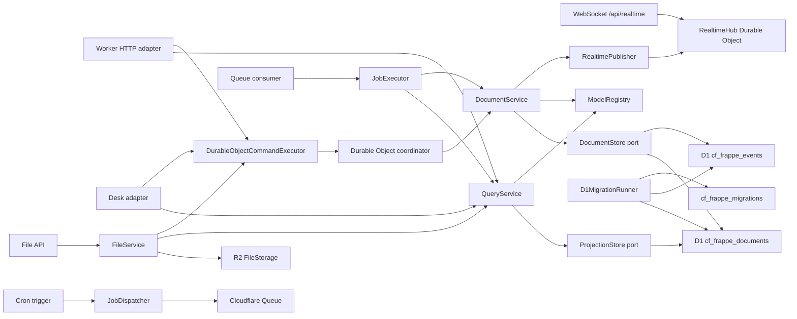

# cf-frappe

cf-frappe is an early Cloudflare-native application framework inspired by Frappe's metadata-driven model. It keeps the "define a DocType, get a useful app surface" idea, but makes event modeling and event sourcing the default instead of an afterthought.

The current slice is a working kernel:

- typed DocType metadata with fields, defaults, validation, naming, permissions, and workflows
- command-side document service that writes immutable events
- query-side projection service for current document reads and lists
- in-memory adapters for TDD
- Cloudflare D1 adapters for atomic event/projection commits
- Hono-powered resource API compatible with Workers
- Durable Object coordinator factory for serial per-aggregate command processing
- D1 schema migration planner/runner from DocType `indexes`
- generated Desk list/form UI from DocType metadata
- Cloudflare Queue/Cron background job primitives
- R2-backed file attachments with event-sourced `File` metadata
- Durable Object WebSocket realtime topics for document events
- a runnable `Task` example under `examples/todos`

## Why

Frappe is productive because DocTypes centralize schema, form metadata, permissions, and APIs. cf-frappe targets the same developer ergonomics on Cloudflare, but with platform-native primitives:

| Frappe concept | cf-frappe direction |
| --- | --- |
| DocType | `defineDocType(...)` metadata |
| Document lifecycle | command handlers that emit domain events |
| Permissions | role and predicate rules attached to DocTypes |
| Hooks/controllers | pure hook contracts registered in `ModelRegistry` |
| REST resources | generated `/api/resource/:doctype` routes |
| Desk list/forms | generated `/desk` pages from DocType metadata |
| Background jobs | `JobRegistry`, Queue producers/consumers, and Cron dispatch |
| File attachments | `File` DocType metadata plus R2 object storage |
| Realtime events | document commit events over Durable Object WebSocket topics |
| Database tables | D1 append-only events plus current projections |
| Migrations | metadata-planned D1 migrations with applied checksum journal |
| Concurrency boundary | Durable Object command coordinator per aggregate stream |

See [docs/frappe-assessment.md](docs/frappe-assessment.md) for the assessment and parity map.
See [docs/test-parity.md](docs/test-parity.md) for the current upstream Frappe test-count target.

## Quick Start

```bash
npm install
npm run check
```

Create the D1 database before deploying the example:

```bash
npx wrangler d1 create cf-frappe-dev
```

Copy the returned `database_id` into `wrangler.jsonc`, then apply the schema:

```bash
npm run d1:migrate:local
npm run dev
```

## Define A Model

```ts
import { createRegistry, defineDocType, fileDocType } from "cf-frappe";

export const Task = defineDocType({
  name: "Task",
  naming: { kind: "field", field: "title" },
  fields: [
    { name: "title", type: "text", required: true, min: 3 },
    { name: "priority", type: "select", options: ["Low", "Medium", "High"], defaultValue: "Medium" }
  ],
  indexes: [["priority"]],
  commands: [
    {
      name: "raisePriority",
      eventType: "TaskPriorityRaised",
      fields: ["priority"]
    }
  ],
  permissions: [
    { roles: ["User"], actions: ["read", "create", "update", "transition"] }
  ]
});

export const registry = createRegistry({ doctypes: [Task, fileDocType] });
```

## Expose It On Workers

```ts
import { createAggregateCoordinatorClass, createCloudFrappeWorker } from "cf-frappe";
import { registry } from "./models";

export class AggregateCoordinator extends createAggregateCoordinatorClass({ registry }) {}

export default createCloudFrappeWorker({
  registry,
  actor: yourTrustedActorResolver
});
```

The generated API includes:

- `GET /health`
- `GET /api/meta/doctypes`
- `GET /api/meta/doctypes/:doctype`
- `POST /api/resource/:doctype`
- `GET /api/resource/:doctype`
- `GET /api/resource/:doctype/:name`
- `PUT /api/resource/:doctype/:name`
- `POST /api/resource/:doctype/:name/transition/:action`
- `POST /api/resource/:doctype/:name/command/:command`
- `DELETE /api/resource/:doctype/:name`

When file support is enabled, the generated API also includes:

- `POST /api/files`
- `GET /api/files/:name/content`
- `DELETE /api/files/:name`

The generated Desk UI includes:

- `GET /desk`
- `GET /desk/:doctype`
- `GET /desk/:doctype/new`
- `POST /desk/:doctype`
- `GET /desk/:doctype/:name`
- `POST /desk/:doctype/:name`
- `POST /desk/:doctype/:name/command/:command`

Generate and review D1 migrations from metadata:

```ts
import { planD1Migrations, renderD1Migrations } from "cf-frappe";
import { registry } from "./models";

const migrations = planD1Migrations(registry.list());
const sql = renderD1Migrations(migrations);
```

Apply pending D1 migrations from a trusted admin route, deployment task, or CI script:

```ts
import { D1MigrationRunner, planD1Migrations, type CloudFrappeEnv } from "cf-frappe";
import { registry } from "./models";

export async function migrate(env: CloudFrappeEnv) {
  const runner = new D1MigrationRunner(env.DB);
  return runner.apply(planD1Migrations(registry.list()));
}
```

No actor resolver is installed by default. Production apps must pass a trusted resolver that derives the actor from a verified session, Access JWT, API token, or another authenticated source.

The checked-in Wrangler demo uses a read-only guest actor. For local demos only, `unsafeHeaderActorResolver` reads caller-controlled headers:

- `x-cf-frappe-user`
- `x-cf-frappe-roles`
- `x-cf-frappe-tenant`
- `x-cf-frappe-email`

## Background Jobs

Jobs are registered separately from DocTypes, then dispatched through a `JobQueue` port. On Cloudflare, `CloudflareJobQueue` wraps a Queue binding and the Worker factory can expose both `queue(...)` and `scheduled(...)` handlers.

```ts
import {
  CloudflareJobQueue,
  createAggregateCoordinatorClass,
  createCloudFrappeWorker,
  createJobRegistry,
  type CloudFrappeEnv,
  type CloudFrappeRuntimeServices,
  type JobMessage
} from "cf-frappe";
import { registry } from "./models";

interface Env extends CloudFrappeEnv {
  readonly JOBS: Queue<JobMessage>;
}

const jobs = createJobRegistry<CloudFrappeRuntimeServices>({
  jobs: [
    {
      name: "task.digest",
      handler: async ({ resources }) => {
        const actor = { id: "jobs", roles: ["System Manager"], tenantId: "default" };
        const tasks = await resources.queries.listDocuments(actor, "Task");
        console.log("Digest task count", tasks.data.length);
      }
    }
  ]
});

export class AggregateCoordinator extends createAggregateCoordinatorClass({ registry }) {}

export default createCloudFrappeWorker<Env>({
  registry,
  actor: yourTrustedActorResolver,
  jobs: {
    registry: jobs,
    queue: (env) => new CloudflareJobQueue(env.JOBS),
    schedules: [{ cron: "0 2 * * *", jobName: "task.digest" }]
  }
});
```

Queue consumers process each message independently: malformed messages and permanent failures are acknowledged, retryable failures use backoff, and job contexts carry an idempotency key. For production, create the Queue with Wrangler and add producer/consumer bindings plus UTC Cron triggers in `wrangler.jsonc`.

## File Attachments

File bytes live in a `FileStorage` port; file metadata is a regular event-sourced `File` document. On Cloudflare, `R2FileStorage` stores bytes in R2 while `DocumentService` records filename, object key, size, content type, attachment target, uploader, privacy, and ETag.

```ts
import {
  R2FileStorage,
  createAggregateCoordinatorClass,
  createCloudFrappeWorker,
  type CloudFrappeEnv
} from "cf-frappe";
import { registry } from "./models";

interface Env extends CloudFrappeEnv {
  readonly FILES: R2Bucket;
}

export class AggregateCoordinator extends createAggregateCoordinatorClass({ registry }) {}

export default createCloudFrappeWorker<Env>({
  registry,
  actor: yourTrustedActorResolver,
  files: {
    storage: (env) => new R2FileStorage(env.FILES),
    maxFileBytes: 25 * 1024 * 1024
  }
});
```

Register `fileDocType` with your app registry, then bind R2 in `wrangler.jsonc`:

```jsonc
{
  "r2_buckets": [
    {
      "binding": "FILES",
      "bucket_name": "cf-frappe-files"
    }
  ]
}
```

Uploads are buffered in this first slice so the framework always knows the object length before writing to R2. Multipart uploads and presigned direct browser uploads are intentionally left as future adapters over the same `FileStorage` boundary.

## Realtime

Realtime is modeled as a port over event-sourced commits. `DocumentService` publishes after-commit events, and the Cloudflare adapter delivers them through one Durable Object hub per topic.

```ts
import {
  DurableObjectRealtimePublisher,
  createAggregateCoordinatorClass,
  createCloudFrappeWorker,
  createRealtimeHubClass,
  type CloudFrappeEnv,
  type RealtimeHubNamespace
} from "cf-frappe";
import { registry } from "./models";

interface Env extends CloudFrappeEnv {
  readonly REALTIME: RealtimeHubNamespace;
}

export class AggregateCoordinator extends createAggregateCoordinatorClass<Env>({
  registry,
  realtime: (env) => new DurableObjectRealtimePublisher(env.REALTIME)
}) {}

export class RealtimeHub extends createRealtimeHubClass() {}

export default createCloudFrappeWorker<Env>({
  registry,
  actor: yourTrustedActorResolver,
  realtime: {
    namespace: (env) => env.REALTIME
  }
});
```

Clients subscribe with a WebSocket upgrade to `/api/realtime?topic=...`. Built-in topic helpers create tenant, DocType, and document topics such as `tenant:acme`, `doctype:acme:Task`, and `document:acme:Task:TASK-1`. This slice exposes document-topic subscriptions only after `QueryService.getDocument(...)` confirms the actor can read the document; broader tenant/DocType filtered fan-out is future work.

Bind the realtime hub in `wrangler.jsonc`:

```jsonc
{
  "durable_objects": {
    "bindings": [
      {
        "name": "AGGREGATES",
        "class_name": "AggregateCoordinator"
      },
      {
        "name": "REALTIME",
        "class_name": "RealtimeHub"
      }
    ]
  },
  "migrations": [
    {
      "tag": "v1",
      "new_sqlite_classes": ["AggregateCoordinator", "RealtimeHub"]
    }
  ]
}
```

## Architecture



The dependency direction is one way:

- `core` has pure types, schema validation, event folding, permissions, and registry contracts
- `application` orchestrates commands, queries, files, realtime, and job execution through ports
- `ports` define document storage, projections, file storage, realtime publishing, queues, execution logs, clocks, and id generation
- `adapters` implement in-memory, D1 stores/migrations, HTTP, Desk, R2, realtime, and Cloudflare integration
- `cloudflare` packages Worker and Durable Object factories

## Quality Gate

Current local gate:

```bash
npm run check
```

This runs:

- TypeScript strict typecheck
- Vitest unit/API tests
- declaration build

Current suite: 114 tests across schema, permissions, events, registry, services, jobs, files, realtime, D1/in-memory adapters, HTTP API, generated Desk UI, Durable Object command routing, Worker routing, WebSocket topic routing, Queue/Cron/R2 integration, and D1 schema planning/migration application.

## Status

This is not Frappe parity yet. Basic generated Desk list/form pages, metadata-planned D1 migrations, Cloudflare-native background job primitives, R2-backed file attachments, and Durable Object realtime topics exist, but reporting, print views, durable job dashboards, richer realtime presence, auth integrations, advanced file workflows, app installation, client scripting, and a compatibility-sized test suite remain open. The current implementation is the event-sourced Cloudflare kernel needed to grow those surfaces without rewiring the foundation.

## References

- [Frappe DocTypes](https://docs.frappe.io/framework/user/en/basics/doctypes)
- [Frappe REST API](https://docs.frappe.io/framework/user/en/api/rest)
- [Frappe Hooks](https://docs.frappe.io/framework/user/en/python-api/hooks)
- [Frappe Users and Permissions](https://docs.frappe.io/framework/user/en/basics/users-and-permissions)
- [Cloudflare Workers](https://developers.cloudflare.com/workers/)
- [Cloudflare D1](https://developers.cloudflare.com/d1/)
- [Cloudflare Durable Objects](https://developers.cloudflare.com/durable-objects/)
- [Cloudflare Durable Objects WebSockets](https://developers.cloudflare.com/durable-objects/best-practices/websockets/)
- [Cloudflare Queues](https://developers.cloudflare.com/queues/)
- [Cloudflare Cron Triggers](https://developers.cloudflare.com/workers/configuration/cron-triggers/)
- [Cloudflare R2](https://developers.cloudflare.com/r2/)
