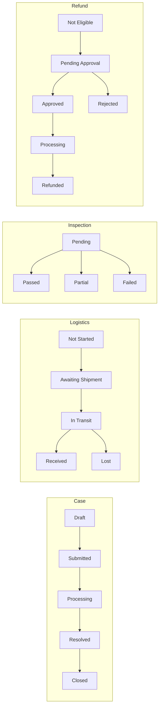

# ReturnsOS Architecture And Acceptance

## Purpose

ReturnsOS is the executable acceptance application for `docs/transition-automation-architecture-blueprint.md`. It demonstrates that the refactored primitives can support a realistic operational workflow without adding application-specific state engines or callback infrastructure.

## Domain Boundaries

| Boundary | Responsibility |
| --- | --- |
| `Customer` | Customer identity and the latest completed return summary |
| `Order` | Fulfilled order data and denormalized current return/refund summary |
| `Return Request` | Return aggregate, four workflow state fields, operational evidence, and refund decision data |
| Named workflows | Authorized state-transition paths for case, logistics, inspection, and refund dimensions |
| Predicates | Cross-workflow facts such as “inspection requires Received” and “resolution requires Refunded or Rejected” |
| Domain commands | Atomic multi-workflow business operations |
| Automation Runs | Reliable eventual updates to linked documents and ordinary derived fields |
| ReturnsOS frontend | Independent responsive product UI composed over permission-filtered resource, timeline, assignment, workflow, and command APIs |
| Desk metadata | Generated administration, reporting, and raw-record UI for power users |
| Local demo harness | Restricted persona switching, additive seed data, and Automation inspection |
| Public intake boundary | Bounded relationship verification without anonymous master-data APIs |

## Workflow Model

The state fields are independent, but transitions can read the complete authoritative document:

- inspection requires `logistics_state = Received`;
- refund approval request requires Received plus Passed or Partial inspection;
- approval requires a positive `approved_amount`;
- processing requires `scheduled_refund_at`;
- completion requires `refund_reference`;
- case resolution requires Refunded or Rejected.

Roles decide who may attempt an action. Predicates decide whether the business facts permit it. The two concerns are not merged into application callbacks.

## Composite Commands

`acceptReturn` atomically applies:

- `case.submit`: Draft to Submitted;
- `logistics.prepareShipment`: Not Started to Awaiting Shipment.

`dispatchReturn` records a tracking number and atomically applies `logistics.markInTransit`.

`inspectReturn` accepts both In Transit and Received starting points. It can atomically apply:

- `logistics.receive`, when the parcel is still In Transit;
- one of `inspection.pass`, `inspection.markPartial`, or `inspection.fail`.

`approveAndScheduleRefund` accepts either Pending Approval or Approved. It validates the amount and processing time, then atomically applies the missing transitions needed to reach Processing.

`completeRefundAndResolve` validates the settlement reference and transitions against a progressive proposed snapshot, then atomically applies:

- `refund.markRefunded`: Processing to Refunded;
- `case.resolve`: Processing to Resolved.

If either transition fails its role, path, predicate, field, or version check, neither state change commits.

## Automation Reliability

1. The source event and deterministic Automation Run append in the same document commit.
2. A successful mutating HTTP response triggers an immediate Queue drain signal.
3. A scheduled once-per-minute drain recovers a run if the immediate signal is lost.
4. The consumer claims due runs with a lease and records attempt state.
5. Failures receive retry timestamps and eventually dead-letter according to policy.
6. Before writing a target, the consumer checks whether the target event stream already contains the Automation action id.
7. A repeated delivery therefore observes the prior action and finishes without duplicating the target update.

Public intake has a separate synchronous invariant: `Return Request.order` is unique. The framework reserves that unique value in the same event-store batch as Return creation, so concurrent requests cannot both claim an Order while the asynchronous `has_open_return` projection is still false. The Order flag remains an operational read model, not the concurrency lock.

The app uses Automation only for `updateDocument`, matching the framework's currently implemented action contract.

## Security Boundary

- Demo routes require explicit `RETURNS_DEMO_MODE=true` and a loopback hostname.
- The standalone `/returns` frontend is inside the same localhost-only demo boundary.
- Persona path and cookie values are checked against a fixed allowlist.
- The persona cookie is `HttpOnly`, `SameSite=Lax`, and scoped to `/`.
- Seed requests use constant, encoded resource paths and JSON bodies.
- The seed has no reset, delete, or overwrite mode.
- Guest has no general Customer/Order `read` or `metadata` permission.
- The exact public intake POST route accepts only bounded URL-encoded data and validates canonical Customer/Order IDs, allowed reasons, ownership, open-return state, and amount limits. The framework Naming Engine generates `RMA-{YYYY}-{sequence:6}` and writes `return_id` while advancing the yearly named counter in the same atomic commit as document creation. Generic JSON and HTML Web Form routes reject caller injection of generated fields, and rejected public submissions return one generic response.
- The Order claim is enforced again by an event-sourced unique-value reservation committed atomically with Return Request creation.
- Only a verified in-memory Request identity receives the internal `Public Return Intake` role; headers, cookies, and form fields cannot select it.
- Automation Runs require the Demo Administrator persona and are not linked from non-admin demo homes.
- Non-administrator custom-app navigation also omits Automation Runs.
- Custom action routes accept only bounded form bodies, allowlisted command/workflow names, canonical document names, optimistic versions, bounded text, valid choices, money ranges, and parseable datetimes.
- The custom frontend delegates every read and write to the normal cf-frappe API using the selected actor; hiding a button is never treated as authorization.
- Demo HTML escapes dynamic output and ships a restrictive Content Security Policy.
- Production authentication remains signed session, Cloudflare Access, or OIDC.

## Acceptance Criteria

- The registry loads all DocTypes, four workflows, five commands, Automation rules, and generated UI metadata.
- `/returns` renders a standalone desktop/mobile product UI rather than the Desk shell.
- Search, persona switching, role-specific next actions, timelines, assignments, and composite action forms work through framework APIs.
- A warehouse inspection before receipt is denied without committing an event.
- Finance approval with zero amount is denied.
- Direct writes to workflow state fields are denied.
- The composite refund command produces Refunded and Resolved together.
- A risk-score change creates a durable Automation Run and eventually updates `high_risk`.
- Linked Order and Customer updates are idempotent across consumer retries.
- Seed execution is additive and idempotent.
- Persona switching is unavailable outside localhost demo mode.
- Guest master-data APIs are denied while a verified public intake can still create a Return Request.
- Concurrent public submissions for one Order produce exactly one Return Request before Automation delivery.
- Automation Runs are inaccessible to non-administrator personas.
- Unit/integration tests, browser journeys, framework checks, coverage gate, and independent architecture review pass.

Evidence is recorded in `docs/returns-example-browser-verification.md`, `docs/returns-example-architecture-review.md`, and the repository test output.
