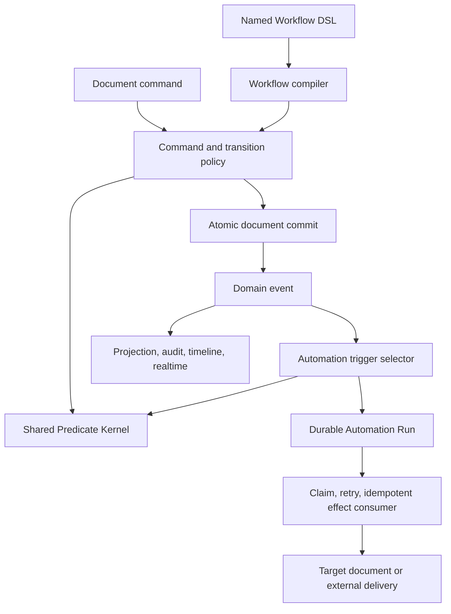

# Transition, Workflow, Predicate, and Automation Architecture Upgrade Blueprint

Status: Proposed
Date: 2026-08-05
Scope: cf-frappe core, application services, HTTP/Desk/CLI adapters, runtime metadata, and tests
Primary audience: framework maintainers and application authors

## Executive Summary

cf-frappe currently has two useful but partially overlapping capabilities:

- Workflow protects one designated state field and applies role-gated state transitions before a document commit.
- Automation Rules react to committed document events and durably execute cross-document effects with idempotency, retry, claim leases, and dead-letter handling.

The architectural problem is not that either capability is wrong. The problem is that the abstraction boundary is too narrow in Workflow and too query-oriented in shared conditions:

- A DocType can have only one Workflow.
- Workflow treats one field as structurally special.
- Workflow transitions cannot use the same business conditions already used by Automation, Assignment Rules, Notification Rules, and conditional field behavior.
- `ListFilterExpression` is already functioning as a general document predicate but is named and shaped as a query concern.
- Automation can detect that a field was touched, but it cannot directly express an old-value to new-value change.
- Runtime Workflow overrides are keyed logically by tenant and DocType, so they cannot independently manage multiple named workflows.

This blueprint establishes the following target architecture:

1. A shared, deterministic Predicate Kernel owns condition normalization and evaluation.
2. Transition Policy owns pre-commit legality, authorization, and business invariants for field changes.
3. Named Workflow is an optional declarative DSL compiled into Transition Policies and Desk metadata.
4. Domain Events record committed facts and business intent.
5. Automation Rules select the proposed committed change during atomic command planning and durably register post-commit effects.
6. The existing Automation Run mechanism remains the reliability boundary for idempotency, retry, leases, and dead letters.

The resulting architecture naturally supports multiple named workflows on one DocType without introducing multiple execution engines.

## Decision Summary

The upgrade SHALL adopt these decisions:

- Conditions SHALL share one Predicate Kernel but preserve phase-specific orchestration and failure semantics.
- Authorization SHALL remain explicit and SHALL NOT be hidden inside arbitrary predicate expressions.
- Workflow SHALL become an optional named DSL over Transition Policy, not the base execution primitive.
- A DocType SHALL support multiple named workflows, with at most one workflow owning a given state field.
- Direct writes to workflow-controlled fields SHALL remain prohibited unless a validated transition plan authorizes the exact mutation.
- Automation effects SHALL remain asynchronous, at-least-once, retryable, and idempotent.
- Transition validation SHALL remain synchronous and SHALL complete before the source document commit.
- Composite operations that atomically change multiple controlled fields SHALL use an explicit Domain Command transition plan rather than chained asynchronous workflows.
- The upgrade SHALL be a clean break: singular Workflow metadata, old Workflow APIs, old runtime definition streams, old Workflow event shapes, and their persisted history SHALL be discarded at an operator-approved reset boundary rather than adapted, migrated, or replayed. The framework supports only fresh-state installation and reseeding for this upgrade.
- The architecture-critical branch coverage gate SHALL remain at least 93 percent throughout the upgrade. Full-source coverage SHALL also be reported separately and transparently; it SHALL NOT be represented as meeting the scoped gate.

## Current Architecture

### Workflow

The current `WorkflowDefinition` contains:

- one optional `stateField`, defaulting to `workflow_state`;
- one `initialState`;
- a closed list of states;
- transitions with `action`, `from`, `to`, optional roles, and optional event type.

The current DocType shape contains one optional `workflow` property. `DocumentService.transition()` resolves that workflow, checks the current state and actor role, and appends a `WorkflowTransitioned` event. Normal create and update paths reject direct mutations of the controlled field.

This gives cf-frappe useful pre-commit guarantees:

- invalid state paths are rejected;
- transition roles are enforced;
- optimistic concurrency is checked;
- transition intent is recorded as `action`, `from`, and `to`;
- generated Desk controls can expose available actions.

Its current limitations are:

- one workflow per DocType;
- one controlled state dimension;
- no predicate guard beyond state and role;
- runtime administration and API contracts assume one definition per DocType;
- transition APIs identify only an action, so action names become ambiguous when multiple workflows exist.

### Automation Rules

The current `AutomationRuleDefinition` can:

- select document event kinds;
- restrict matches by `changedFields`;
- evaluate a `ListFilterExpression` against the resulting snapshot;
- resolve an `updateDocument` action;
- atomically register Automation Runs with the source document commit;
- claim, retry, deliver, fail, and dead-letter durable runs;
- suppress duplicate effects through a stable automation action id.

This is already the correct reliability boundary for post-commit effects. Workflow SHALL NOT duplicate it.

Current Automation limitations relevant to this upgrade are:

- `changedFields` means that the field appears in a patch or unset list; it does not express `from` and `to` values;
- the condition sees the resulting document but not an explicit before/after change context;
- action identity currently depends on rule name and action index rather than stable rule and action identifiers;
- rule-chain causation and loop-depth controls are not first-class metadata.

### Shared Conditions

`ListFilterExpression` is currently reused by:

- list queries and saved filters;
- Automation Rules;
- Assignment Rules;
- Notification Rules;
- conditional required, read-only, and hidden field behavior;
- reports, dashboards, calendars, Kanban, and web views.

The reuse is directionally correct, but the name and evaluation context are too narrow for transition guards and before/after comparisons.

## Problem Statement

The current architecture conflates three independent concerns:

1. State representation: which fields store current business state.
2. Mutation governance: which changes are legal, who may perform them, and under which business conditions.
3. Reaction and delivery: which effects should happen after a committed fact.

A field-change listener is sufficient for the third concern. It is not sufficient for the second concern when it runs after commit. Conversely, a state machine is unnecessarily restrictive when the requirement is only to react to ordinary data changes.

The target architecture SHALL separate these concerns while sharing their reusable pure logic.

## Goals

- Allow ordinary fields to trigger reliable Automation without any Workflow configuration.
- Allow multiple independent named workflows on one DocType.
- Reuse one predicate representation and evaluator across query, UI conditions, transition policy, and event-driven rules.
- Preserve the semantic difference between pre-commit rejection and post-commit reaction.
- Preserve explicit authorization, auditability, and optimistic concurrency.
- Keep transition decisions pure, deterministic, and testable.
- Keep effects durable, retryable, replayable, and idempotent.
- Provide enough metadata for Desk and custom frontends to discover currently available actions.
- Replace the existing Workflow, condition, Automation, and persisted Workflow-history contracts in one coordinated cutover backed by an explicit operator-approved reset and reseed.
- Keep adapters thin and keep business decisions in focused core/application policy modules.

## Non-Goals

This upgrade SHALL NOT attempt to become:

- a BPMN engine;
- a long-running orchestration or Saga engine;
- a distributed transaction coordinator;
- an arbitrary scripting engine;
- a general-purpose expression language with network, database, time, or filesystem access;
- an exactly-once delivery system;
- a replacement for Domain Commands that represent richer business intent.

## Target Architecture



The architecture has four semantic phases:

| Phase | Owner | May reject source command | May perform I/O | Failure meaning |
| --- | --- | --- | --- | --- |
| Normalize | Metadata and predicate normalization | Yes, at definition load/save | No | Invalid definition |
| Authorize and validate | Command, Transition Policy, and Automation selection | Yes for command and transition policy; a false Automation predicate does not reject | Permission providers may be orchestrated outside pure policy | Command denied or no Automation Run selected |
| Commit | DocumentStore command boundary | Yes | Event, Automation Run, and projection persistence | Nothing committed |
| React and deliver | Automation Run consumer | No | Yes | Source stays committed; effect retries or dead-letters |

## Core Terminology

### Predicate

A deterministic boolean expression evaluated against an explicit context.

### Transition Policy

A pre-commit rule describing a legal field transition, its business action name, authorization requirements, and optional predicate.

### Workflow

A named collection of transition policies for one state field, plus metadata needed for state discovery and UI rendering.

### Change Selector

A post-change event selector describing event kind, changed fields, optional before/after values, and optional workflow or command identity.

### Automation Rule

A Change Selector, an optional post-change predicate, and one or more durable effects.

### Effect

An operation executed after the source commit, such as updating another document, sending a notification, enqueueing a job, or publishing a realtime message.

## Shared Predicate Kernel

### Public Model

The new general-purpose model SHALL be named `PredicateExpression`. It replaces `ListFilterExpression` as the shared condition model. Query request DTOs may remain query-specific, but they SHALL normalize directly into `PredicateExpression` rather than preserving a second expression tree.

The target shape is conceptually:

```ts
export type PredicateScope =
  | "before"
  | "after"
  | "input"
  | "event"
  | "actor";

export type PredicateOperand =
  | {
      readonly kind: "literal";
      readonly value: JsonValue;
    }
  | {
      readonly kind: "field";
      readonly scope: "before" | "after";
      readonly field: string;
    }
  | {
      readonly kind: "path";
      readonly scope: "input" | "event" | "actor";
      readonly path: readonly string[];
    };

export type PredicateExpression =
  | {
      readonly kind: "compare";
      readonly left: PredicateOperand;
      readonly operator: PredicateOperator;
      readonly right?: PredicateOperand;
    }
  | {
      readonly kind: "group";
      readonly match: "all" | "any";
      readonly predicates: readonly PredicateExpression[];
    }
  | {
      readonly kind: "not";
      readonly predicate: PredicateExpression;
    };
```

`PredicateOperator` initially SHALL cover the current `ListFilterOperator` set. New operators require explicit type semantics, SQL-planner parity where query use is supported, and direct branch coverage.

The first implementation MAY retain the current field/operator/literal syntax internally, but the architecture SHALL support explicit evaluation scope so that before/after transition semantics do not require a second condition system.

### Evaluation Context

```ts
export interface PredicateEvaluationContext {
  readonly before: DocumentSnapshot | null;
  readonly after: DocumentSnapshot | null;
  readonly input: DocumentData;
  readonly event?: DomainEvent;
  readonly actor?: Actor;
}
```

Not every caller supplies every scope. Normalization SHALL reject expressions that require a scope unavailable to that feature.

Examples:

- A list query exposes only the candidate document as `after`.
- A conditional form field exposes the current document as `after`.
- A transition exposes `before`, proposed `after`, command input, and actor.
- Automation selection exposes the authoritative `before` snapshot, proposed `after` snapshot, and planned source event. The selection becomes durable only if the atomic commit succeeds.

### Predicate Invariants

- Evaluation SHALL be pure and deterministic.
- Predicates SHALL NOT perform I/O.
- Predicates SHALL NOT read current time, random values, environment state, or global mutable state.
- Field and path references SHALL be validated when metadata is registered or saved.
- Operators SHALL be validated against operand types.
- Missing and null values SHALL have documented, stable semantics.
- Group depth and item count SHALL be bounded to prevent abusive or accidental complexity.
- Evaluation SHOULD short-circuit `all` and `any` groups.
- Diagnostic traces MAY explain failed business conditions to authorized administrators, but SHALL NOT expose protected field values to unauthorized users.

### Authorization Boundary

Role and permission authorization SHALL remain first-class policy metadata:

```ts
{
  roles: ["Approver"],
  allowWhen: predicate
}
```

The Predicate Kernel MAY read actor identity for business comparisons, such as matching document owner, but a predicate result SHALL NOT grant an action that the authorization policy denied.

## Document Change Context

The command layer SHALL produce one normalized change context before event planning:

```ts
export interface DocumentChangeContext {
  readonly before: DocumentSnapshot | null;
  readonly after: DocumentSnapshot | null;
  readonly touchedFields: readonly string[];
  readonly changedFields: readonly string[];
  readonly changes: Readonly<Record<string, {
    readonly before: JsonValue | undefined;
    readonly after: JsonValue | undefined;
  }>>;
}
```

`touchedFields` contains patch and unset keys supplied by the command. `changedFields` contains only fields whose normalized before and after values are not equal. The `changes` map contains only semantic changes.

Automation SHALL expose touched-field selection and semantic change selection as separate explicit trigger properties. `trigger.touchedFields` matches submitted patch/unset keys. `trigger.changes` matches normalized before/after value differences. This prevents a write of the existing value from masquerading as a state change while still supporting the less common "field was submitted" use case.

This context is the shared input for:

- schema validation;
- protected-field policy;
- Transition Policy;
- audit diff projection;
- Automation trigger selection;
- conditional field rules.

It SHOULD be calculated once per command and passed through pure policy functions. Features SHOULD NOT independently reconstruct field changes from partial event payloads.

Before values do not have to be copied into every domain event. The authoritative document command already has the previous snapshot while planning the commit. Durable Automation Runs SHALL snapshot their resolved action at enqueue time so later rule edits do not change an existing run.

## Transition Policy

### Target Model

```ts
export interface FieldTransitionPolicyDefinition {
  readonly name: string;
  readonly field: string;
  readonly action: string;
  readonly from: JsonPrimitive | readonly JsonPrimitive[];
  readonly to: JsonPrimitive;
  readonly roles?: readonly string[];
  readonly allowWhen?: PredicateExpression;
  readonly eventType?: string;
}
```

Workflow compilation will normally generate these definitions. Advanced applications MAY define transition policies without exposing a Workflow UI, provided they use the same normalization and authorization path.

### Transition Semantics

A transition command SHALL execute in this order:

1. Resolve tenant, effective DocType, named workflow, and transition action.
2. Load the current document snapshot.
3. Check DocType and record-level permission for the transition action.
4. Check expected document version.
5. Verify that the workflow owns the target state field.
6. Verify that the current field value matches `from`.
7. Verify transition role authorization.
8. Construct the proposed after-snapshot with the exact target value.
9. Evaluate `allowWhen` against the before/after context.
10. Run schema, link, uniqueness, and other document validation.
11. Plan the semantic domain event and any matching Automation Runs.
12. Commit the source event, auxiliary events, and projections atomically.

When any pre-commit step fails, no source document change and no Automation Run SHALL be committed.

### Protected Fields

- Every field owned by a named workflow SHALL be protected from ordinary create/update/unset mutation.
- Create MAY omit the controlled field, in which case the initial state is applied.
- Create MAY explicitly provide only the configured initial state.
- A validated transition plan SHALL authorize only its exact field mutation.
- Internal code SHALL NOT receive a blanket bypass flag for workflow fields.
- Data import, bulk actions, Desk forms, APIs, and Domain Commands SHALL pass through the same protected-field policy.

### Failure Codes

The target API SHOULD distinguish:

- `WORKFLOW_NOT_FOUND`;
- `WORKFLOW_ACTION_NOT_FOUND`;
- `WORKFLOW_TRANSITION_DENIED`;
- `WORKFLOW_TRANSITION_CONDITION_FAILED`;
- `WORKFLOW_STATE_PROTECTED`;
- `VERSION_CONFLICT`.

Authorization failures SHALL avoid disclosing sensitive condition details.

## Named Multi-Workflow

### Target Metadata

```ts
export interface NamedWorkflowDefinition {
  readonly name: string;
  readonly label?: string;
  readonly stateField: string;
  readonly initialState: string;
  readonly states: readonly string[];
  readonly transitions: readonly NamedWorkflowTransition[];
}

export interface NamedWorkflowTransition {
  readonly action: string;
  readonly from: string;
  readonly to: string;
  readonly roles?: readonly string[];
  readonly allowWhen?: PredicateExpression;
  readonly eventType?: string;
}

export interface DocTypeDefinition {
  readonly workflows?: readonly NamedWorkflowDefinition[];
}
```

Example:

```ts
workflows: [
  {
    name: "lifecycle",
    stateField: "lifecycle_state",
    initialState: "Backlog",
    states: ["Backlog", "In Progress", "Done"],
    transitions: [
      { action: "start", from: "Backlog", to: "In Progress" },
      { action: "finish", from: "In Progress", to: "Done" }
    ]
  },
  {
    name: "review",
    stateField: "review_state",
    initialState: "Not Reviewed",
    states: ["Not Reviewed", "Pending", "Approved", "Rejected"],
    transitions: [
      {
        action: "approve",
        from: "Pending",
        to: "Approved",
        roles: ["Reviewer"],
        allowWhen: {
          kind: "compare",
          left: { kind: "field", scope: "before", field: "lifecycle_state" },
          operator: "eq",
          right: { kind: "literal", value: "Done" }
        }
      }
    ]
  }
]
```

### Workflow Invariants

- Workflow names SHALL be unique within one effective DocType.
- Workflow names SHALL be stable identifiers; labels MAY change.
- A state field SHALL be owned by at most one workflow.
- State fields SHALL exist and be able to store every declared state.
- Initial state SHALL be a declared state.
- Every transition `from` and `to` SHALL be declared.
- An action SHALL be unique within one workflow and one `from` state.
- Roles SHALL reference known or permitted role names under the existing role-validation policy.
- `allowWhen` SHALL validate against the effective DocType and transition evaluation context.
- Runtime overrides SHALL preserve all invariants after composing custom fields and field-property overrides.

### Cross-Workflow Conditions

A transition predicate MAY inspect fields controlled by another workflow. This supports rules such as:

```text
review.approve is allowed only when lifecycle_state = Done
```

This does not make two transitions atomic. A command that must atomically change multiple controlled fields SHALL use a composite Domain Command plan and validate each transition policy within the same document commit.

The initial implementation MAY keep composite controlled-field mutation disabled until the explicit composite plan is implemented. It SHALL NOT use a generic internal bypass as an interim solution.

## Workflow Compilation

Named Workflow SHALL compile into reusable primitives:

```text
Named Workflow
  -> state-field ownership metadata
  -> initial-value policy
  -> FieldTransitionPolicyDefinition[]
  -> available-action metadata
  -> Desk labels and grouping
  -> workflow-specific event identity
```

There SHALL be one transition evaluator, one protected-field policy, and one available-action projection. Static metadata, runtime overrides, HTTP, Desk, CLI, and custom frontends SHALL all use those same boundaries.

## Domain Events

### Workflow Event

The target `WorkflowTransitioned` payload SHALL identify its workflow dimension:

```ts
{
  kind: "WorkflowTransitioned",
  workflow: "review",
  stateField: "review_state",
  action: "approve",
  from: "Pending",
  to: "Approved",
  patch: { review_state: "Approved" }
}
```

The source event type MAY remain application-defined through `eventType`, but payload kind SHALL remain authoritative for framework matching.

### Event Metadata

Events and Automation Runs SHOULD carry:

- `causationId`: the immediate source command or event;
- `correlationId`: the root business operation;
- `automationRuleId` and `automationActionId` when applicable;
- `workflowName` and `workflowAction` when applicable;
- bounded automation depth.

These values support audit, tracing, loop prevention, and operator diagnostics.

## Automation Rules

### Target Trigger Model

Automation SHALL distinguish trigger selection from predicate evaluation:

```ts
export interface AutomationTriggerDefinition {
  readonly events: readonly AutomationRuleEventKind[];
  readonly touchedFields?: readonly string[];
  readonly changes?: readonly {
    readonly field: string;
    readonly from?: JsonValue;
    readonly to?: JsonValue;
  }[];
  readonly workflow?: string;
  readonly workflowAction?: string;
  readonly domainCommand?: string;
}

export interface AutomationRuleDefinition {
  readonly id: string;
  readonly name: string;
  readonly enabled?: boolean;
  readonly trigger: AutomationTriggerDefinition;
  readonly runWhen?: PredicateExpression;
  readonly actions: readonly AutomationActionDefinition[];
}
```

Semantics:

- omitted `from` means any previous value;
- omitted `to` means any resulting value;
- `touchedFields` matches submitted patch and unset keys whether or not the normalized value changes;
- omitted `changes` means event-kind matching only;
- multiple change selectors SHOULD use explicit `match: all | any` when that capability is introduced;
- `runWhen` evaluates during atomic command planning against the authoritative before snapshot and proposed after snapshot;
- a selected Automation Run becomes visible only if the source event and run enqueue commit together;
- a false `runWhen` result does not fail the source command;
- invalid rule metadata fails at registry or admin-save validation, not during effect delivery.

### Clean-Break Definition Contract

The old `events`, `changedFields`, and `condition` properties SHALL be removed. Every Automation Rule and action SHALL provide a stable id, use `trigger`, and use `runWhen` when a predicate is required. Registry and runtime admin validation SHALL reject the old shape rather than silently translating it.

### Reliable Execution

Automation reliability SHALL preserve and strengthen the current design:

- source document event and Automation Run enqueue event commit in one `DocumentStore.commitBatch`;
- effect execution remains at-least-once;
- each action has a stable idempotency key;
- claimed runs have bounded leases;
- transient failures use bounded exponential backoff;
- terminal failures dead-letter with operator-visible diagnostics;
- resolved action targets and values are snapshotted at enqueue time;
- target updates pass through normal authentication/authorization using the configured automation actor;
- target events retain causation and correlation metadata;
- duplicate application is checked before and after ambiguous delivery errors;
- automation loops are bounded by depth and repeated causation-path detection.

Stable action identity SHOULD use immutable ids rather than array positions:

```text
automationActionId = sourceEventId + ruleId + actionId
```

Definitions SHALL therefore require stable `id` values for rules and actions. Index-based identity SHALL be removed in the cutover.

## Domain Commands and Composite Transitions

Domain Commands remain the preferred abstraction when an operation:

- expresses richer intent than assigning a state value;
- calculates several field updates;
- must atomically validate several workflow dimensions;
- requires command input;
- emits a domain-specific event.

The target command planner SHOULD support explicit transition intents:

```ts
export interface DomainCommandTransitionIntent {
  readonly workflow: string;
  readonly action: string;
}

export interface DomainCommandPlan {
  readonly patch: DocumentData;
  readonly transitions?: readonly DomainCommandTransitionIntent[];
}
```

The framework SHALL validate every transition intent against a progressively constructed proposed snapshot. The final patch SHALL exactly match the validated controlled-field changes. Domain Commands SHALL NOT directly patch controlled fields without corresponding transition intents.

The event representation for a composite command SHALL preserve the primary `DomainCommandApplied` event and include normalized transition facts in its payload. Domain transition facts are not diagnostic metadata. Automation may select the domain command identity and inspect both the transition facts and resulting change context. This avoids pretending that several user-visible workflow button clicks occurred when the actual intent was one atomic domain command.

## Runtime Workflow Definitions

### Identity

Runtime definitions SHALL be keyed by:

```text
tenantId + doctypeName + workflowName
```

Expected-version concurrency SHALL be resource-local. Editing `Task.review` SHALL NOT conflict with an unrelated edit to `Invoice.approval`.

The preferred event stream identity is one stream per named workflow definition. Stream construction SHALL use existing validated stream helpers rather than adapter string concatenation.

### Effective Composition

Effective workflows SHALL be composed in this order:

1. static DocType metadata;
2. effective custom fields and field property overrides;
3. runtime named workflow override or clear marker;
4. final normalization and cross-workflow invariant validation.

Runtime definitions SHALL NOT be able to reference fields or roles hidden from the authorized administrator's effective metadata view, and server-side validation remains authoritative.

### Runtime State Cutover

The existing tenant-wide Workflow Definition stream SHALL NOT be read by the new service. Named definitions SHALL use resource-local streams from the first release. Every environment adopting the new architecture SHALL cross an operator-approved reset/reseed boundary; no environment receives an old-definition export, translator, or replay path from the framework runtime.

## API Design

### Document Transition

```text
POST /api/resource/:doctype/:name/workflows/:workflow/transition/:action
```

Request body:

```json
{
  "expectedVersion": 7
}
```

Transition input SHALL remain unsupported until a transition declares and validates an explicit input schema. Arbitrary unvalidated input SHALL NOT be added to the transition API.

Bulk transition routes SHALL similarly include workflow identity. Bulk results SHALL preserve per-document success and failure outcomes.

### Workflow Administration

Recommended routes:

```text
GET    /api/workflows/:doctype
GET    /api/workflows/:doctype/:workflow
PUT    /api/workflows/:doctype/:workflow
DELETE /api/workflows/:doctype/:workflow
```

Responses SHOULD include:

- workflow name and label;
- state field;
- effective source: static or runtime override;
- resource-local version;
- normalized states and transitions;
- validation diagnostics safe for the actor.

### Available Actions

The resource API SHOULD expose available actions as structured metadata:

```json
{
  "workflows": [
    {
      "name": "review",
      "stateField": "review_state",
      "currentState": "Pending",
      "actions": [
        { "action": "approve", "to": "Approved", "label": "Approve" }
      ]
    }
  ]
}
```

Only actions authorized for the actor and allowed by current transition predicates SHALL be returned.

## Desk and Client Design

### Workflow Administration

Desk Workflow administration SHALL:

- list workflows by DocType and stable workflow name;
- allow create, edit, disable/clear, and inspect source;
- use meta-driven selectors for DocType, state field, roles, and state values;
- use the shared predicate builder for `allowWhen`;
- display validation errors without losing stale draft values;
- prevent selecting a field already owned by another effective workflow;
- preserve server-side validation as authoritative.

### Document Form

Document forms SHALL group actions by workflow label when more than one workflow is present. A single workflow MAY retain a compact action presentation while still preserving its workflow identity in requests and events.

Controls SHALL be based on the server-returned available-action projection. The client SHALL NOT independently reproduce permission or predicate logic.

### Automation Administration

Automation administration SHALL:

- use event selectors rather than free-form event names where metadata exists;
- use field selectors for changed fields;
- support optional `from` and `to` controls based on field type and options;
- reuse the same predicate builder for `runWhen`;
- use stable rule/action ids hidden from ordinary labels;
- show retry policy and recent run diagnostics without exposing sensitive document data.

### Browser Client and CLI

Generated browser clients and CLI commands SHALL require workflow-name arguments for transition and single-workflow administration operations.

Examples:

```text
cf-frappe workflows list --doctype Task
cf-frappe workflows get --doctype Task --workflow review
cf-frappe workflows save --doctype Task --workflow review --workflow-json ...
cf-frappe resources transition --doctype Task --name TASK-001 --workflow review --action approve
```

## Failure and Consistency Semantics

| Situation | Source document | Domain event | Automation Run | Result |
| --- | --- | --- | --- | --- |
| Transition role denied | Unchanged | None | None | Synchronous denial |
| Transition predicate false | Unchanged | None | None | Synchronous condition failure |
| Version conflict | Unchanged | None | None | Client reload/retry required |
| Automation predicate false | Committed | Source event committed | None | Successful source command |
| Automation enqueue commit fails | Unchanged | None | None | Entire atomic commit fails |
| Automation effect fails transiently | Committed | Committed | Failed with retry time | Retry later |
| Automation effect exceeds attempts | Committed | Committed | Dead-lettered | Operator intervention |
| Duplicate queue delivery | Committed | Committed | Existing run reused | No duplicate effect |

## Security Requirements

- All workflow, predicate, and automation input SHALL be structurally validated and bounded.
- Authorization SHALL be evaluated before business predicates when disclosure could leak protected values.
- Predicate diagnostics SHALL be filtered by field-level visibility policy.
- Runtime workflow and automation administration SHALL remain tenant-scoped and role-protected.
- Automated target updates SHALL pass normal document permissions and user-permission checks for the configured automation actor.
- The implementation SHALL NOT add eval, dynamic code generation, arbitrary regular expressions, or executable templates.
- HTTP, Desk, and CLI adapters SHALL treat all names, paths, fields, and action identifiers as untrusted input.
- D1 access SHALL remain parameterized through existing ports and adapters.
- Desk output SHALL continue to use context-appropriate escaping helpers.

## Performance Requirements

- Predicate definitions SHOULD be normalized once when registry or runtime metadata is loaded.
- Predicate evaluation SHALL be in-memory and SHALL NOT issue per-predicate database reads.
- Available-action calculation SHOULD evaluate only transitions matching the current state and authorized role set.
- Predicate depth, group width, workflow count, transition count, rule count, and action count SHALL have configurable bounds.
- Runtime workflow reads SHOULD avoid replaying unrelated tenant definitions by using resource-local streams or equivalent indexed reads.
- Automation Runs SHALL retain bounded claim pages and existing batch-lane concurrency controls.

## Observability Requirements

Operators SHOULD be able to answer:

- Which workflow and action changed this field?
- Which actor or automation initiated the command?
- Which predicate or authorization category denied a transition?
- Which source event created an Automation Run?
- Has an action been delivered, retried, or dead-lettered?
- Which target document event proves idempotent application?
- Is an automation loop approaching its configured depth limit?

Audit and timeline projections SHALL distinguish:

- ordinary field update;
- named workflow transition;
- Domain Command;
- automation-originated update.

## Fresh-Start Replacement Strategy

This upgrade SHALL not ship compatibility adapters for superseded contracts.

The cutover establishes a new metadata, API, and event-storage epoch. Old and new Workflow models SHALL NOT coexist in one running framework instance, and the new runtime SHALL NOT read, translate, replay, or project old Workflow definitions or historical Workflow events.

The cutover removes:

- singular `workflow` metadata;
- `ListFilterExpression` as the shared condition model;
- old Automation `events`, `changedFields`, and `condition` properties;
- action-index-based Automation identity;
- action-only document transition routes;
- DocType-only Workflow administration mutation routes;
- tenant-wide legacy Workflow Definition stream reads;
- old `WorkflowTransitioned` payloads without workflow identity;
- mixed old/new Workflow event replay code and fixtures.

The repository SHALL switch all framework code, generated starters, examples, tests, Desk forms, browser clients, and CLI commands in one coordinated branch before merge.

Every environment adopting this architecture SHALL start from fresh Workflow definition, Workflow event, affected projection, and runtime-metadata state, followed by the new schema migrations and seeds. The implementation SHALL document the exact reset scope, backup checkpoint, verification steps, and reseed commands, but SHALL NOT execute the destructive reset without separate human approval.

Pre-cutover Workflow definitions, API payloads, event streams, and projected Workflow history are intentionally discarded from the active system. The blueprint does not include export/transform/import tooling. New document history and audit projections begin from events written under the new contracts after reset; unrelated document history remains subject to the reset scope chosen by the operator.

This is not a rolling upgrade. There is no dual-read period, compatibility mode, legacy parser, fallback route, event upcaster, or old-to-new conversion job.

## Implementation Plan

### Phase 0: Characterization and Architecture Contracts

Deliverables:

- Write target-contract tests for Predicate, Automation, Transition Policy, named Workflow, HTTP, Desk, CLI, event projection, and D1 behavior without preserving superseded contracts.
- Add architecture tests proving current source-event plus Automation Run atomic commit behavior.
- Inventory every old metadata property, route, client method, CLI command, event payload, runtime stream, generated starter reference, and test fixture that the cutover must remove.
- Define the exact reset, backup checkpoint, verification, and reseed targets without executing them.

Exit gates:

- `npm run check` passes.
- `npm run coverage` preserves at least 93 percent branch coverage across the architecture-critical modules named in `vitest.config.ts`.
- `npm run coverage:all` publishes the full-source baseline without weakening or misrepresenting the critical-module gate.
- The clean-break removal inventory has no unknown owners.

### Phase 1: Shared Predicate Kernel

Deliverables:

- Introduce bounded `PredicateExpression`, normalization, compilation, and evaluation modules.
- Replace `ListFilterExpression` in shared condition metadata with `PredicateExpression`.
- Replace Automation, Assignment, Notification, and conditional field condition handling with the shared evaluator and new public metadata shape.
- Keep query SQL planning separate from in-memory predicate evaluation while sharing normalized semantics.

Exit gates:

- Truth-table tests cover every operator, null/missing behavior, grouping, negation, type errors, and depth bounds.
- Query and rule tests assert only the new predicate contract.
- Independent architecture review confirms no adapter-to-core dependency inversion.

### Phase 2: Shared Document Change Context

Deliverables:

- Introduce one pure before/after change planner.
- Reuse it in update validation, audit diffing, protected-field checks, and Automation selection.
- Replace old Automation metadata with `trigger`, `touchedFields`, semantic `changes`, and `runWhen`.
- Require stable Automation rule and action ids and remove index-based identity.

Exit gates:

- Tests cover create, update, unset, transition, Domain Command, no-op patch, mixed patch/unset, and new-contract event replay behavior.
- Tests distinguish touched fields from semantic changes.
- Automation action identity remains stable across label changes and action reordering.

### Phase 3: Transition Policy Kernel

Deliverables:

- Extract field-transition normalization, authorization, proposed-snapshot planning, and predicate evaluation into focused pure policy modules.
- Add `allowWhen` while retaining roles as explicit authorization metadata.
- Reuse the kernel for available-action projection and command execution.

Exit gates:

- Tests prove direct mutation protection across create, update, bulk, import, Desk, API, merge, and Domain Command paths.
- Tests prove role denial, predicate denial, state mismatch, expected-version conflict, and successful transition.
- Available-action and execution decisions use the same policy and cannot drift.

### Phase 4: Named Multi-Workflow Metadata

Deliverables:

- Replace singular `workflow` metadata with required-name `workflows` metadata and remove the old normalizer.
- Add workflow-name and state-field ownership validation.
- Extend transition events, history, audit, Assignment Rules, Notification Rules, Automation selectors, and realtime projections with workflow identity.
- Replace old Workflow event payloads and reducers with the named event contract.

Exit gates:

- One DocType can execute two independent named workflows.
- Duplicate names and duplicate field ownership are rejected.
- Cross-workflow predicates are covered.
- No singular Workflow type, `default` mapping, or old event fold remains.

### Phase 5: Runtime Definitions, HTTP, and CLI

Deliverables:

- Add resource-local named workflow definition streams and expected versions.
- Compose static, custom-field, field-property, and named runtime metadata.
- Replace old admin and transition routes with workflow-qualified routes.
- Replace browser-client and CLI methods with workflow-qualified contracts.
- Remove tenant-wide Workflow Definition stream reads.

Exit gates:

- Concurrent edits to unrelated named workflows do not conflict.
- Tenant and admin authorization tests cover every route and CLI operation.
- Removed routes, clients, CLI options, and runtime streams have no remaining references.
- D1 and in-memory adapters pass the same contract suite.

### Phase 6: Desk and Meta-Driven Builders

Deliverables:

- Upgrade Workflow administration to named definitions.
- Add shared Predicate builder controls for transition and automation conditions.
- Add typed before/after field change controls.
- Group document and bulk actions by workflow.
- Preserve progressive enhancement and server-rendered form submission.

Exit gates:

- Desk tests cover stale values, actor-visible metadata, field visibility, role options, validation errors, and multiple workflow action groups.
- Browser verification covers desktop and mobile layouts.
- No client reproduces server-side authorization or predicate decisions.

### Phase 7: Composite Domain Command Transitions

Deliverables:

- Add explicit transition intents to Domain Command plans.
- Validate several controlled-field transitions against a progressive proposed snapshot.
- Preserve one atomic document commit and one primary command intent.
- Add Automation selection for normalized composite transition facts.

Exit gates:

- Tests prove all-or-nothing behavior when one transition intent fails.
- No internal blanket bypass exists.
- Audit and Automation retain unambiguous command and transition causation.

### Phase 8: Cutover and Dead-Code Removal

Deliverables:

- Delete old metadata types, normalizers, routes, clients, CLI parsing, event folds, runtime stream readers, generated code, and obsolete tests.
- Regenerate starters and examples using only the new architecture.
- Publish the operator-approved reset and reseed procedure for every environment adopting the new architecture.
- Run the reset only as a separately approved operational action.

Exit gates:

- All generated starters use named Workflow metadata.
- Public examples cover ordinary field Automation, multiple named workflows, transition predicates, and composite Domain Commands.
- Repository search finds no old Workflow, Automation, route, or event compatibility path.
- Fresh-state installation, seed, Desk, API, CLI, and Worker tests pass end to end.

## Test Strategy

The upgrade SHALL be TDD-driven. Each phase begins with failing contract tests and ends with local regression checks, the architecture-critical coverage gate, and a transparent full-source coverage report.

Required coverage areas:

- Predicate normalization and evaluation truth tables.
- Predicate scope availability and invalid path rejection.
- Transition authorization and business-condition separation.
- State-field ownership and direct-mutation protection.
- Named workflow normalization and runtime composition.
- Available-action and execution decision parity.
- Before/after Automation selectors.
- Atomic source-event and Automation Run registration.
- Idempotent delivery before and after ambiguous failures.
- Retry backoff, lease expiry, dead-letter, and operator retry.
- Loop depth and causation propagation.
- Clean-break rejection of removed metadata, route, and event shapes where an external boundary can still receive them.
- D1 and in-memory adapter contract parity.
- Desk rendering, parsing, stale values, and field-level visibility.
- Bulk transition partial outcomes and composite command atomicity.

Required commands:

```bash
npm run typecheck
npm run test
npm run coverage
npm run coverage:all
npm run build
npm run check
```

The branch threshold in `vitest.config.ts` SHALL remain at least 93 percent for the explicitly listed architecture-critical modules. `vitest.full-coverage.config.ts` SHALL continue to report all `src` modules without claiming that the repository-wide baseline has reached 93 percent. New predicate and transition policy modules SHOULD target higher local branch coverage because they are security and invariant boundaries.

## Module Ownership Direction

The target implementation SHOULD converge on focused modules similar to:

```text
src/core/predicates.ts
src/core/document-change.ts
src/core/workflows.ts
src/core/automation-rules.ts

src/application/transition-policy.ts
src/application/document-field-policy.ts
src/application/document-command-events.ts
src/application/automation-run-policy.ts
src/application/automation-run-service.ts
src/application/automation-run-consumer.ts

src/adapters/http/workflow-api.ts
src/adapters/http/resource-api.ts
src/adapters/desk/app.ts
src/adapters/desk/render.ts
src/cli/workflows.ts
```

Exact filenames may follow existing conventions, but ownership SHALL remain:

- core: immutable types, normalization, pure evaluation, and event folds;
- application policy: authorization and command decisions;
- application service: I/O orchestration and atomic commit planning;
- adapters: parsing, actor resolution, service calls, and response rendering;
- ports/adapters: persistence and platform integration only.

## Alternatives Considered

### Remove Workflow and Use Only Post-Commit Listeners

Rejected because post-commit listeners cannot prevent illegal transitions, cannot reliably express current available actions, and lose explicit business intent unless a separate pre-commit policy is reintroduced.

### Keep Singular Workflow and Add More Guard Fields

Rejected because it preserves the artificial single-state-axis constraint and encourages state explosion for approval, lifecycle, payment, fulfillment, and synchronization dimensions.

### Build One Universal Rule Engine

Rejected because authorization, validation, query filtering, and asynchronous effects have different execution phases and failure semantics. They should share a Predicate Kernel, not one unrestricted orchestrator.

### Put Roles Inside Predicate Expressions

Rejected because security authorization must remain explicit, default-deny, auditable, and independently testable.

### Execute Transition Effects Inline

Rejected for cross-document and external effects because retries would repeat source commands, latency would increase, and partial failures would be harder to recover. Effects belong in durable Automation Runs.

### Allow Internal Workflow-Field Bypass

Rejected because imports, background jobs, Domain Commands, and future adapters would eventually bypass invariants. Controlled-field writes require explicit validated transition plans.

## Risks and Mitigations

| Risk | Mitigation |
| --- | --- |
| Predicate model becomes too expressive | Bound scopes, operators, depth, and width; prohibit I/O and code execution |
| Query and in-memory semantics drift | Shared normalization plus adapter contract tests for SQL planning and in-memory evaluation |
| Named workflows create invalid cross-state combinations | Cross-workflow predicates and explicit composite Domain Commands |
| Clean cutover discards pre-cutover Workflow data | Define the exact reset scope, take an operator-controlled backup checkpoint, and require human approval before destructive operations; do not add runtime migration code |
| Automation rules form cycles | Causation metadata, bounded depth, repeated-path detection, and dead-letter diagnostics |
| Runtime edits race | Resource-local streams and expected versions |
| UI exposes actions server would deny | Server-produced available-action projection and execution-time revalidation |
| Predicate diagnostics leak data | Authorization-first evaluation and visibility-filtered diagnostics |
| Rule edits change queued behavior | Snapshot resolved actions in durable Automation Runs |

## Definition of Done

The architecture upgrade is complete only when:

- one DocType can define and execute multiple named workflows;
- ordinary field changes can trigger reliable Automation without Workflow configuration;
- transition and automation conditions use the same Predicate Kernel;
- authorization remains explicit and separate from business predicates;
- all controlled fields are protected across every write surface;
- named workflow identity is present in events, audit, history, API, Desk, browser client, and CLI;
- before/after Automation selectors are supported;
- Automation effects remain atomically registered, idempotent, retryable, and dead-lettered;
- singular Workflow metadata, old APIs, old clients, old runtime streams, and old Workflow event reducers are removed;
- pre-cutover Workflow events and projected Workflow history are neither migrated nor replayed by the new runtime;
- no export/transform/import or rolling-upgrade path exists for pre-cutover Workflow state;
- no `default` workflow compatibility convention exists;
- runtime named workflow edits have resource-local optimistic concurrency;
- composite Domain Commands can validate multiple controlled-field transitions without bypasses;
- generated starters and public examples use the new architecture;
- `npm run check` passes;
- the architecture-critical branch coverage gate remains at least 93 percent and the full-source baseline is reported separately;
- an independent software architecture review returns PASS with no blocking findings.

## Recommended First Executable Slice

The first implementation change SHOULD include only:

1. Predicate Kernel introduction as the only shared condition model.
2. Replacement of Automation, Assignment, Notification, conditional fields, and query planning with that kernel.
3. Replacement of old condition metadata and tests in the same change.
4. Truth-table and integration tests proving consistent predicate semantics across every consumer.

It SHOULD NOT introduce named workflows in the same change. Establishing the shared pure predicate boundary first reduces the blast radius and gives Transition Policy a stable dependency in the next slice.
